DTW validation analysis
================
Last updated: 2025-11-19

# Data preparation

## Data wrangling

### Load data

``` r
### Load data
df_dtw_f2f = read_csv("data/dtw_distance_f2f.csv") %>% 
  select(comparison_id, pair, target, average_distance,
         shape, movement, orientation, position) %>%
  mutate(dataset = "f2f",
         pair = as.factor(pair),
         target = as.factor(target),
         n_features_smop = shape + movement + orientation + position,
         n_features_smo = shape + movement + orientation,
         handshape = factor(ifelse(shape == 1, "similar", "not similar"), 
                        levels = c("similar", "not similar")),
         movement = factor(ifelse(movement == 1, "similar", "not similar"),
                           levels = c("similar", "not similar")),
         orientation = factor(ifelse(orientation == 1, "similar", "not similar"),
                              levels = c("similar", "not similar")),
         position = factor(ifelse(position == 1, "similar", "not similar"),
                           levels = c("similar", "not similar")))

df_dtw_zoom = read_csv("data/dtw_distance_zoom.csv") %>% 
  rename(target = target_2) %>%
  select(comparison_id, pair, target, average_distance, average_distance, hands_dtw) %>%
  mutate(dataset = "zoom",
         pair = as.factor(pair),
         target = as.factor(target))

df_sim_coding_zoom = read_csv("data/similarity_coding_zoom.csv") %>% 
  rename(position = location) %>% 
  mutate(total_similarity = handshape + movement + orientation + position,
         ### binary coding
         handshape_bin = ifelse(handshape >= 4, 1, 0),
         movement_bin = ifelse(movement >= 4, 1, 0),
         orientation_bin = ifelse(orientation >= 4, 1, 0),
         position_bin = ifelse(position >= 4, 1, 0),
         n_features = handshape_bin + movement_bin + orientation_bin + position_bin,
         handshape_bin = factor(handshape_bin, 
                                levels = c(1, 0), 
                                labels = c("similar", "not similar")),
         movement_bin = factor(movement_bin,
                               levels = c(1, 0), 
                               labels = c("similar", "not similar")),
         orientation_bin = factor(orientation_bin,
                                  levels = c(1, 0), 
                                  labels = c("similar", "not similar")),
         position_bin = factor(position_bin,
                               levels = c(1, 0), 
                               labels = c("similar", "not similar")),
         ### z-score
         handshape_z = scale(handshape)[,1],
         movement_z = scale(movement)[,1],
         orientation_z = scale(orientation)[,1],
         position_z = scale(position)[,1],
         total_similarity_z = scale(total_similarity)[,1]) %>% 
  select(-notes)

### combine dtw and coding data for zoom dataset
df_dtw_zoom = right_join(df_dtw_zoom, df_sim_coding_zoom)

### convert to long format for data visualization
### f2f
df_dtw_f2f_long = df_dtw_f2f %>%
  pivot_longer(cols = c("handshape", "movement", "orientation", "position"), 
               names_to = "feature", 
               values_to = "similarity")

### zoom
df_dtw_zoom_long = df_dtw_zoom %>%
  pivot_longer(cols = c("handshape", "movement", "orientation", "position"), 
               names_to = "feature", 
               values_to = "similarity") %>% 
  select(-ends_with("_z"), -ends_with("_bin"))

df_dtw_zoom_long_bin = df_dtw_zoom %>%
  pivot_longer(cols = c("handshape_bin", "movement_bin", "orientation_bin", "position_bin"), 
               names_to = "feature", 
               values_to = "similarity_bin") %>% 
  mutate(feature = factor(sub("_bin", "", feature),
                          levels = c("handshape", "movement", "orientation", "position"))) %>% 
  select(-handshape, -movement, -orientation, -position, -ends_with("_z"))

df_dtw_zoom_long_z = df_dtw_zoom %>%
  pivot_longer(cols = c("handshape_z", "movement_z", "orientation_z", "position_z"), 
               names_to = "feature", 
               values_to = "similarity_z") %>% 
  mutate(feature = factor(sub("_z", "", feature),
                          levels = c("handshape", "movement", "orientation", "position"))) %>% 
  select(-handshape, -movement, -orientation, -position, -ends_with("_bin"))

df_dtw_zoom_long = left_join(df_dtw_zoom_long, df_dtw_zoom_long_z) %>% 
  left_join(., df_dtw_zoom_long_bin) %>%
  select(-starts_with("total_similarity"))

## for partial residual plot
df_dtw_zoom$handshape_res = residuals(lm(handshape ~ movement + orientation + position, data = df_dtw_zoom))
df_dtw_zoom$movement_res = residuals(lm(movement ~ handshape + orientation + position, data = df_dtw_zoom))
df_dtw_zoom$orientation_res = residuals(lm(orientation ~ handshape + movement + position, data = df_dtw_zoom))
df_dtw_zoom$position_res = residuals(lm(position ~ handshape + movement + orientation, data = df_dtw_zoom))

df_dtw_zoom_long_res = df_dtw_zoom %>%
  pivot_longer(cols = c("handshape_res", "movement_res", "orientation_res", "position_res"), 
               names_to = "feature", 
               values_to = "similarity_res") %>% 
  mutate(feature = factor(sub("_res", "", feature),
                          levels = c("handshape", "movement", "orientation", "position"))) %>% 
  select(!dataset:total_similarity_z)
```

------------------------------------------------------------------------

# ===F2f dataset===

## Summarize the data

``` r
### [Validation] Mean distance for validation data
mean_distance_by_pp_f2f = df_dtw_f2f %>% 
  group_by(pair) %>%
  summarize(mean_distance = mean(average_distance)) %>%
  ungroup()

mean_distance_f2f_smop = df_dtw_f2f %>%
  group_by(n_features_smop) %>%
  summarize(mean_distance = mean(average_distance),
            sd = sd(average_distance),
            se = std.error(average_distance),
            count = n(),
            lower_ci = mean_distance - qt(1 - (0.05 / 2), count - 1) * se,
            upper_ci = mean_distance + qt(1 - (0.05 / 2), count - 1) * se) %>%
  ungroup()

mean_distance_f2f_smop
```

    ## # A tibble: 5 × 7
    ##   n_features_smop mean_distance     sd      se count lower_ci upper_ci
    ##             <dbl>         <dbl>  <dbl>   <dbl> <int>    <dbl>    <dbl>
    ## 1               0         0.357 0.144  0.0240     36    0.308    0.406
    ## 2               1         0.317 0.0771 0.00602   164    0.306    0.329
    ## 3               2         0.283 0.0862 0.00815   112    0.267    0.299
    ## 4               3         0.266 0.0779 0.00952    67    0.247    0.285
    ## 5               4         0.246 0.0702 0.0135     27    0.219    0.274

<br>

------------------------------------------------------------------------

## Data Visualization

### by SMOP features

``` r
dis_f2f_feature = df_dtw_f2f_long %>%
  ggplot(aes(x = feature, y = average_distance, 
             fill = similarity, color = similarity)) +
  ggdist::stat_halfeye(adjust = 1, width = 0.5, .width = 0, ,
                       point_color = NA, alpha = 0.6, justification = -0.4) +
  geom_jitter(aes(x = stage(start = feature, after_scale = x - 0.25)),
              size = 0.3, alpha = 0.7, width = 0.07, height = 0) +
  geom_boxplot(width = .3,
               outlier.shape = NA, 
               alpha = 0.7, 
               color = "black") +
  labs(x="Feature", 
       y="Normalized DTW distance") +
  scale_fill_manual(values = c("#ED6B06", "grey"),
                    name = c("Similarity")) +
  scale_color_manual(values = c("#ED6B06", "grey"),
                    name = c("Similarity")) +
  scale_y_continuous(breaks = seq(0, 0.6, 0.1)) +
  coord_cartesian(ylim = c(0, 0.6)) +
  theme_classic(base_size = 14) +
  theme(axis.text.x = element_text(colour = "black", size = 13),
        axis.text.y = element_text(colour = "black", size = 13),
        axis.title = element_text(face = 'bold'),
        axis.title.x = element_text(vjust = -2),
        axis.title.y = element_text(vjust = 2),
        strip.text = element_text(face = 'bold'),
        legend.background = element_rect(fill = "white", color = "black"),
        legend.position = "top",
        legend.title = element_blank(),
        plot.margin = unit(c(1.1,1.1,1.1,1.1), "lines"))
# dis_f2f_feature
```

<br>

### by the number of similar features

``` r
dis_f2f_n_features = df_dtw_f2f %>%
  ggplot(aes(x = n_features_smop, y = average_distance, 
             group = n_features_smop)) +
  ggdist::stat_halfeye(adjust = 1, width = 0.8, .width = 0,
                       point_color = NA, alpha = 0.5) +
  geom_jitter(aes(x = stage(start = n_features_smop, after_scale = x - 0.23)),
              size = 0.01, alpha = 0.5, width = 0.05, height = 0) +
  geom_boxplot(width = .25, outlier.shape = NA, color = "black") +
  geom_smooth(aes(x=as.numeric(n_features_smop), group=NA),
              method = "lm", size = 1) +
  stat_cor(aes(group = 1),
           p.accuracy = 0.001, r.accuracy = 0.01,
           label.y = 0.66,
           method="spearman") +
  labs(x="Number of similar features", 
       y="Normalized DTW distance") +
  scale_y_continuous(breaks = seq(0, 0.6, 0.1)) +
  coord_cartesian(xlim = c(-0.2, 4.6), 
                  ylim = c(0, 0.65)) +
  theme_classic(base_size = 14) +
  theme(axis.text.x = element_text(colour = "black", size = 13),
        axis.text.y = element_text(colour = "black", size = 13),
        axis.title = element_text(face = 'bold'),
        axis.title.x = element_text(vjust = -2),
        axis.title.y = element_text(vjust = 2),
        strip.text = element_text(face = 'bold'),
        legend.position = "none",
        plot.margin = unit(c(1.1,1.1,1.1,1.1), "lines"))
```

    ## Warning: Using `size` aesthetic for lines was deprecated in ggplot2 3.4.0.
    ## ℹ Please use `linewidth` instead.
    ## This warning is displayed once every 8 hours.
    ## Call `lifecycle::last_lifecycle_warnings()` to see where this warning was
    ## generated.

``` r
# ggExtra::ggMarginal(dis_f2f_n_features, fill = "lightblue")
dis_f2f_n_features
```

    ## `geom_smooth()` using formula = 'y ~ x'

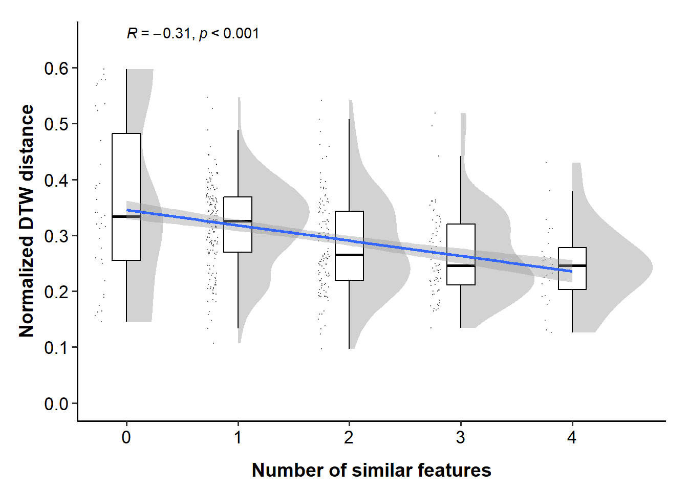<!-- -->

``` r
dis_f2f_n_features = dis_f2f_n_features + 
  labs(tag = "A") +
  theme(plot.tag.position = c(0,1),
        plot.tag = element_text(vjust = 2, hjust = 0.3))

dis_f2f_feature = dis_f2f_feature + 
  labs(tag = "B") +
  theme(plot.tag.position = c(0,1),
        plot.tag = element_text(vjust = 2, hjust = 0.3))

combined_p = dis_f2f_n_features + dis_f2f_feature + plot_layout(widths = c(5, 5))
combined_p[[2]] = combined_p[[2]] + theme(axis.title.y = element_blank())
combined_p
```

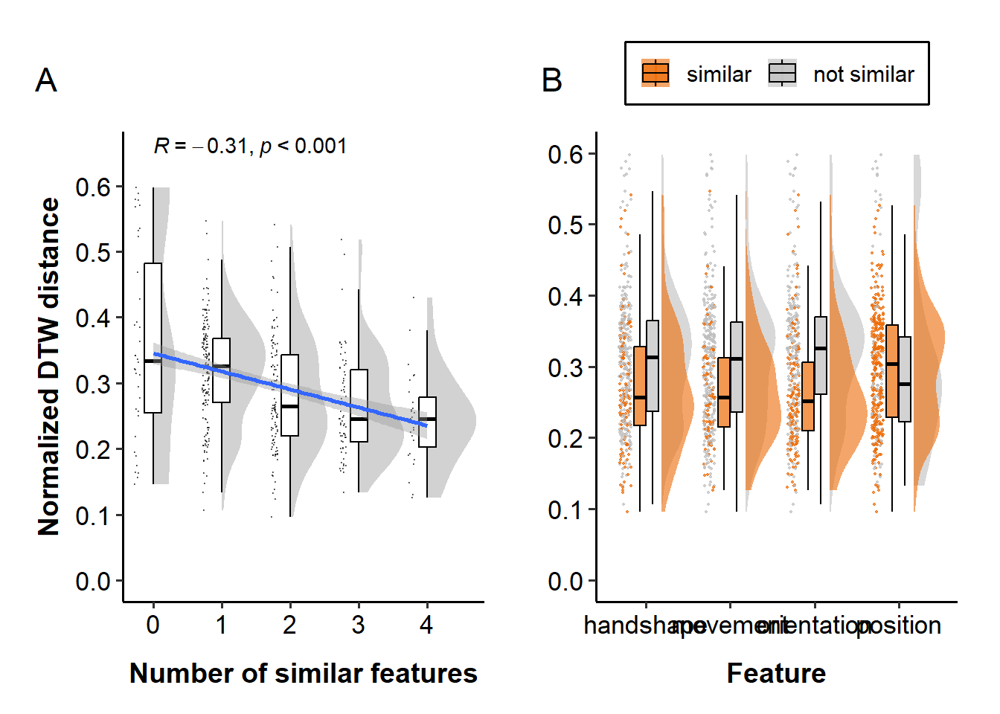<!-- -->

``` r
ggsave("figures/distance_f2f_combined.svg", width=10, height=5, dpi=600)
```

<br>

## Statistical Analysis

### Contrast coding

``` r
### apply deviation coding to the features
contrasts(df_dtw_f2f$handshape) = c(0.5, -0.5)
contrasts(df_dtw_f2f$movement) = c(0.5, -0.5)
contrasts(df_dtw_f2f$orientation) = c(0.5, -0.5)
contrasts(df_dtw_f2f$position) = c(0.5, -0.5)

### check the coding
contrasts(df_dtw_f2f$handshape)
```

    ##             [,1]
    ## similar      0.5
    ## not similar -0.5

<br>

### Check the normality assumption of errors

Linear mixed-effects models assume that the residuals are normally
distributed. Let’s check this assumption by plotting the residuals of
the models. For this, we will use the `check_model()` function from the
`performance` package.

``` r
model = lmer(average_distance ~ 1 + (1|pair) + (1|target), 
             data = subset(df_dtw_f2f))
check_model(model)
```

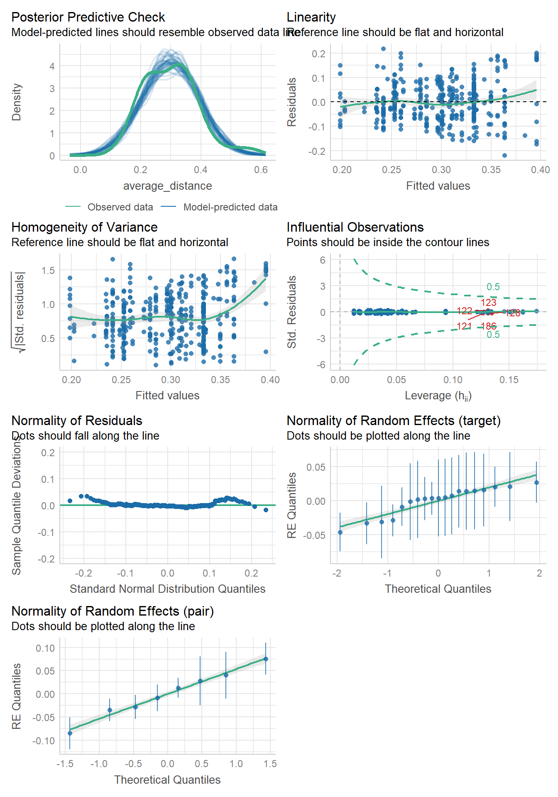<!-- -->

``` r
model_log = lmer(log(average_distance) ~ 1 + (1|pair) + (1|target), 
                 data = subset(df_dtw_f2f))
check_model(model_log)
```

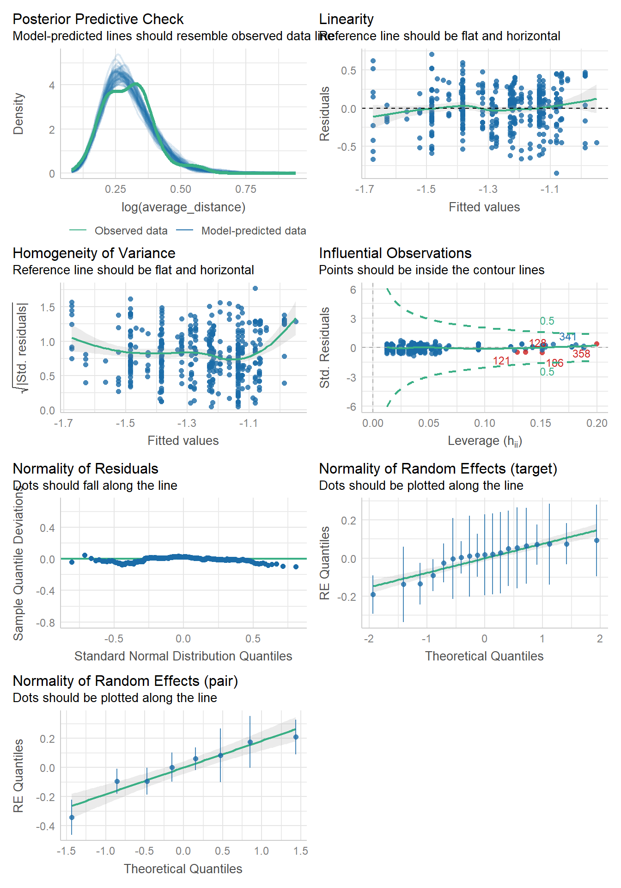<!-- -->

We didn’t detect any violations of the normality assumption. Also, the
posterior-predictive check shows that these models are almost equally
well-fit to the data. Therefore, we will use model the data with linear
regressions.

<br>

### Correlation between distance and similarity coding

``` r
x = df_dtw_f2f$n_features_smop
y = df_dtw_f2f$average_distance

cor.test(x, y, method="pearson")
```

    ## 
    ##  Pearson's product-moment correlation
    ## 
    ## data:  x and y
    ## t = -7, df = 404, p-value = 0.00000000007
    ## alternative hypothesis: true correlation is not equal to 0
    ## 95 percent confidence interval:
    ##  -0.401 -0.225
    ## sample estimates:
    ##    cor 
    ## -0.316

``` r
cor.test(x, y, method="spearman")
```

    ## 
    ##  Spearman's rank correlation rho
    ## 
    ## data:  x and y
    ## S = 14619096, p-value = 0.0000000002
    ## alternative hypothesis: true rho is not equal to 0
    ## sample estimates:
    ##    rho 
    ## -0.311

The correlation between the number of similar features and the
normalized DTW distance is significant (r = -0.324, p \< 0.001),
suggesting that the more similar features two gestures have, the smaller
the distance is.

<br>

### LMM

Let’s examine if the normalized DTW distance is significantly lower when
two gestures are similar than not in terms of handshape, movement,
orientation, position. Handedness is excluded because we used the
distance for gesturing hands only.

#### Number of features

First, we will check if the DTW distance is significantly lower for
gesture pairs that align in more features.

``` r
lmer_n_features = lmer(average_distance ~ n_features_smop + 
                         (1|pair) + (1|target), 
                       data = df_dtw_f2f)
summ(lmer_n_features, digits = 3)
```

<table class="table table-striped table-hover table-condensed table-responsive" style="width: auto !important; margin-left: auto; margin-right: auto;">

<tbody>

<tr>

<td style="text-align:left;font-weight: bold;">

Observations
</td>

<td style="text-align:right;">

406
</td>

</tr>

<tr>

<td style="text-align:left;font-weight: bold;">

Dependent variable
</td>

<td style="text-align:right;">

average_distance
</td>

</tr>

<tr>

<td style="text-align:left;font-weight: bold;">

Type
</td>

<td style="text-align:right;">

Mixed effects linear regression
</td>

</tr>

</tbody>

</table>

<table class="table table-striped table-hover table-condensed table-responsive" style="width: auto !important; margin-left: auto; margin-right: auto;">

<tbody>

<tr>

<td style="text-align:left;font-weight: bold;">

AIC
</td>

<td style="text-align:right;">

-873.323
</td>

</tr>

<tr>

<td style="text-align:left;font-weight: bold;">

BIC
</td>

<td style="text-align:right;">

-853.291
</td>

</tr>

<tr>

<td style="text-align:left;font-weight: bold;">

Pseudo-R² (fixed effects)
</td>

<td style="text-align:right;">

0.046
</td>

</tr>

<tr>

<td style="text-align:left;font-weight: bold;">

Pseudo-R² (total)
</td>

<td style="text-align:right;">

0.397
</td>

</tr>

</tbody>

</table>

<table class="table table-striped table-hover table-condensed table-responsive" style="width: auto !important; margin-left: auto; margin-right: auto;border-bottom: 0;">

<thead>

<tr>

<th style="border-bottom:hidden;padding-bottom:0; padding-left:3px;padding-right:3px;text-align: center; " colspan="6">

<div style="border-bottom: 1px solid #ddd; padding-bottom: 5px; ">

Fixed Effects

</div>

</th>

</tr>

<tr>

<th style="text-align:left;">

</th>

<th style="text-align:right;">

Est.
</th>

<th style="text-align:right;">

S.E.
</th>

<th style="text-align:right;">

t val.
</th>

<th style="text-align:right;">

d.f.
</th>

<th style="text-align:right;">

p
</th>

</tr>

</thead>

<tbody>

<tr>

<td style="text-align:left;font-weight: bold;">

(Intercept)
</td>

<td style="text-align:right;">

0.353
</td>

<td style="text-align:right;">

0.022
</td>

<td style="text-align:right;">

16.020
</td>

<td style="text-align:right;">

11.905
</td>

<td style="text-align:right;">

0.000
</td>

</tr>

<tr>

<td style="text-align:left;font-weight: bold;">

n_features_smop
</td>

<td style="text-align:right;">

-0.020
</td>

<td style="text-align:right;">

0.004
</td>

<td style="text-align:right;">

-5.186
</td>

<td style="text-align:right;">

395.571
</td>

<td style="text-align:right;">

0.000
</td>

</tr>

</tbody>

<tfoot>

<tr>

<td style="padding: 0; " colspan="100%">

<sup></sup> p values calculated using Satterthwaite d.f.
</td>

</tr>

</tfoot>

</table>

<table class="table table-striped table-hover table-condensed table-responsive" style="width: auto !important; margin-left: auto; margin-right: auto;">

<thead>

<tr>

<th style="border-bottom:hidden;padding-bottom:0; padding-left:3px;padding-right:3px;text-align: center; " colspan="3">

<div style="border-bottom: 1px solid #ddd; padding-bottom: 5px; ">

Random Effects

</div>

</th>

</tr>

<tr>

<th>

Group
</th>

<th>

Parameter
</th>

<th>

Std. Dev.
</th>

</tr>

</thead>

<tbody>

<tr>

<td>

target
</td>

<td>

(Intercept)
</td>

<td>

0.030
</td>

</tr>

<tr>

<td>

pair
</td>

<td>

(Intercept)
</td>

<td>

0.050
</td>

</tr>

<tr>

<td>

Residual
</td>

<td>

</td>

<td>

0.076
</td>

</tr>

</tbody>

</table>

<table class="table table-striped table-hover table-condensed table-responsive" style="width: auto !important; margin-left: auto; margin-right: auto;">

<thead>

<tr>

<th style="border-bottom:hidden;padding-bottom:0; padding-left:3px;padding-right:3px;text-align: center; " colspan="3">

<div style="border-bottom: 1px solid #ddd; padding-bottom: 5px; ">

Grouping Variables

</div>

</th>

</tr>

<tr>

<th>

Group
</th>

<th>

\# groups
</th>

<th>

ICC
</th>

</tr>

</thead>

<tbody>

<tr>

<td>

target
</td>

<td>

19
</td>

<td>

0.097
</td>

</tr>

<tr>

<td>

pair
</td>

<td>

8
</td>

<td>

0.270
</td>

</tr>

</tbody>

</table>

The model shows that the number of similar features are significantly
negatively associated with the distance, suggesting that DTW can capture
gesture form similarity.

<br>

#### Feature-wise analysis

Next, we will apply regression on each feature separately to see if the
DTW distance is significantly lower for gesture pairs that were
annotated as similar.

Lastly, we will include all features as fixed effects in the model to
see the effect of each feature while controlling for the other features.

``` r
lmer_shape = lmer(average_distance ~ 
                    handshape + (1|pair) + (1|target),
                  data = df_dtw_f2f)
summ(lmer_shape, digits = 3)
```

<table class="table table-striped table-hover table-condensed table-responsive" style="width: auto !important; margin-left: auto; margin-right: auto;">

<tbody>

<tr>

<td style="text-align:left;font-weight: bold;">

Observations
</td>

<td style="text-align:right;">

406
</td>

</tr>

<tr>

<td style="text-align:left;font-weight: bold;">

Dependent variable
</td>

<td style="text-align:right;">

average_distance
</td>

</tr>

<tr>

<td style="text-align:left;font-weight: bold;">

Type
</td>

<td style="text-align:right;">

Mixed effects linear regression
</td>

</tr>

</tbody>

</table>

<table class="table table-striped table-hover table-condensed table-responsive" style="width: auto !important; margin-left: auto; margin-right: auto;">

<tbody>

<tr>

<td style="text-align:left;font-weight: bold;">

AIC
</td>

<td style="text-align:right;">

-858.328
</td>

</tr>

<tr>

<td style="text-align:left;font-weight: bold;">

BIC
</td>

<td style="text-align:right;">

-838.296
</td>

</tr>

<tr>

<td style="text-align:left;font-weight: bold;">

Pseudo-R² (fixed effects)
</td>

<td style="text-align:right;">

0.016
</td>

</tr>

<tr>

<td style="text-align:left;font-weight: bold;">

Pseudo-R² (total)
</td>

<td style="text-align:right;">

0.388
</td>

</tr>

</tbody>

</table>

<table class="table table-striped table-hover table-condensed table-responsive" style="width: auto !important; margin-left: auto; margin-right: auto;border-bottom: 0;">

<thead>

<tr>

<th style="border-bottom:hidden;padding-bottom:0; padding-left:3px;padding-right:3px;text-align: center; " colspan="6">

<div style="border-bottom: 1px solid #ddd; padding-bottom: 5px; ">

Fixed Effects

</div>

</th>

</tr>

<tr>

<th style="text-align:left;">

</th>

<th style="text-align:right;">

Est.
</th>

<th style="text-align:right;">

S.E.
</th>

<th style="text-align:right;">

t val.
</th>

<th style="text-align:right;">

d.f.
</th>

<th style="text-align:right;">

p
</th>

</tr>

</thead>

<tbody>

<tr>

<td style="text-align:left;font-weight: bold;">

(Intercept)
</td>

<td style="text-align:right;">

0.314
</td>

<td style="text-align:right;">

0.022
</td>

<td style="text-align:right;">

14.413
</td>

<td style="text-align:right;">

9.613
</td>

<td style="text-align:right;">

0.000
</td>

</tr>

<tr>

<td style="text-align:left;font-weight: bold;">

handshape1
</td>

<td style="text-align:right;">

-0.027
</td>

<td style="text-align:right;">

0.009
</td>

<td style="text-align:right;">

-3.087
</td>

<td style="text-align:right;">

398.155
</td>

<td style="text-align:right;">

0.002
</td>

</tr>

</tbody>

<tfoot>

<tr>

<td style="padding: 0; " colspan="100%">

<sup></sup> p values calculated using Satterthwaite d.f.
</td>

</tr>

</tfoot>

</table>

<table class="table table-striped table-hover table-condensed table-responsive" style="width: auto !important; margin-left: auto; margin-right: auto;">

<thead>

<tr>

<th style="border-bottom:hidden;padding-bottom:0; padding-left:3px;padding-right:3px;text-align: center; " colspan="3">

<div style="border-bottom: 1px solid #ddd; padding-bottom: 5px; ">

Random Effects

</div>

</th>

</tr>

<tr>

<th>

Group
</th>

<th>

Parameter
</th>

<th>

Std. Dev.
</th>

</tr>

</thead>

<tbody>

<tr>

<td>

target
</td>

<td>

(Intercept)
</td>

<td>

0.031
</td>

</tr>

<tr>

<td>

pair
</td>

<td>

(Intercept)
</td>

<td>

0.053
</td>

</tr>

<tr>

<td>

Residual
</td>

<td>

</td>

<td>

0.078
</td>

</tr>

</tbody>

</table>

<table class="table table-striped table-hover table-condensed table-responsive" style="width: auto !important; margin-left: auto; margin-right: auto;">

<thead>

<tr>

<th style="border-bottom:hidden;padding-bottom:0; padding-left:3px;padding-right:3px;text-align: center; " colspan="3">

<div style="border-bottom: 1px solid #ddd; padding-bottom: 5px; ">

Grouping Variables

</div>

</th>

</tr>

<tr>

<th>

Group
</th>

<th>

\# groups
</th>

<th>

ICC
</th>

</tr>

</thead>

<tbody>

<tr>

<td>

target
</td>

<td>

19
</td>

<td>

0.095
</td>

</tr>

<tr>

<td>

pair
</td>

<td>

8
</td>

<td>

0.283
</td>

</tr>

</tbody>

</table>

``` r
lmer_movement = lmer(average_distance ~ 
                        movement + (1|pair) + (1|target),
                      data = df_dtw_f2f)
summ(lmer_movement, digits = 3)
```

<table class="table table-striped table-hover table-condensed table-responsive" style="width: auto !important; margin-left: auto; margin-right: auto;">

<tbody>

<tr>

<td style="text-align:left;font-weight: bold;">

Observations
</td>

<td style="text-align:right;">

406
</td>

</tr>

<tr>

<td style="text-align:left;font-weight: bold;">

Dependent variable
</td>

<td style="text-align:right;">

average_distance
</td>

</tr>

<tr>

<td style="text-align:left;font-weight: bold;">

Type
</td>

<td style="text-align:right;">

Mixed effects linear regression
</td>

</tr>

</tbody>

</table>

<table class="table table-striped table-hover table-condensed table-responsive" style="width: auto !important; margin-left: auto; margin-right: auto;">

<tbody>

<tr>

<td style="text-align:left;font-weight: bold;">

AIC
</td>

<td style="text-align:right;">

-865.976
</td>

</tr>

<tr>

<td style="text-align:left;font-weight: bold;">

BIC
</td>

<td style="text-align:right;">

-845.944
</td>

</tr>

<tr>

<td style="text-align:left;font-weight: bold;">

Pseudo-R² (fixed effects)
</td>

<td style="text-align:right;">

0.026
</td>

</tr>

<tr>

<td style="text-align:left;font-weight: bold;">

Pseudo-R² (total)
</td>

<td style="text-align:right;">

0.432
</td>

</tr>

</tbody>

</table>

<table class="table table-striped table-hover table-condensed table-responsive" style="width: auto !important; margin-left: auto; margin-right: auto;border-bottom: 0;">

<thead>

<tr>

<th style="border-bottom:hidden;padding-bottom:0; padding-left:3px;padding-right:3px;text-align: center; " colspan="6">

<div style="border-bottom: 1px solid #ddd; padding-bottom: 5px; ">

Fixed Effects

</div>

</th>

</tr>

<tr>

<th style="text-align:left;">

</th>

<th style="text-align:right;">

Est.
</th>

<th style="text-align:right;">

S.E.
</th>

<th style="text-align:right;">

t val.
</th>

<th style="text-align:right;">

d.f.
</th>

<th style="text-align:right;">

p
</th>

</tr>

</thead>

<tbody>

<tr>

<td style="text-align:left;font-weight: bold;">

(Intercept)
</td>

<td style="text-align:right;">

0.310
</td>

<td style="text-align:right;">

0.023
</td>

<td style="text-align:right;">

13.413
</td>

<td style="text-align:right;">

9.840
</td>

<td style="text-align:right;">

0.000
</td>

</tr>

<tr>

<td style="text-align:left;font-weight: bold;">

movement1
</td>

<td style="text-align:right;">

-0.040
</td>

<td style="text-align:right;">

0.010
</td>

<td style="text-align:right;">

-4.172
</td>

<td style="text-align:right;">

394.467
</td>

<td style="text-align:right;">

0.000
</td>

</tr>

</tbody>

<tfoot>

<tr>

<td style="padding: 0; " colspan="100%">

<sup></sup> p values calculated using Satterthwaite d.f.
</td>

</tr>

</tfoot>

</table>

<table class="table table-striped table-hover table-condensed table-responsive" style="width: auto !important; margin-left: auto; margin-right: auto;">

<thead>

<tr>

<th style="border-bottom:hidden;padding-bottom:0; padding-left:3px;padding-right:3px;text-align: center; " colspan="3">

<div style="border-bottom: 1px solid #ddd; padding-bottom: 5px; ">

Random Effects

</div>

</th>

</tr>

<tr>

<th>

Group
</th>

<th>

Parameter
</th>

<th>

Std. Dev.
</th>

</tr>

</thead>

<tbody>

<tr>

<td>

target
</td>

<td>

(Intercept)
</td>

<td>

0.034
</td>

</tr>

<tr>

<td>

pair
</td>

<td>

(Intercept)
</td>

<td>

0.056
</td>

</tr>

<tr>

<td>

Residual
</td>

<td>

</td>

<td>

0.077
</td>

</tr>

</tbody>

</table>

<table class="table table-striped table-hover table-condensed table-responsive" style="width: auto !important; margin-left: auto; margin-right: auto;">

<thead>

<tr>

<th style="border-bottom:hidden;padding-bottom:0; padding-left:3px;padding-right:3px;text-align: center; " colspan="3">

<div style="border-bottom: 1px solid #ddd; padding-bottom: 5px; ">

Grouping Variables

</div>

</th>

</tr>

<tr>

<th>

Group
</th>

<th>

\# groups
</th>

<th>

ICC
</th>

</tr>

</thead>

<tbody>

<tr>

<td>

target
</td>

<td>

19
</td>

<td>

0.111
</td>

</tr>

<tr>

<td>

pair
</td>

<td>

8
</td>

<td>

0.305
</td>

</tr>

</tbody>

</table>

``` r
lmer_orientation = lmer(average_distance ~ 
                           orientation + (1|pair) + (1|target),
                         data = df_dtw_f2f)
summ(lmer_orientation, digits = 3)
```

<table class="table table-striped table-hover table-condensed table-responsive" style="width: auto !important; margin-left: auto; margin-right: auto;">

<tbody>

<tr>

<td style="text-align:left;font-weight: bold;">

Observations
</td>

<td style="text-align:right;">

406
</td>

</tr>

<tr>

<td style="text-align:left;font-weight: bold;">

Dependent variable
</td>

<td style="text-align:right;">

average_distance
</td>

</tr>

<tr>

<td style="text-align:left;font-weight: bold;">

Type
</td>

<td style="text-align:right;">

Mixed effects linear regression
</td>

</tr>

</tbody>

</table>

<table class="table table-striped table-hover table-condensed table-responsive" style="width: auto !important; margin-left: auto; margin-right: auto;">

<tbody>

<tr>

<td style="text-align:left;font-weight: bold;">

AIC
</td>

<td style="text-align:right;">

-880.057
</td>

</tr>

<tr>

<td style="text-align:left;font-weight: bold;">

BIC
</td>

<td style="text-align:right;">

-860.025
</td>

</tr>

<tr>

<td style="text-align:left;font-weight: bold;">

Pseudo-R² (fixed effects)
</td>

<td style="text-align:right;">

0.053
</td>

</tr>

<tr>

<td style="text-align:left;font-weight: bold;">

Pseudo-R² (total)
</td>

<td style="text-align:right;">

0.404
</td>

</tr>

</tbody>

</table>

<table class="table table-striped table-hover table-condensed table-responsive" style="width: auto !important; margin-left: auto; margin-right: auto;border-bottom: 0;">

<thead>

<tr>

<th style="border-bottom:hidden;padding-bottom:0; padding-left:3px;padding-right:3px;text-align: center; " colspan="6">

<div style="border-bottom: 1px solid #ddd; padding-bottom: 5px; ">

Fixed Effects

</div>

</th>

</tr>

<tr>

<th style="text-align:left;">

</th>

<th style="text-align:right;">

Est.
</th>

<th style="text-align:right;">

S.E.
</th>

<th style="text-align:right;">

t val.
</th>

<th style="text-align:right;">

d.f.
</th>

<th style="text-align:right;">

p
</th>

</tr>

</thead>

<tbody>

<tr>

<td style="text-align:left;font-weight: bold;">

(Intercept)
</td>

<td style="text-align:right;">

0.309
</td>

<td style="text-align:right;">

0.021
</td>

<td style="text-align:right;">

14.683
</td>

<td style="text-align:right;">

9.325
</td>

<td style="text-align:right;">

0.000
</td>

</tr>

<tr>

<td style="text-align:left;font-weight: bold;">

orientation1
</td>

<td style="text-align:right;">

-0.046
</td>

<td style="text-align:right;">

0.008
</td>

<td style="text-align:right;">

-5.710
</td>

<td style="text-align:right;">

396.878
</td>

<td style="text-align:right;">

0.000
</td>

</tr>

</tbody>

<tfoot>

<tr>

<td style="padding: 0; " colspan="100%">

<sup></sup> p values calculated using Satterthwaite d.f.
</td>

</tr>

</tfoot>

</table>

<table class="table table-striped table-hover table-condensed table-responsive" style="width: auto !important; margin-left: auto; margin-right: auto;">

<thead>

<tr>

<th style="border-bottom:hidden;padding-bottom:0; padding-left:3px;padding-right:3px;text-align: center; " colspan="3">

<div style="border-bottom: 1px solid #ddd; padding-bottom: 5px; ">

Random Effects

</div>

</th>

</tr>

<tr>

<th>

Group
</th>

<th>

Parameter
</th>

<th>

Std. Dev.
</th>

</tr>

</thead>

<tbody>

<tr>

<td>

target
</td>

<td>

(Intercept)
</td>

<td>

0.027
</td>

</tr>

<tr>

<td>

pair
</td>

<td>

(Intercept)
</td>

<td>

0.052
</td>

</tr>

<tr>

<td>

Residual
</td>

<td>

</td>

<td>

0.076
</td>

</tr>

</tbody>

</table>

<table class="table table-striped table-hover table-condensed table-responsive" style="width: auto !important; margin-left: auto; margin-right: auto;">

<thead>

<tr>

<th style="border-bottom:hidden;padding-bottom:0; padding-left:3px;padding-right:3px;text-align: center; " colspan="3">

<div style="border-bottom: 1px solid #ddd; padding-bottom: 5px; ">

Grouping Variables

</div>

</th>

</tr>

<tr>

<th>

Group
</th>

<th>

\# groups
</th>

<th>

ICC
</th>

</tr>

</thead>

<tbody>

<tr>

<td>

target
</td>

<td>

19
</td>

<td>

0.079
</td>

</tr>

<tr>

<td>

pair
</td>

<td>

8
</td>

<td>

0.291
</td>

</tr>

</tbody>

</table>

``` r
lmer_position = lmer(average_distance ~ 
                        position + (1|pair) + (1|target),
                      data = df_dtw_f2f)
summ(lmer_position, digits = 3)
```

<table class="table table-striped table-hover table-condensed table-responsive" style="width: auto !important; margin-left: auto; margin-right: auto;">

<tbody>

<tr>

<td style="text-align:left;font-weight: bold;">

Observations
</td>

<td style="text-align:right;">

406
</td>

</tr>

<tr>

<td style="text-align:left;font-weight: bold;">

Dependent variable
</td>

<td style="text-align:right;">

average_distance
</td>

</tr>

<tr>

<td style="text-align:left;font-weight: bold;">

Type
</td>

<td style="text-align:right;">

Mixed effects linear regression
</td>

</tr>

</tbody>

</table>

<table class="table table-striped table-hover table-condensed table-responsive" style="width: auto !important; margin-left: auto; margin-right: auto;">

<tbody>

<tr>

<td style="text-align:left;font-weight: bold;">

AIC
</td>

<td style="text-align:right;">

-851.483
</td>

</tr>

<tr>

<td style="text-align:left;font-weight: bold;">

BIC
</td>

<td style="text-align:right;">

-831.451
</td>

</tr>

<tr>

<td style="text-align:left;font-weight: bold;">

Pseudo-R² (fixed effects)
</td>

<td style="text-align:right;">

0.004
</td>

</tr>

<tr>

<td style="text-align:left;font-weight: bold;">

Pseudo-R² (total)
</td>

<td style="text-align:right;">

0.398
</td>

</tr>

</tbody>

</table>

<table class="table table-striped table-hover table-condensed table-responsive" style="width: auto !important; margin-left: auto; margin-right: auto;border-bottom: 0;">

<thead>

<tr>

<th style="border-bottom:hidden;padding-bottom:0; padding-left:3px;padding-right:3px;text-align: center; " colspan="6">

<div style="border-bottom: 1px solid #ddd; padding-bottom: 5px; ">

Fixed Effects

</div>

</th>

</tr>

<tr>

<th style="text-align:left;">

</th>

<th style="text-align:right;">

Est.
</th>

<th style="text-align:right;">

S.E.
</th>

<th style="text-align:right;">

t val.
</th>

<th style="text-align:right;">

d.f.
</th>

<th style="text-align:right;">

p
</th>

</tr>

</thead>

<tbody>

<tr>

<td style="text-align:left;font-weight: bold;">

(Intercept)
</td>

<td style="text-align:right;">

0.312
</td>

<td style="text-align:right;">

0.023
</td>

<td style="text-align:right;">

13.614
</td>

<td style="text-align:right;">

9.739
</td>

<td style="text-align:right;">

0.000
</td>

</tr>

<tr>

<td style="text-align:left;font-weight: bold;">

position1
</td>

<td style="text-align:right;">

0.016
</td>

<td style="text-align:right;">

0.010
</td>

<td style="text-align:right;">

1.528
</td>

<td style="text-align:right;">

393.223
</td>

<td style="text-align:right;">

0.127
</td>

</tr>

</tbody>

<tfoot>

<tr>

<td style="padding: 0; " colspan="100%">

<sup></sup> p values calculated using Satterthwaite d.f.
</td>

</tr>

</tfoot>

</table>

<table class="table table-striped table-hover table-condensed table-responsive" style="width: auto !important; margin-left: auto; margin-right: auto;">

<thead>

<tr>

<th style="border-bottom:hidden;padding-bottom:0; padding-left:3px;padding-right:3px;text-align: center; " colspan="3">

<div style="border-bottom: 1px solid #ddd; padding-bottom: 5px; ">

Random Effects

</div>

</th>

</tr>

<tr>

<th>

Group
</th>

<th>

Parameter
</th>

<th>

Std. Dev.
</th>

</tr>

</thead>

<tbody>

<tr>

<td>

target
</td>

<td>

(Intercept)
</td>

<td>

0.031
</td>

</tr>

<tr>

<td>

pair
</td>

<td>

(Intercept)
</td>

<td>

0.056
</td>

</tr>

<tr>

<td>

Residual
</td>

<td>

</td>

<td>

0.079
</td>

</tr>

</tbody>

</table>

<table class="table table-striped table-hover table-condensed table-responsive" style="width: auto !important; margin-left: auto; margin-right: auto;">

<thead>

<tr>

<th style="border-bottom:hidden;padding-bottom:0; padding-left:3px;padding-right:3px;text-align: center; " colspan="3">

<div style="border-bottom: 1px solid #ddd; padding-bottom: 5px; ">

Grouping Variables

</div>

</th>

</tr>

<tr>

<th>

Group
</th>

<th>

\# groups
</th>

<th>

ICC
</th>

</tr>

</thead>

<tbody>

<tr>

<td>

target
</td>

<td>

19
</td>

<td>

0.093
</td>

</tr>

<tr>

<td>

pair
</td>

<td>

8
</td>

<td>

0.303
</td>

</tr>

</tbody>

</table>

``` r
### all features
lmer_feature = lmer(average_distance ~ 
                      handshape + movement + orientation + position +
                      (1|pair) + (1|target),
                   data = df_dtw_f2f)
summ(lmer_feature, digits = 3)
```

<table class="table table-striped table-hover table-condensed table-responsive" style="width: auto !important; margin-left: auto; margin-right: auto;">

<tbody>

<tr>

<td style="text-align:left;font-weight: bold;">

Observations
</td>

<td style="text-align:right;">

406
</td>

</tr>

<tr>

<td style="text-align:left;font-weight: bold;">

Dependent variable
</td>

<td style="text-align:right;">

average_distance
</td>

</tr>

<tr>

<td style="text-align:left;font-weight: bold;">

Type
</td>

<td style="text-align:right;">

Mixed effects linear regression
</td>

</tr>

</tbody>

</table>

<table class="table table-striped table-hover table-condensed table-responsive" style="width: auto !important; margin-left: auto; margin-right: auto;">

<tbody>

<tr>

<td style="text-align:left;font-weight: bold;">

AIC
</td>

<td style="text-align:right;">

-865.895
</td>

</tr>

<tr>

<td style="text-align:left;font-weight: bold;">

BIC
</td>

<td style="text-align:right;">

-833.844
</td>

</tr>

<tr>

<td style="text-align:left;font-weight: bold;">

Pseudo-R² (fixed effects)
</td>

<td style="text-align:right;">

0.072
</td>

</tr>

<tr>

<td style="text-align:left;font-weight: bold;">

Pseudo-R² (total)
</td>

<td style="text-align:right;">

0.463
</td>

</tr>

</tbody>

</table>

<table class="table table-striped table-hover table-condensed table-responsive" style="width: auto !important; margin-left: auto; margin-right: auto;border-bottom: 0;">

<thead>

<tr>

<th style="border-bottom:hidden;padding-bottom:0; padding-left:3px;padding-right:3px;text-align: center; " colspan="6">

<div style="border-bottom: 1px solid #ddd; padding-bottom: 5px; ">

Fixed Effects

</div>

</th>

</tr>

<tr>

<th style="text-align:left;">

</th>

<th style="text-align:right;">

Est.
</th>

<th style="text-align:right;">

S.E.
</th>

<th style="text-align:right;">

t val.
</th>

<th style="text-align:right;">

d.f.
</th>

<th style="text-align:right;">

p
</th>

</tr>

</thead>

<tbody>

<tr>

<td style="text-align:left;font-weight: bold;">

(Intercept)
</td>

<td style="text-align:right;">

0.300
</td>

<td style="text-align:right;">

0.023
</td>

<td style="text-align:right;">

13.020
</td>

<td style="text-align:right;">

9.523
</td>

<td style="text-align:right;">

0.000
</td>

</tr>

<tr>

<td style="text-align:left;font-weight: bold;">

handshape1
</td>

<td style="text-align:right;">

-0.011
</td>

<td style="text-align:right;">

0.009
</td>

<td style="text-align:right;">

-1.187
</td>

<td style="text-align:right;">

395.353
</td>

<td style="text-align:right;">

0.236
</td>

</tr>

<tr>

<td style="text-align:left;font-weight: bold;">

movement1
</td>

<td style="text-align:right;">

-0.030
</td>

<td style="text-align:right;">

0.009
</td>

<td style="text-align:right;">

-3.171
</td>

<td style="text-align:right;">

393.004
</td>

<td style="text-align:right;">

0.002
</td>

</tr>

<tr>

<td style="text-align:left;font-weight: bold;">

orientation1
</td>

<td style="text-align:right;">

-0.038
</td>

<td style="text-align:right;">

0.009
</td>

<td style="text-align:right;">

-4.447
</td>

<td style="text-align:right;">

394.008
</td>

<td style="text-align:right;">

0.000
</td>

</tr>

<tr>

<td style="text-align:left;font-weight: bold;">

position1
</td>

<td style="text-align:right;">

0.016
</td>

<td style="text-align:right;">

0.010
</td>

<td style="text-align:right;">

1.670
</td>

<td style="text-align:right;">

390.601
</td>

<td style="text-align:right;">

0.096
</td>

</tr>

</tbody>

<tfoot>

<tr>

<td style="padding: 0; " colspan="100%">

<sup></sup> p values calculated using Satterthwaite d.f.
</td>

</tr>

</tfoot>

</table>

<table class="table table-striped table-hover table-condensed table-responsive" style="width: auto !important; margin-left: auto; margin-right: auto;">

<thead>

<tr>

<th style="border-bottom:hidden;padding-bottom:0; padding-left:3px;padding-right:3px;text-align: center; " colspan="3">

<div style="border-bottom: 1px solid #ddd; padding-bottom: 5px; ">

Random Effects

</div>

</th>

</tr>

<tr>

<th>

Group
</th>

<th>

Parameter
</th>

<th>

Std. Dev.
</th>

</tr>

</thead>

<tbody>

<tr>

<td>

target
</td>

<td>

(Intercept)
</td>

<td>

0.029
</td>

</tr>

<tr>

<td>

pair
</td>

<td>

(Intercept)
</td>

<td>

0.057
</td>

</tr>

<tr>

<td>

Residual
</td>

<td>

</td>

<td>

0.075
</td>

</tr>

</tbody>

</table>

<table class="table table-striped table-hover table-condensed table-responsive" style="width: auto !important; margin-left: auto; margin-right: auto;">

<thead>

<tr>

<th style="border-bottom:hidden;padding-bottom:0; padding-left:3px;padding-right:3px;text-align: center; " colspan="3">

<div style="border-bottom: 1px solid #ddd; padding-bottom: 5px; ">

Grouping Variables

</div>

</th>

</tr>

<tr>

<th>

Group
</th>

<th>

\# groups
</th>

<th>

ICC
</th>

</tr>

</thead>

<tbody>

<tr>

<td>

target
</td>

<td>

19
</td>

<td>

0.090
</td>

</tr>

<tr>

<td>

pair
</td>

<td>

8
</td>

<td>

0.332
</td>

</tr>

</tbody>

</table>

``` r
cov2cor(vcov(lmer_feature))
```

    ## 5 x 5 Matrix of class "corMatrix"
    ##              (Intercept) handshape1 movement1 orientation1 position1
    ## (Intercept)       1.0000     0.0120    0.0710      0.02920  -0.12040
    ## handshape1        0.0120     1.0000   -0.0817     -0.29888   0.01017
    ## movement1         0.0710    -0.0817    1.0000     -0.15864  -0.02450
    ## orientation1      0.0292    -0.2989   -0.1586      1.00000   0.00571
    ## position1        -0.1204     0.0102   -0.0245      0.00571   1.00000

The models show that the normalized DTW distance is significantly lower
when two gestures are similar than not in terms of movement,
orientation, and position (handshape didn’t reach significance when
controling for other variables). The correlation of fixed effects shows
a weak negative correlation between handshape and orientation (-0.3),
suggesting that when the slope for orientation is more extremely
negative, the slope for handshape becomes flatter. This is likely due to
the fact that handshape and orientation are both reflected in relative
finger tip positions. This suggests a need for developing a different
approach to capturing handshape similarity independently of hand
orientation.

<br>

#### Model diagnostics

``` r
check_model(lmer_n_features)
```

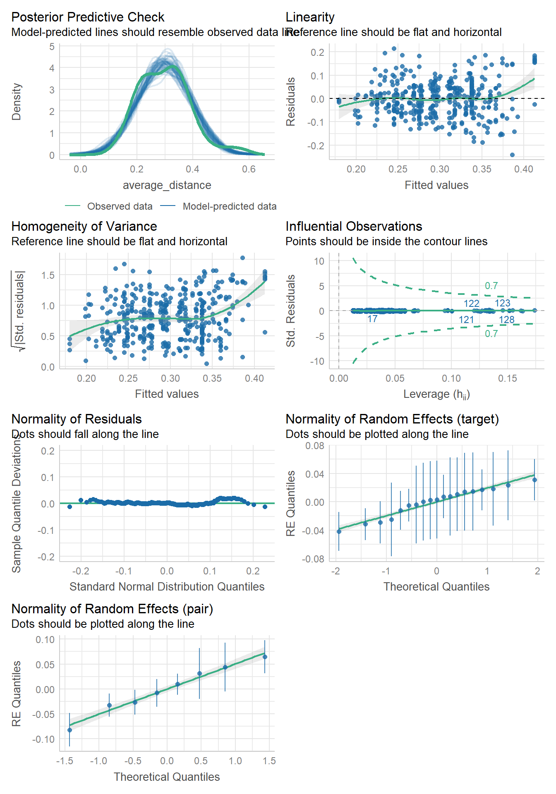<!-- -->

<br>

## Summary

In this analysis, we found that the normalized DTW distance is
significantly lower when two gestures are similar than not in terms of
movement and orientation (handshape and position didn’t reach
significance). The number of similar features also was significantly
negatively associated with the distance, suggesting that DTW can capture
gesture form similarity.

<br>

------------------------------------------------------------------------

# ===Zoom dataset===

## Data visualization

### by SMOP features

``` r
dis_zoom_feature = df_dtw_zoom_long %>%
  ggplot(aes(x = feature, y = average_distance, 
             fill = similarity_bin, color = similarity_bin)) +
  ggdist::stat_halfeye(adjust = 1, width = 0.5, .width = 0, ,
                       point_color = NA, alpha = 0.6, justification = -0.4) +
  geom_jitter(aes(x = stage(start = feature, after_scale = x - 0.25)),
              size = 0.3, alpha = 0.7, width = 0.07, height = 0) +
  geom_boxplot(width = .3,
               outlier.shape = NA, 
               alpha = 0.7, 
               color = "black") +
  labs(x="Feature", 
       y="Normalized DTW distance") +
  scale_fill_manual(values = c("#ED6B06", "grey"),
                    name = c("Similarity")) +
  scale_color_manual(values = c("#ED6B06", "grey"),
                    name = c("Similarity")) +
  scale_y_continuous(breaks = seq(0, 1, 0.2)) +
  coord_cartesian(ylim = c(0, 0.9)) +
  theme_classic(base_size = 14) +
  theme(axis.text.x = element_text(colour = "black", size = 13),
        axis.text.y = element_text(colour = "black", size = 13),
        axis.title = element_text(face = 'bold'),
        axis.title.x = element_text(vjust = -2),
        axis.title.y = element_text(vjust = 2),
        strip.text = element_text(face = 'bold'),
        legend.background = element_rect(fill = "white", color = "black"),
        legend.position = "top",
        legend.title = element_blank(),
        plot.margin = unit(c(1.1,1.1,1.1,1.1), "lines"))
  # facet_wrap(~feature, nrow = 2)

# dis_zoom_feature
```

<br>

### by the number of similar features

``` r
dis_zoom_n_features = df_dtw_zoom %>%
  ggplot(aes(x = n_features, y = average_distance, 
             group = n_features)) +
  ggdist::stat_halfeye(adjust = 1, width = 0.8, .width = 0,
                       point_color = NA, alpha = 0.5) +
  geom_jitter(aes(x = stage(start = n_features, after_scale = x - 0.23)),
              size = 0.01, alpha = 0.5, width = 0.05, height = 0) +
  geom_boxplot(width = .25, outlier.shape = NA, color = "black") +
  geom_smooth(aes(x=as.numeric(n_features), group=NA),
              method = "lm", size = 1) +
  stat_cor(aes(group = 1),
           p.accuracy = 0.001, r.accuracy = 0.01,
           label.y = 0.9,
           method="spearman") +
  labs(x="Number of similar features", 
       y="Normalized DTW distance") +
  scale_y_continuous(breaks = seq(0, 0.8, 0.2)) +
  coord_cartesian(xlim = c(-0.2, 4.6), 
                  ylim = c(0, 0.9)) +
  theme_classic(base_size = 14) +
  theme(axis.text.x = element_text(colour = "black", size = 13),
        axis.text.y = element_text(colour = "black", size = 13),
        axis.title = element_text(face = 'bold'),
        axis.title.x = element_text(vjust = -2),
        axis.title.y = element_text(vjust = 2),
        strip.text = element_text(face = 'bold'),
        legend.position = "none",
        plot.margin = unit(c(1.1,1.1,1.1,1.1), "lines"))

# ggExtra::ggMarginal(dis_zoom_n_features, fill = "lightblue")
```

``` r
dis_zoom_n_features = dis_zoom_n_features + 
  labs(tag = "A") +
  theme(plot.tag.position = c(0,1),
        plot.tag = element_text(vjust = 2, hjust = 0.3))

dis_zoom_feature = dis_zoom_feature + 
  labs(tag = "B") +
  theme(plot.tag.position = c(0,1),
        plot.tag = element_text(vjust = 2, hjust = 0.3))

combined_p = dis_zoom_n_features + dis_zoom_feature + plot_layout(widths = c(5, 5))
combined_p[[2]] = combined_p[[2]] + theme(axis.title.y = element_blank())
combined_p
```

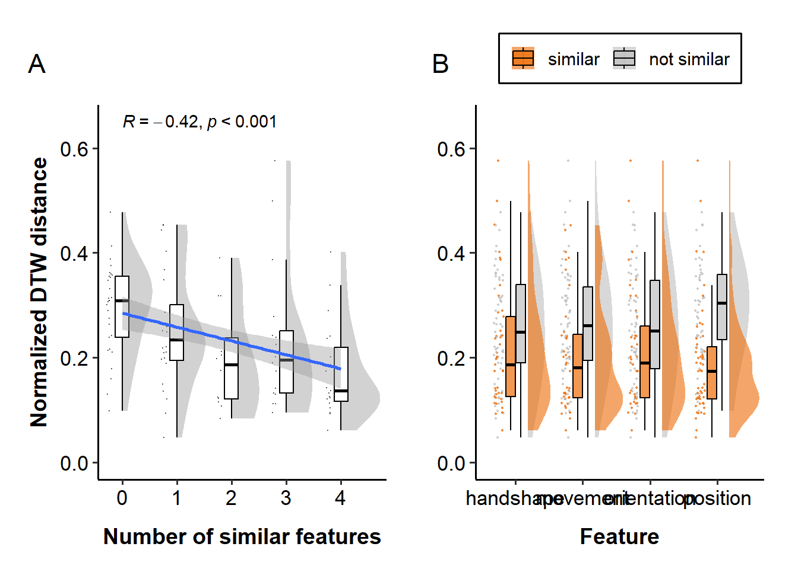<!-- -->

``` r
ggsave("figures/distance_zoom_combined_bin.svg", width=10, height=5, dpi=600)
```

<br>

## Statistical analysis

### Contrast coding

``` r
### apply deviation coding to the features
contrasts(df_dtw_zoom$handshape_bin) = c(0.5, -0.5)
contrasts(df_dtw_zoom$movement_bin) = c(0.5, -0.5)
contrasts(df_dtw_zoom$orientation_bin) = c(0.5, -0.5)
contrasts(df_dtw_zoom$position_bin) = c(0.5, -0.5)

### check the coding
contrasts(df_dtw_zoom$handshape_bin)
```

    ##             [,1]
    ## similar      0.5
    ## not similar -0.5

### Check the normality assumption of errors

Linear mixed-effects models assume that the residuals are normally
distributed. Let’s check this assumption by plotting the residuals of
the models. For this, we will use the `check_model()` function from the
`performance` package.

``` r
model = lmer(average_distance ~ 1 + (1|pair) + (1|target), 
             data = subset(df_dtw_zoom))
check_model(model)
```

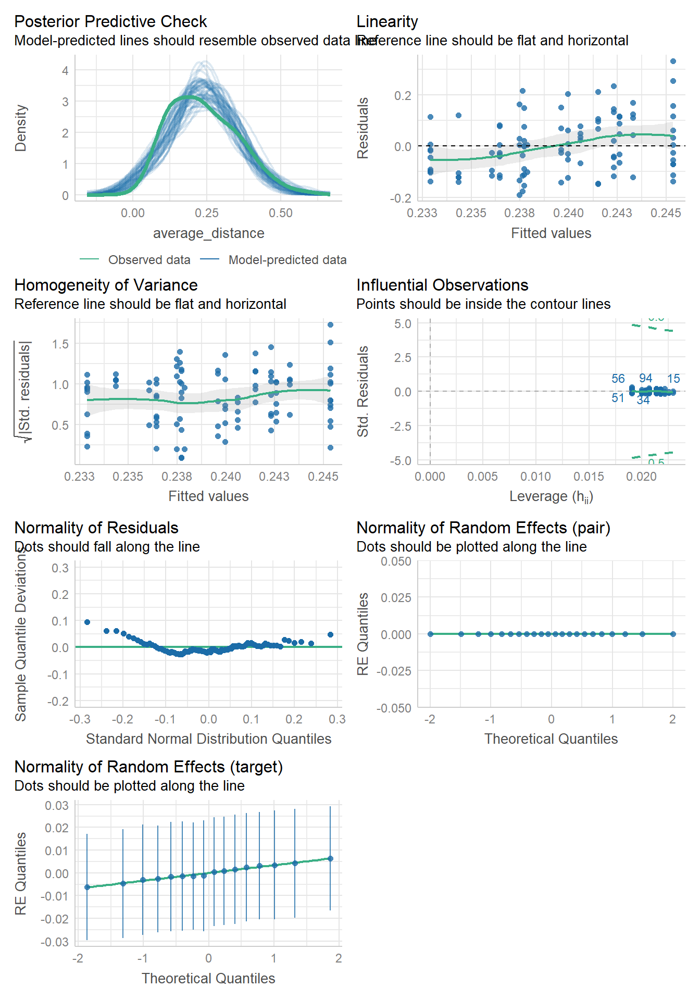<!-- -->

``` r
model_log = lmer(log(average_distance) ~ 1 + (1|pair) + (1|target), 
                 data = subset(df_dtw_zoom))
check_model(model_log)
```

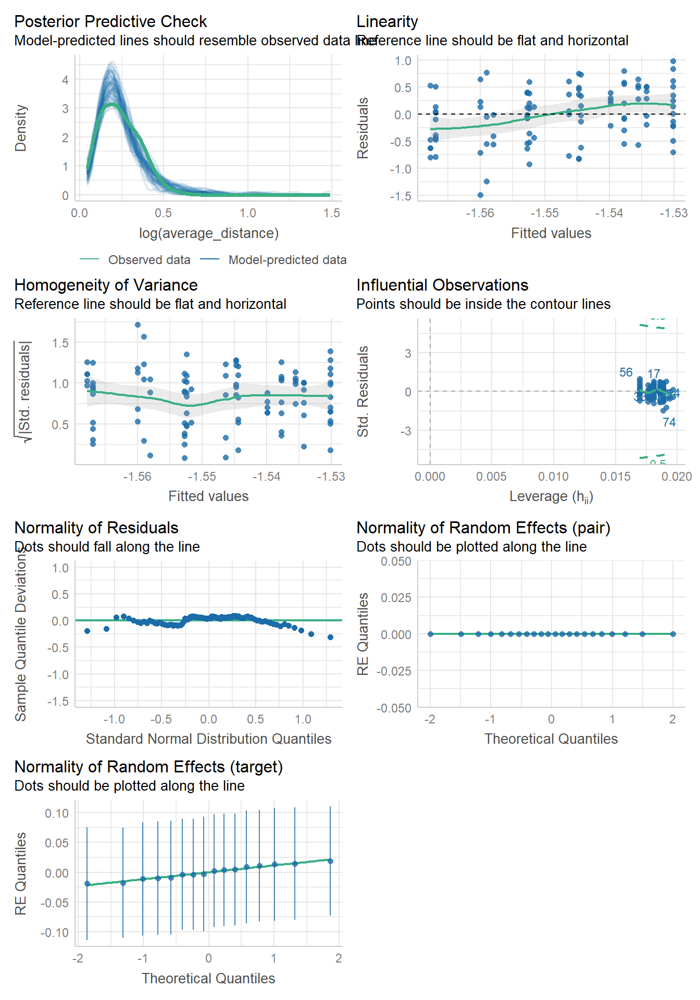<!-- -->

Log-normal model returned a sigular fit (i.e., the model is not able to
estimate the variance of the random effects for pair). Therefore, we
will use linear regression for the analysis.

<br>

### Correlation between distance and n_features

``` r
x = df_dtw_zoom$n_features
y = df_dtw_zoom$average_distance

cor.test(x, y, method="pearson")
```

    ## 
    ##  Pearson's product-moment correlation
    ## 
    ## data:  x and y
    ## t = -4, df = 98, p-value = 0.0003
    ## alternative hypothesis: true correlation is not equal to 0
    ## 95 percent confidence interval:
    ##  -0.517 -0.172
    ## sample estimates:
    ##    cor 
    ## -0.356

``` r
cor.test(x, y, method="spearman")
```

    ## 
    ##  Spearman's rank correlation rho
    ## 
    ## data:  x and y
    ## S = 236345, p-value = 0.00001
    ## alternative hypothesis: true rho is not equal to 0
    ## sample estimates:
    ##    rho 
    ## -0.418

The correlation between the total similarity score and the normalized
DTW distance is significant, suggesting that the more similar features
two gestures have, the smaller the distance is.

<br>

### LMM

#### Number of features

``` r
lmer_zoom_n_features = lmer(average_distance ~ 
                              n_features +
                              (1|pair) + (1|target),
                            data = df_dtw_zoom)

summ(lmer_zoom_n_features, digits = 4)
```

<table class="table table-striped table-hover table-condensed table-responsive" style="width: auto !important; margin-left: auto; margin-right: auto;">

<tbody>

<tr>

<td style="text-align:left;font-weight: bold;">

Observations
</td>

<td style="text-align:right;">

100
</td>

</tr>

<tr>

<td style="text-align:left;font-weight: bold;">

Dependent variable
</td>

<td style="text-align:right;">

average_distance
</td>

</tr>

<tr>

<td style="text-align:left;font-weight: bold;">

Type
</td>

<td style="text-align:right;">

Mixed effects linear regression
</td>

</tr>

</tbody>

</table>

<table class="table table-striped table-hover table-condensed table-responsive" style="width: auto !important; margin-left: auto; margin-right: auto;">

<tbody>

<tr>

<td style="text-align:left;font-weight: bold;">

AIC
</td>

<td style="text-align:right;">

-143.6941
</td>

</tr>

<tr>

<td style="text-align:left;font-weight: bold;">

BIC
</td>

<td style="text-align:right;">

-130.6682
</td>

</tr>

<tr>

<td style="text-align:left;font-weight: bold;">

Pseudo-R² (fixed effects)
</td>

<td style="text-align:right;">

0.1273
</td>

</tr>

<tr>

<td style="text-align:left;font-weight: bold;">

Pseudo-R² (total)
</td>

<td style="text-align:right;">

0.1460
</td>

</tr>

</tbody>

</table>

<table class="table table-striped table-hover table-condensed table-responsive" style="width: auto !important; margin-left: auto; margin-right: auto;border-bottom: 0;">

<thead>

<tr>

<th style="border-bottom:hidden;padding-bottom:0; padding-left:3px;padding-right:3px;text-align: center; " colspan="6">

<div style="border-bottom: 1px solid #ddd; padding-bottom: 5px; ">

Fixed Effects

</div>

</th>

</tr>

<tr>

<th style="text-align:left;">

</th>

<th style="text-align:right;">

Est.
</th>

<th style="text-align:right;">

S.E.
</th>

<th style="text-align:right;">

t val.
</th>

<th style="text-align:right;">

d.f.
</th>

<th style="text-align:right;">

p
</th>

</tr>

</thead>

<tbody>

<tr>

<td style="text-align:left;font-weight: bold;">

(Intercept)
</td>

<td style="text-align:right;">

0.2847
</td>

<td style="text-align:right;">

0.0165
</td>

<td style="text-align:right;">

17.3019
</td>

<td style="text-align:right;">

50.8095
</td>

<td style="text-align:right;">

0.0000
</td>

</tr>

<tr>

<td style="text-align:left;font-weight: bold;">

n_features
</td>

<td style="text-align:right;">

-0.0267
</td>

<td style="text-align:right;">

0.0070
</td>

<td style="text-align:right;">

-3.7990
</td>

<td style="text-align:right;">

97.9152
</td>

<td style="text-align:right;">

0.0003
</td>

</tr>

</tbody>

<tfoot>

<tr>

<td style="padding: 0; " colspan="100%">

<sup></sup> p values calculated using Satterthwaite d.f.
</td>

</tr>

</tfoot>

</table>

<table class="table table-striped table-hover table-condensed table-responsive" style="width: auto !important; margin-left: auto; margin-right: auto;">

<thead>

<tr>

<th style="border-bottom:hidden;padding-bottom:0; padding-left:3px;padding-right:3px;text-align: center; " colspan="3">

<div style="border-bottom: 1px solid #ddd; padding-bottom: 5px; ">

Random Effects

</div>

</th>

</tr>

<tr>

<th>

Group
</th>

<th>

Parameter
</th>

<th>

Std. Dev.
</th>

</tr>

</thead>

<tbody>

<tr>

<td>

pair
</td>

<td>

(Intercept)
</td>

<td>

0.0000
</td>

</tr>

<tr>

<td>

target
</td>

<td>

(Intercept)
</td>

<td>

0.0154
</td>

</tr>

<tr>

<td>

Residual
</td>

<td>

</td>

<td>

0.1040
</td>

</tr>

</tbody>

</table>

<table class="table table-striped table-hover table-condensed table-responsive" style="width: auto !important; margin-left: auto; margin-right: auto;">

<thead>

<tr>

<th style="border-bottom:hidden;padding-bottom:0; padding-left:3px;padding-right:3px;text-align: center; " colspan="3">

<div style="border-bottom: 1px solid #ddd; padding-bottom: 5px; ">

Grouping Variables

</div>

</th>

</tr>

<tr>

<th>

Group
</th>

<th>

\# groups
</th>

<th>

ICC
</th>

</tr>

</thead>

<tbody>

<tr>

<td>

pair
</td>

<td>

22
</td>

<td>

0.0000
</td>

</tr>

<tr>

<td>

target
</td>

<td>

16
</td>

<td>

0.0215
</td>

</tr>

</tbody>

</table>

``` r
check_model(lmer_zoom_n_features)
```

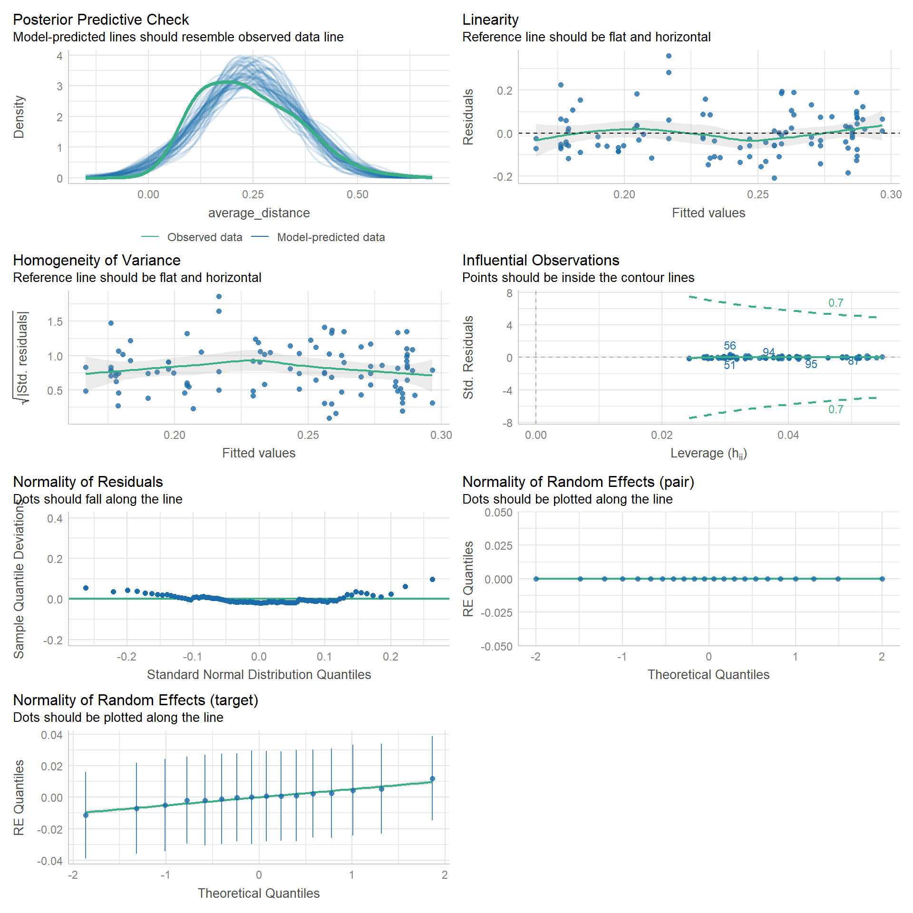<!-- -->

<br>

#### Feature-level analysis

``` r
### each feature
lmer_zoom_shape = lmer(average_distance ~ 
                         handshape_bin + (1|pair) + (1|target),
                       data = df_dtw_zoom)
summ(lmer_zoom_shape, digits = 3)
```

<table class="table table-striped table-hover table-condensed table-responsive" style="width: auto !important; margin-left: auto; margin-right: auto;">

<tbody>

<tr>

<td style="text-align:left;font-weight: bold;">

Observations
</td>

<td style="text-align:right;">

100
</td>

</tr>

<tr>

<td style="text-align:left;font-weight: bold;">

Dependent variable
</td>

<td style="text-align:right;">

average_distance
</td>

</tr>

<tr>

<td style="text-align:left;font-weight: bold;">

Type
</td>

<td style="text-align:right;">

Mixed effects linear regression
</td>

</tr>

</tbody>

</table>

<table class="table table-striped table-hover table-condensed table-responsive" style="width: auto !important; margin-left: auto; margin-right: auto;">

<tbody>

<tr>

<td style="text-align:left;font-weight: bold;">

AIC
</td>

<td style="text-align:right;">

-134.994
</td>

</tr>

<tr>

<td style="text-align:left;font-weight: bold;">

BIC
</td>

<td style="text-align:right;">

-121.968
</td>

</tr>

<tr>

<td style="text-align:left;font-weight: bold;">

Pseudo-R² (fixed effects)
</td>

<td style="text-align:right;">

0.025
</td>

</tr>

<tr>

<td style="text-align:left;font-weight: bold;">

Pseudo-R² (total)
</td>

<td style="text-align:right;">

0.037
</td>

</tr>

</tbody>

</table>

<table class="table table-striped table-hover table-condensed table-responsive" style="width: auto !important; margin-left: auto; margin-right: auto;border-bottom: 0;">

<thead>

<tr>

<th style="border-bottom:hidden;padding-bottom:0; padding-left:3px;padding-right:3px;text-align: center; " colspan="6">

<div style="border-bottom: 1px solid #ddd; padding-bottom: 5px; ">

Fixed Effects

</div>

</th>

</tr>

<tr>

<th style="text-align:left;">

</th>

<th style="text-align:right;">

Est.
</th>

<th style="text-align:right;">

S.E.
</th>

<th style="text-align:right;">

t val.
</th>

<th style="text-align:right;">

d.f.
</th>

<th style="text-align:right;">

p
</th>

</tr>

</thead>

<tbody>

<tr>

<td style="text-align:left;font-weight: bold;">

(Intercept)
</td>

<td style="text-align:right;">

0.236
</td>

<td style="text-align:right;">

0.012
</td>

<td style="text-align:right;">

20.153
</td>

<td style="text-align:right;">

18.533
</td>

<td style="text-align:right;">

0.000
</td>

</tr>

<tr>

<td style="text-align:left;font-weight: bold;">

handshape_bin1
</td>

<td style="text-align:right;">

-0.036
</td>

<td style="text-align:right;">

0.023
</td>

<td style="text-align:right;">

-1.597
</td>

<td style="text-align:right;">

97.941
</td>

<td style="text-align:right;">

0.114
</td>

</tr>

</tbody>

<tfoot>

<tr>

<td style="padding: 0; " colspan="100%">

<sup></sup> p values calculated using Satterthwaite d.f.
</td>

</tr>

</tfoot>

</table>

<table class="table table-striped table-hover table-condensed table-responsive" style="width: auto !important; margin-left: auto; margin-right: auto;">

<thead>

<tr>

<th style="border-bottom:hidden;padding-bottom:0; padding-left:3px;padding-right:3px;text-align: center; " colspan="3">

<div style="border-bottom: 1px solid #ddd; padding-bottom: 5px; ">

Random Effects

</div>

</th>

</tr>

<tr>

<th>

Group
</th>

<th>

Parameter
</th>

<th>

Std. Dev.
</th>

</tr>

</thead>

<tbody>

<tr>

<td>

pair
</td>

<td>

(Intercept)
</td>

<td>

0.000
</td>

</tr>

<tr>

<td>

target
</td>

<td>

(Intercept)
</td>

<td>

0.012
</td>

</tr>

<tr>

<td>

Residual
</td>

<td>

</td>

<td>

0.110
</td>

</tr>

</tbody>

</table>

<table class="table table-striped table-hover table-condensed table-responsive" style="width: auto !important; margin-left: auto; margin-right: auto;">

<thead>

<tr>

<th style="border-bottom:hidden;padding-bottom:0; padding-left:3px;padding-right:3px;text-align: center; " colspan="3">

<div style="border-bottom: 1px solid #ddd; padding-bottom: 5px; ">

Grouping Variables

</div>

</th>

</tr>

<tr>

<th>

Group
</th>

<th>

\# groups
</th>

<th>

ICC
</th>

</tr>

</thead>

<tbody>

<tr>

<td>

pair
</td>

<td>

22
</td>

<td>

0.000
</td>

</tr>

<tr>

<td>

target
</td>

<td>

16
</td>

<td>

0.012
</td>

</tr>

</tbody>

</table>

``` r
lmer_zoom_movement = lmer(average_distance ~ 
                            movement_bin + (1|pair) + (1|target),
                          data = df_dtw_zoom)
summ(lmer_zoom_movement, digits = 3)
```

<table class="table table-striped table-hover table-condensed table-responsive" style="width: auto !important; margin-left: auto; margin-right: auto;">

<tbody>

<tr>

<td style="text-align:left;font-weight: bold;">

Observations
</td>

<td style="text-align:right;">

100
</td>

</tr>

<tr>

<td style="text-align:left;font-weight: bold;">

Dependent variable
</td>

<td style="text-align:right;">

average_distance
</td>

</tr>

<tr>

<td style="text-align:left;font-weight: bold;">

Type
</td>

<td style="text-align:right;">

Mixed effects linear regression
</td>

</tr>

</tbody>

</table>

<table class="table table-striped table-hover table-condensed table-responsive" style="width: auto !important; margin-left: auto; margin-right: auto;">

<tbody>

<tr>

<td style="text-align:left;font-weight: bold;">

AIC
</td>

<td style="text-align:right;">

-139.956
</td>

</tr>

<tr>

<td style="text-align:left;font-weight: bold;">

BIC
</td>

<td style="text-align:right;">

-126.930
</td>

</tr>

<tr>

<td style="text-align:left;font-weight: bold;">

Pseudo-R² (fixed effects)
</td>

<td style="text-align:right;">

0.073
</td>

</tr>

<tr>

<td style="text-align:left;font-weight: bold;">

Pseudo-R² (total)
</td>

<td style="text-align:right;">

0.085
</td>

</tr>

</tbody>

</table>

<table class="table table-striped table-hover table-condensed table-responsive" style="width: auto !important; margin-left: auto; margin-right: auto;border-bottom: 0;">

<thead>

<tr>

<th style="border-bottom:hidden;padding-bottom:0; padding-left:3px;padding-right:3px;text-align: center; " colspan="6">

<div style="border-bottom: 1px solid #ddd; padding-bottom: 5px; ">

Fixed Effects

</div>

</th>

</tr>

<tr>

<th style="text-align:left;">

</th>

<th style="text-align:right;">

Est.
</th>

<th style="text-align:right;">

S.E.
</th>

<th style="text-align:right;">

t val.
</th>

<th style="text-align:right;">

d.f.
</th>

<th style="text-align:right;">

p
</th>

</tr>

</thead>

<tbody>

<tr>

<td style="text-align:left;font-weight: bold;">

(Intercept)
</td>

<td style="text-align:right;">

0.233
</td>

<td style="text-align:right;">

0.011
</td>

<td style="text-align:right;">

20.299
</td>

<td style="text-align:right;">

17.634
</td>

<td style="text-align:right;">

0.000
</td>

</tr>

<tr>

<td style="text-align:left;font-weight: bold;">

movement_bin1
</td>

<td style="text-align:right;">

-0.062
</td>

<td style="text-align:right;">

0.022
</td>

<td style="text-align:right;">

-2.786
</td>

<td style="text-align:right;">

97.944
</td>

<td style="text-align:right;">

0.006
</td>

</tr>

</tbody>

<tfoot>

<tr>

<td style="padding: 0; " colspan="100%">

<sup></sup> p values calculated using Satterthwaite d.f.
</td>

</tr>

</tfoot>

</table>

<table class="table table-striped table-hover table-condensed table-responsive" style="width: auto !important; margin-left: auto; margin-right: auto;">

<thead>

<tr>

<th style="border-bottom:hidden;padding-bottom:0; padding-left:3px;padding-right:3px;text-align: center; " colspan="3">

<div style="border-bottom: 1px solid #ddd; padding-bottom: 5px; ">

Random Effects

</div>

</th>

</tr>

<tr>

<th>

Group
</th>

<th>

Parameter
</th>

<th>

Std. Dev.
</th>

</tr>

</thead>

<tbody>

<tr>

<td>

pair
</td>

<td>

(Intercept)
</td>

<td>

0.000
</td>

</tr>

<tr>

<td>

target
</td>

<td>

(Intercept)
</td>

<td>

0.012
</td>

</tr>

<tr>

<td>

Residual
</td>

<td>

</td>

<td>

0.108
</td>

</tr>

</tbody>

</table>

<table class="table table-striped table-hover table-condensed table-responsive" style="width: auto !important; margin-left: auto; margin-right: auto;">

<thead>

<tr>

<th style="border-bottom:hidden;padding-bottom:0; padding-left:3px;padding-right:3px;text-align: center; " colspan="3">

<div style="border-bottom: 1px solid #ddd; padding-bottom: 5px; ">

Grouping Variables

</div>

</th>

</tr>

<tr>

<th>

Group
</th>

<th>

\# groups
</th>

<th>

ICC
</th>

</tr>

</thead>

<tbody>

<tr>

<td>

pair
</td>

<td>

22
</td>

<td>

0.000
</td>

</tr>

<tr>

<td>

target
</td>

<td>

16
</td>

<td>

0.013
</td>

</tr>

</tbody>

</table>

``` r
lmer_zoom_orientation = lmer(average_distance ~ 
                               orientation_bin + (1|pair) + (1|target),
                             data = df_dtw_zoom)
summ(lmer_zoom_orientation, digits = 3)
```

<table class="table table-striped table-hover table-condensed table-responsive" style="width: auto !important; margin-left: auto; margin-right: auto;">

<tbody>

<tr>

<td style="text-align:left;font-weight: bold;">

Observations
</td>

<td style="text-align:right;">

100
</td>

</tr>

<tr>

<td style="text-align:left;font-weight: bold;">

Dependent variable
</td>

<td style="text-align:right;">

average_distance
</td>

</tr>

<tr>

<td style="text-align:left;font-weight: bold;">

Type
</td>

<td style="text-align:right;">

Mixed effects linear regression
</td>

</tr>

</tbody>

</table>

<table class="table table-striped table-hover table-condensed table-responsive" style="width: auto !important; margin-left: auto; margin-right: auto;">

<tbody>

<tr>

<td style="text-align:left;font-weight: bold;">

AIC
</td>

<td style="text-align:right;">

-136.083
</td>

</tr>

<tr>

<td style="text-align:left;font-weight: bold;">

BIC
</td>

<td style="text-align:right;">

-123.058
</td>

</tr>

<tr>

<td style="text-align:left;font-weight: bold;">

Pseudo-R² (fixed effects)
</td>

<td style="text-align:right;">

0.036
</td>

</tr>

<tr>

<td style="text-align:left;font-weight: bold;">

Pseudo-R² (total)
</td>

<td style="text-align:right;">

0.055
</td>

</tr>

</tbody>

</table>

<table class="table table-striped table-hover table-condensed table-responsive" style="width: auto !important; margin-left: auto; margin-right: auto;border-bottom: 0;">

<thead>

<tr>

<th style="border-bottom:hidden;padding-bottom:0; padding-left:3px;padding-right:3px;text-align: center; " colspan="6">

<div style="border-bottom: 1px solid #ddd; padding-bottom: 5px; ">

Fixed Effects

</div>

</th>

</tr>

<tr>

<th style="text-align:left;">

</th>

<th style="text-align:right;">

Est.
</th>

<th style="text-align:right;">

S.E.
</th>

<th style="text-align:right;">

t val.
</th>

<th style="text-align:right;">

d.f.
</th>

<th style="text-align:right;">

p
</th>

</tr>

</thead>

<tbody>

<tr>

<td style="text-align:left;font-weight: bold;">

(Intercept)
</td>

<td style="text-align:right;">

0.234
</td>

<td style="text-align:right;">

0.012
</td>

<td style="text-align:right;">

19.529
</td>

<td style="text-align:right;">

18.355
</td>

<td style="text-align:right;">

0.000
</td>

</tr>

<tr>

<td style="text-align:left;font-weight: bold;">

orientation_bin1
</td>

<td style="text-align:right;">

-0.043
</td>

<td style="text-align:right;">

0.023
</td>

<td style="text-align:right;">

-1.916
</td>

<td style="text-align:right;">

97.999
</td>

<td style="text-align:right;">

0.058
</td>

</tr>

</tbody>

<tfoot>

<tr>

<td style="padding: 0; " colspan="100%">

<sup></sup> p values calculated using Satterthwaite d.f.
</td>

</tr>

</tfoot>

</table>

<table class="table table-striped table-hover table-condensed table-responsive" style="width: auto !important; margin-left: auto; margin-right: auto;">

<thead>

<tr>

<th style="border-bottom:hidden;padding-bottom:0; padding-left:3px;padding-right:3px;text-align: center; " colspan="3">

<div style="border-bottom: 1px solid #ddd; padding-bottom: 5px; ">

Random Effects

</div>

</th>

</tr>

<tr>

<th>

Group
</th>

<th>

Parameter
</th>

<th>

Std. Dev.
</th>

</tr>

</thead>

<tbody>

<tr>

<td>

pair
</td>

<td>

(Intercept)
</td>

<td>

0.000
</td>

</tr>

<tr>

<td>

target
</td>

<td>

(Intercept)
</td>

<td>

0.016
</td>

</tr>

<tr>

<td>

Residual
</td>

<td>

</td>

<td>

0.109
</td>

</tr>

</tbody>

</table>

<table class="table table-striped table-hover table-condensed table-responsive" style="width: auto !important; margin-left: auto; margin-right: auto;">

<thead>

<tr>

<th style="border-bottom:hidden;padding-bottom:0; padding-left:3px;padding-right:3px;text-align: center; " colspan="3">

<div style="border-bottom: 1px solid #ddd; padding-bottom: 5px; ">

Grouping Variables

</div>

</th>

</tr>

<tr>

<th>

Group
</th>

<th>

\# groups
</th>

<th>

ICC
</th>

</tr>

</thead>

<tbody>

<tr>

<td>

pair
</td>

<td>

22
</td>

<td>

0.000
</td>

</tr>

<tr>

<td>

target
</td>

<td>

16
</td>

<td>

0.020
</td>

</tr>

</tbody>

</table>

``` r
lmer_zoom_position = lmer(average_distance ~ 
                            position_bin + (1|pair) + (1|target),
                          data = df_dtw_zoom)
summ(lmer_zoom_position, digits = 3)
```

<table class="table table-striped table-hover table-condensed table-responsive" style="width: auto !important; margin-left: auto; margin-right: auto;">

<tbody>

<tr>

<td style="text-align:left;font-weight: bold;">

Observations
</td>

<td style="text-align:right;">

100
</td>

</tr>

<tr>

<td style="text-align:left;font-weight: bold;">

Dependent variable
</td>

<td style="text-align:right;">

average_distance
</td>

</tr>

<tr>

<td style="text-align:left;font-weight: bold;">

Type
</td>

<td style="text-align:right;">

Mixed effects linear regression
</td>

</tr>

</tbody>

</table>

<table class="table table-striped table-hover table-condensed table-responsive" style="width: auto !important; margin-left: auto; margin-right: auto;">

<tbody>

<tr>

<td style="text-align:left;font-weight: bold;">

AIC
</td>

<td style="text-align:right;">

-156.091
</td>

</tr>

<tr>

<td style="text-align:left;font-weight: bold;">

BIC
</td>

<td style="text-align:right;">

-143.066
</td>

</tr>

<tr>

<td style="text-align:left;font-weight: bold;">

Pseudo-R² (fixed effects)
</td>

<td style="text-align:right;">

0.212
</td>

</tr>

<tr>

<td style="text-align:left;font-weight: bold;">

Pseudo-R² (total)
</td>

<td style="text-align:right;">

0.222
</td>

</tr>

</tbody>

</table>

<table class="table table-striped table-hover table-condensed table-responsive" style="width: auto !important; margin-left: auto; margin-right: auto;border-bottom: 0;">

<thead>

<tr>

<th style="border-bottom:hidden;padding-bottom:0; padding-left:3px;padding-right:3px;text-align: center; " colspan="6">

<div style="border-bottom: 1px solid #ddd; padding-bottom: 5px; ">

Fixed Effects

</div>

</th>

</tr>

<tr>

<th style="text-align:left;">

</th>

<th style="text-align:right;">

Est.
</th>

<th style="text-align:right;">

S.E.
</th>

<th style="text-align:right;">

t val.
</th>

<th style="text-align:right;">

d.f.
</th>

<th style="text-align:right;">

p
</th>

</tr>

</thead>

<tbody>

<tr>

<td style="text-align:left;font-weight: bold;">

(Intercept)
</td>

<td style="text-align:right;">

0.241
</td>

<td style="text-align:right;">

0.010
</td>

<td style="text-align:right;">

23.240
</td>

<td style="text-align:right;">

19.311
</td>

<td style="text-align:right;">

0.000
</td>

</tr>

<tr>

<td style="text-align:left;font-weight: bold;">

position_bin1
</td>

<td style="text-align:right;">

-0.103
</td>

<td style="text-align:right;">

0.020
</td>

<td style="text-align:right;">

-5.172
</td>

<td style="text-align:right;">

97.512
</td>

<td style="text-align:right;">

0.000
</td>

</tr>

</tbody>

<tfoot>

<tr>

<td style="padding: 0; " colspan="100%">

<sup></sup> p values calculated using Satterthwaite d.f.
</td>

</tr>

</tfoot>

</table>

<table class="table table-striped table-hover table-condensed table-responsive" style="width: auto !important; margin-left: auto; margin-right: auto;">

<thead>

<tr>

<th style="border-bottom:hidden;padding-bottom:0; padding-left:3px;padding-right:3px;text-align: center; " colspan="3">

<div style="border-bottom: 1px solid #ddd; padding-bottom: 5px; ">

Random Effects

</div>

</th>

</tr>

<tr>

<th>

Group
</th>

<th>

Parameter
</th>

<th>

Std. Dev.
</th>

</tr>

</thead>

<tbody>

<tr>

<td>

pair
</td>

<td>

(Intercept)
</td>

<td>

0.000
</td>

</tr>

<tr>

<td>

target
</td>

<td>

(Intercept)
</td>

<td>

0.011
</td>

</tr>

<tr>

<td>

Residual
</td>

<td>

</td>

<td>

0.099
</td>

</tr>

</tbody>

</table>

<table class="table table-striped table-hover table-condensed table-responsive" style="width: auto !important; margin-left: auto; margin-right: auto;">

<thead>

<tr>

<th style="border-bottom:hidden;padding-bottom:0; padding-left:3px;padding-right:3px;text-align: center; " colspan="3">

<div style="border-bottom: 1px solid #ddd; padding-bottom: 5px; ">

Grouping Variables

</div>

</th>

</tr>

<tr>

<th>

Group
</th>

<th>

\# groups
</th>

<th>

ICC
</th>

</tr>

</thead>

<tbody>

<tr>

<td>

pair
</td>

<td>

22
</td>

<td>

0.000
</td>

</tr>

<tr>

<td>

target
</td>

<td>

16
</td>

<td>

0.013
</td>

</tr>

</tbody>

</table>

``` r
### all features
lmer_zoom_feature = lmer(average_distance ~ 
                           handshape_bin + movement_bin + orientation_bin + position_bin +
                           (1|pair) + (1|target),
                         data = df_dtw_zoom)

summ(lmer_zoom_feature, digits = 3)
```

<table class="table table-striped table-hover table-condensed table-responsive" style="width: auto !important; margin-left: auto; margin-right: auto;">

<tbody>

<tr>

<td style="text-align:left;font-weight: bold;">

Observations
</td>

<td style="text-align:right;">

100
</td>

</tr>

<tr>

<td style="text-align:left;font-weight: bold;">

Dependent variable
</td>

<td style="text-align:right;">

average_distance
</td>

</tr>

<tr>

<td style="text-align:left;font-weight: bold;">

Type
</td>

<td style="text-align:right;">

Mixed effects linear regression
</td>

</tr>

</tbody>

</table>

<table class="table table-striped table-hover table-condensed table-responsive" style="width: auto !important; margin-left: auto; margin-right: auto;">

<tbody>

<tr>

<td style="text-align:left;font-weight: bold;">

AIC
</td>

<td style="text-align:right;">

-134.759
</td>

</tr>

<tr>

<td style="text-align:left;font-weight: bold;">

BIC
</td>

<td style="text-align:right;">

-113.917
</td>

</tr>

<tr>

<td style="text-align:left;font-weight: bold;">

Pseudo-R² (fixed effects)
</td>

<td style="text-align:right;">

0.219
</td>

</tr>

<tr>

<td style="text-align:left;font-weight: bold;">

Pseudo-R² (total)
</td>

<td style="text-align:right;">

0.228
</td>

</tr>

</tbody>

</table>

<table class="table table-striped table-hover table-condensed table-responsive" style="width: auto !important; margin-left: auto; margin-right: auto;border-bottom: 0;">

<thead>

<tr>

<th style="border-bottom:hidden;padding-bottom:0; padding-left:3px;padding-right:3px;text-align: center; " colspan="6">

<div style="border-bottom: 1px solid #ddd; padding-bottom: 5px; ">

Fixed Effects

</div>

</th>

</tr>

<tr>

<th style="text-align:left;">

</th>

<th style="text-align:right;">

Est.
</th>

<th style="text-align:right;">

S.E.
</th>

<th style="text-align:right;">

t val.
</th>

<th style="text-align:right;">

d.f.
</th>

<th style="text-align:right;">

p
</th>

</tr>

</thead>

<tbody>

<tr>

<td style="text-align:left;font-weight: bold;">

(Intercept)
</td>

<td style="text-align:right;">

0.239
</td>

<td style="text-align:right;">

0.011
</td>

<td style="text-align:right;">

21.983
</td>

<td style="text-align:right;">

21.347
</td>

<td style="text-align:right;">

0.000
</td>

</tr>

<tr>

<td style="text-align:left;font-weight: bold;">

handshape_bin1
</td>

<td style="text-align:right;">

0.007
</td>

<td style="text-align:right;">

0.027
</td>

<td style="text-align:right;">

0.270
</td>

<td style="text-align:right;">

93.166
</td>

<td style="text-align:right;">

0.788
</td>

</tr>

<tr>

<td style="text-align:left;font-weight: bold;">

movement_bin1
</td>

<td style="text-align:right;">

-0.029
</td>

<td style="text-align:right;">

0.025
</td>

<td style="text-align:right;">

-1.176
</td>

<td style="text-align:right;">

93.711
</td>

<td style="text-align:right;">

0.243
</td>

</tr>

<tr>

<td style="text-align:left;font-weight: bold;">

orientation_bin1
</td>

<td style="text-align:right;">

0.001
</td>

<td style="text-align:right;">

0.028
</td>

<td style="text-align:right;">

0.029
</td>

<td style="text-align:right;">

94.095
</td>

<td style="text-align:right;">

0.977
</td>

</tr>

<tr>

<td style="text-align:left;font-weight: bold;">

position_bin1
</td>

<td style="text-align:right;">

-0.095
</td>

<td style="text-align:right;">

0.022
</td>

<td style="text-align:right;">

-4.266
</td>

<td style="text-align:right;">

93.835
</td>

<td style="text-align:right;">

0.000
</td>

</tr>

</tbody>

<tfoot>

<tr>

<td style="padding: 0; " colspan="100%">

<sup></sup> p values calculated using Satterthwaite d.f.
</td>

</tr>

</tfoot>

</table>

<table class="table table-striped table-hover table-condensed table-responsive" style="width: auto !important; margin-left: auto; margin-right: auto;">

<thead>

<tr>

<th style="border-bottom:hidden;padding-bottom:0; padding-left:3px;padding-right:3px;text-align: center; " colspan="3">

<div style="border-bottom: 1px solid #ddd; padding-bottom: 5px; ">

Random Effects

</div>

</th>

</tr>

<tr>

<th>

Group
</th>

<th>

Parameter
</th>

<th>

Std. Dev.
</th>

</tr>

</thead>

<tbody>

<tr>

<td>

pair
</td>

<td>

(Intercept)
</td>

<td>

0.000
</td>

</tr>

<tr>

<td>

target
</td>

<td>

(Intercept)
</td>

<td>

0.011
</td>

</tr>

<tr>

<td>

Residual
</td>

<td>

</td>

<td>

0.100
</td>

</tr>

</tbody>

</table>

<table class="table table-striped table-hover table-condensed table-responsive" style="width: auto !important; margin-left: auto; margin-right: auto;">

<thead>

<tr>

<th style="border-bottom:hidden;padding-bottom:0; padding-left:3px;padding-right:3px;text-align: center; " colspan="3">

<div style="border-bottom: 1px solid #ddd; padding-bottom: 5px; ">

Grouping Variables

</div>

</th>

</tr>

<tr>

<th>

Group
</th>

<th>

\# groups
</th>

<th>

ICC
</th>

</tr>

</thead>

<tbody>

<tr>

<td>

pair
</td>

<td>

22
</td>

<td>

0.000
</td>

</tr>

<tr>

<td>

target
</td>

<td>

16
</td>

<td>

0.012
</td>

</tr>

</tbody>

</table>

``` r
cov2cor(vcov(lmer_zoom_feature))
```

    ## 5 x 5 Matrix of class "corMatrix"
    ##                  (Intercept) handshape_bin1 movement_bin1 orientation_bin1
    ## (Intercept)           1.0000         0.0303         0.122            0.128
    ## handshape_bin1        0.0303         1.0000        -0.245           -0.496
    ## movement_bin1         0.1224        -0.2450         1.000           -0.210
    ## orientation_bin1      0.1283        -0.4964        -0.210            1.000
    ## position_bin1        -0.1472        -0.0582        -0.228           -0.161
    ##                  position_bin1
    ## (Intercept)            -0.1472
    ## handshape_bin1         -0.0582
    ## movement_bin1          -0.2277
    ## orientation_bin1       -0.1605
    ## position_bin1           1.0000

Regressions on each feature show a significant negative association
between DTW distance and movement and position (handshape and
orientation didn’t reach significance). However, the model with all
features as fixed effects shows such significant negative correlation
only for position.

To check why the effects “disappeared”, we examined the correlation of
fixed effects and found a strong negative correlation between handshape
and orientation (-0.5). This suggests that when the slope estimate for
orientation is more extremely negative, the slope estimate for handshape
becomes flatter (or more positive). This is likely due to the fact that
handshape and orientation are both reflected in relative finger tip
positions.

Again, this suggests a need for developing a different approach to
capturing handshape similarity independently of hand orientation.

<br>

# ===Revised DTW pipeline for Zoom dataset===

A qualitative check on incongruent cases where a pair of gestures was
annotated as similar but it’s DTW distance was large revealed that the
majority of such cases is because of mirrored movements. To tackle this
issue, for gestures where speaker A and B used the opposing hands (e.g.,
speaker used left-hand and speaker B right-hand), we will calculate DTW
distance for both original and flipped videos and take the minimum of
the two.

<br>

## Data wrangling

### Load data

``` r
### Load data
df_dtw_zoom_v2 = read_csv("data/dtw_distance_zoom_mirrored.csv") %>% 
  rename(target = target_2) %>%
  select(comparison_id, pair, target, average_distance, average_distance, hands_dtw) %>%
  mutate(dataset = "zoom",
         pair = as.factor(pair),
         target = as.factor(target))

df_sim_coding_zoom = read_csv("data/similarity_coding_zoom.csv") %>% 
  rename(position = location) %>% 
  mutate(total_similarity = handshape + movement + orientation + position,
         ### binary coding
         handshape_bin = ifelse(handshape >= 4, 1, 0),
         movement_bin = ifelse(movement >= 4, 1, 0),
         orientation_bin = ifelse(orientation >= 4, 1, 0),
         position_bin = ifelse(position >= 4, 1, 0),
         n_features = handshape_bin + movement_bin + orientation_bin + position_bin,
         handshape_bin = factor(handshape_bin, 
                                levels = c(1, 0), 
                                labels = c("similar", "not similar")),
         movement_bin = factor(movement_bin,
                               levels = c(1, 0), 
                               labels = c("similar", "not similar")),
         orientation_bin = factor(orientation_bin,
                                  levels = c(1, 0), 
                                  labels = c("similar", "not similar")),
         position_bin = factor(position_bin,
                               levels = c(1, 0), 
                               labels = c("similar", "not similar")),
         ### z-score
         handshape_z = scale(handshape)[,1],
         movement_z = scale(movement)[,1],
         orientation_z = scale(orientation)[,1],
         position_z = scale(position)[,1],
         total_similarity_z = scale(total_similarity)[,1]) %>% 
  select(-notes)

### combine dtw and coding data for zoom dataset
df_dtw_zoom_v2 = right_join(df_dtw_zoom_v2, df_sim_coding_zoom)

### convert to long format for data visualization
df_dtw_zoom_v2_long = df_dtw_zoom_v2 %>%
  pivot_longer(cols = c("handshape", "movement", "orientation", "position"), 
               names_to = "feature", 
               values_to = "similarity") %>% 
  select(-ends_with("_z"), -ends_with("_bin"))

df_dtw_zoom_v2_long_bin = df_dtw_zoom_v2 %>%
  pivot_longer(cols = c("handshape_bin", "movement_bin", "orientation_bin", "position_bin"), 
               names_to = "feature", 
               values_to = "similarity_bin") %>% 
  mutate(feature = factor(sub("_bin", "", feature),
                          levels = c("handshape", "movement", "orientation", "position"))) %>% 
  select(-handshape, -movement, -orientation, -position, -ends_with("_z"))

df_dtw_zoom_v2_long_z = df_dtw_zoom_v2 %>%
  pivot_longer(cols = c("handshape_z", "movement_z", "orientation_z", "position_z"), 
               names_to = "feature", 
               values_to = "similarity_z") %>% 
  mutate(feature = factor(sub("_z", "", feature),
                          levels = c("handshape", "movement", "orientation", "position"))) %>% 
  select(-handshape, -movement, -orientation, -position, -ends_with("_bin"))

df_dtw_zoom_v2_long = left_join(df_dtw_zoom_v2_long, df_dtw_zoom_v2_long_z) %>% 
  left_join(., df_dtw_zoom_v2_long_bin) %>%
  select(-starts_with("total_similarity"))
```

<br>

### by SMOP features

``` r
dis_zoom_v2_feature = df_dtw_zoom_v2_long %>%
  ggplot(aes(x = feature, y = average_distance, 
             fill = similarity_bin, color = similarity_bin)) +
  ggdist::stat_halfeye(adjust = 1, width = 0.5, .width = 0, ,
                       point_color = NA, alpha = 0.6, justification = -0.4) +
  geom_jitter(aes(x = stage(start = feature, after_scale = x - 0.25)),
              size = 0.3, alpha = 0.7, width = 0.07, height = 0) +
  geom_boxplot(width = .3,
               outlier.shape = NA, 
               alpha = 0.7, 
               color = "black") +
  labs(x="Feature", 
       y="Normalized DTW distance") +
  scale_fill_manual(values = c("#ED6B06", "grey"),
                    name = c("Similarity")) +
  scale_color_manual(values = c("#ED6B06", "grey"),
                    name = c("Similarity")) +
  scale_y_continuous(breaks = seq(0, 1, 0.2)) +
  coord_cartesian(ylim = c(0, 0.7)) +
  theme_classic(base_size = 14) +
  theme(axis.text.x = element_text(colour = "black", size = 13),
        axis.text.y = element_text(colour = "black", size = 13),
        axis.title = element_text(face = 'bold'),
        axis.title.x = element_text(vjust = -2),
        axis.title.y = element_text(vjust = 2),
        strip.text = element_text(face = 'bold'),
        legend.background = element_rect(fill = "white", color = "black"),
        legend.position = "top",
        legend.title = element_blank(),
        plot.margin = unit(c(1.1,1.1,1.1,1.1), "lines"))
  # facet_wrap(~feature, nrow = 2)

# dis_zoom_v2_feature
```

<br>

### by the number of similar features

``` r
dis_zoom_v2_n_features = df_dtw_zoom_v2 %>%
  ggplot(aes(x = n_features, y = average_distance, 
             group = n_features)) +
  ggdist::stat_halfeye(adjust = 1, width = 0.8, .width = 0,
                       point_color = NA, alpha = 0.5) +
  geom_jitter(aes(x = stage(start = n_features, after_scale = x - 0.23)),
              size = 0.01, alpha = 0.5, width = 0.05, height = 0) +
  geom_boxplot(width = .25, outlier.shape = NA, color = "black") +
  geom_smooth(aes(x=as.numeric(n_features), group=NA),
              method = "lm", size = 1) +
  stat_cor(aes(group = 1),
           p.accuracy = 0.001, r.accuracy = 0.01,
           label.y = 0.7,
           method="spearman") +
  labs(x="Number of similar features", 
       y="Normalized DTW distance") +
  scale_y_continuous(breaks = seq(0, 0.8, 0.2)) +
  coord_cartesian(xlim = c(-0.2, 4.6), 
                  ylim = c(0, 0.7)) +
  theme_classic(base_size = 14) +
  theme(axis.text.x = element_text(colour = "black", size = 13),
        axis.text.y = element_text(colour = "black", size = 13),
        axis.title = element_text(face = 'bold'),
        axis.title.x = element_text(vjust = -2),
        axis.title.y = element_text(vjust = 2),
        strip.text = element_text(face = 'bold'),
        legend.position = "none",
        plot.margin = unit(c(1.1,1.1,1.1,1.1), "lines"))

# ggExtra::ggMarginal(dis_zoom_v2_n_features, fill = "lightblue")
```

``` r
dis_zoom_v2_n_features = dis_zoom_v2_n_features + 
  labs(tag = "A") +
  theme(plot.tag.position = c(0,1),
        plot.tag = element_text(vjust = 2, hjust = 0.3))

dis_zoom_v2_feature = dis_zoom_v2_feature + 
  labs(tag = "B") +
  theme(plot.tag.position = c(0,1),
        plot.tag = element_text(vjust = 2, hjust = 0.3))

combined_p = dis_zoom_v2_n_features + dis_zoom_v2_feature + plot_layout(widths = c(5, 5))
combined_p[[2]] = combined_p[[2]] + theme(axis.title.y = element_blank())
combined_p
```

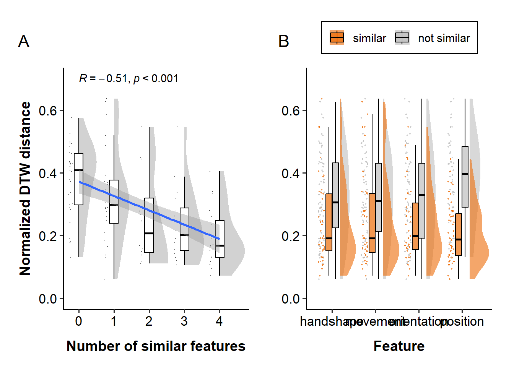<!-- -->

``` r
ggsave("figures/distance_zoom_v2_combined_bin.svg", width=10, height=5, dpi=600)
```

<br>

## Statistical analysis

### Contrast coding

``` r
### apply deviation coding to the features
contrasts(df_dtw_zoom_v2$handshape_bin) = c(0.5, -0.5)
contrasts(df_dtw_zoom_v2$movement_bin) = c(0.5, -0.5)
contrasts(df_dtw_zoom_v2$orientation_bin) = c(0.5, -0.5)
contrasts(df_dtw_zoom_v2$position_bin) = c(0.5, -0.5)

### check the coding
contrasts(df_dtw_zoom_v2$handshape_bin)
```

    ##             [,1]
    ## similar      0.5
    ## not similar -0.5

### Check the normality assumption of errors

Linear mixed-effects models assume that the residuals are normally
distributed. Let’s check this assumption by plotting the residuals of
the models. For this, we will use the `check_model()` function from the
`performance` package.

``` r
model = lmer(average_distance ~ 1 + (1|pair), 
             data = subset(df_dtw_zoom_v2))
check_model(model)
```

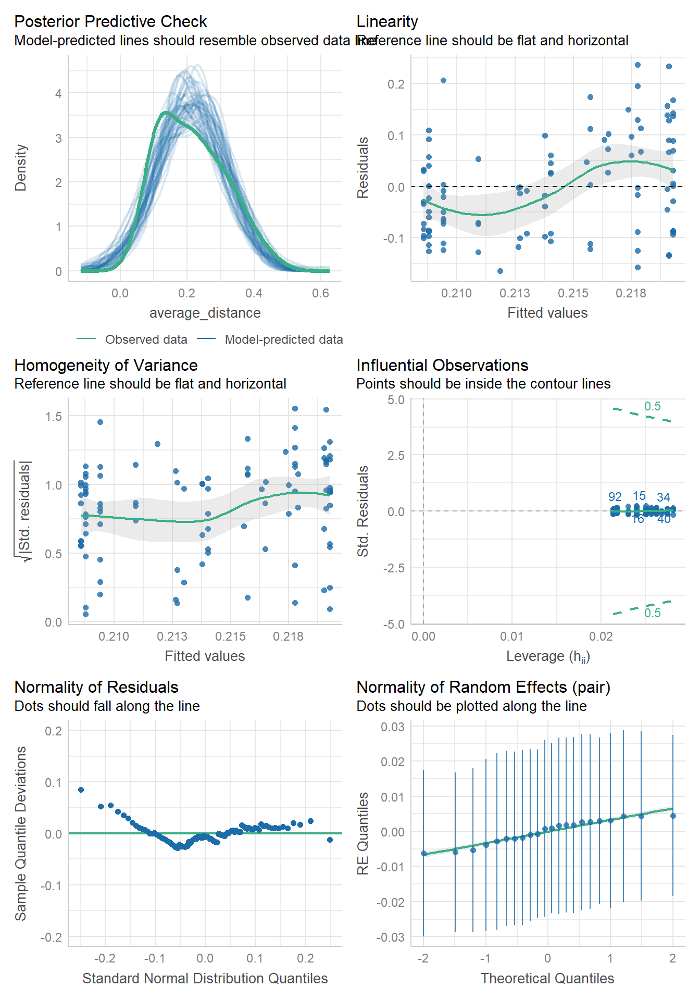<!-- -->

``` r
model_log = lmer(log(average_distance) ~ 1 + (1|pair), 
                 data = subset(df_dtw_zoom_v2))
check_model(model_log)
```

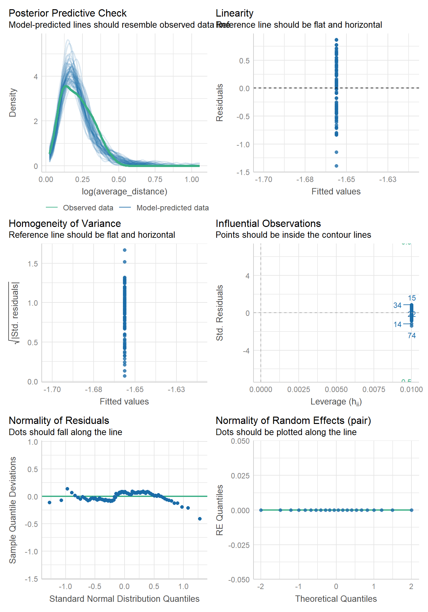<!-- -->

Models including random intercepts for dyads and items returned a
singular fit, most likely because of the small sample size. After
removing the by-item random intercept, the model converged only for the
linear model. Therefore, we will use linear regression for the analysis.

<br>

### Correlation between distance and n_features

``` r
x = df_dtw_zoom_v2$n_features
y = df_dtw_zoom_v2$average_distance

cor.test(x, y, method="pearson")
```

    ## 
    ##  Pearson's product-moment correlation
    ## 
    ## data:  x and y
    ## t = -6, df = 98, p-value = 0.0000003
    ## alternative hypothesis: true correlation is not equal to 0
    ## 95 percent confidence interval:
    ##  -0.624 -0.321
    ## sample estimates:
    ##    cor 
    ## -0.487

``` r
cor.test(x, y, method="spearman")
```

    ## 
    ##  Spearman's rank correlation rho
    ## 
    ## data:  x and y
    ## S = 251839, p-value = 0.00000005
    ## alternative hypothesis: true rho is not equal to 0
    ## sample estimates:
    ##    rho 
    ## -0.511

The modifed DTW pipeline results in a stronger negative correlation (r =
-0.51) between the number of similar features and the normalized DTW
distance compared to the original pipeline (r = -0.41). This suggests
that the modified DTW pipeline is more sensitive to the similarity of
gestures.

<br>

### LMM

#### Number of features

``` r
lmer_zoom_n_features = lmer(average_distance ~ 
                              n_features +
                              (1|pair),
                            data = df_dtw_zoom_v2)

summ(lmer_zoom_n_features, digits = 3)
```

<table class="table table-striped table-hover table-condensed table-responsive" style="width: auto !important; margin-left: auto; margin-right: auto;">

<tbody>

<tr>

<td style="text-align:left;font-weight: bold;">

Observations
</td>

<td style="text-align:right;">

100
</td>

</tr>

<tr>

<td style="text-align:left;font-weight: bold;">

Dependent variable
</td>

<td style="text-align:right;">

average_distance
</td>

</tr>

<tr>

<td style="text-align:left;font-weight: bold;">

Type
</td>

<td style="text-align:right;">

Mixed effects linear regression
</td>

</tr>

</tbody>

</table>

<table class="table table-striped table-hover table-condensed table-responsive" style="width: auto !important; margin-left: auto; margin-right: auto;">

<tbody>

<tr>

<td style="text-align:left;font-weight: bold;">

AIC
</td>

<td style="text-align:right;">

-183.931
</td>

</tr>

<tr>

<td style="text-align:left;font-weight: bold;">

BIC
</td>

<td style="text-align:right;">

-173.510
</td>

</tr>

<tr>

<td style="text-align:left;font-weight: bold;">

Pseudo-R² (fixed effects)
</td>

<td style="text-align:right;">

0.235
</td>

</tr>

<tr>

<td style="text-align:left;font-weight: bold;">

Pseudo-R² (total)
</td>

<td style="text-align:right;">

0.266
</td>

</tr>

</tbody>

</table>

<table class="table table-striped table-hover table-condensed table-responsive" style="width: auto !important; margin-left: auto; margin-right: auto;border-bottom: 0;">

<thead>

<tr>

<th style="border-bottom:hidden;padding-bottom:0; padding-left:3px;padding-right:3px;text-align: center; " colspan="6">

<div style="border-bottom: 1px solid #ddd; padding-bottom: 5px; ">

Fixed Effects

</div>

</th>

</tr>

<tr>

<th style="text-align:left;">

</th>

<th style="text-align:right;">

Est.
</th>

<th style="text-align:right;">

S.E.
</th>

<th style="text-align:right;">

t val.
</th>

<th style="text-align:right;">

d.f.
</th>

<th style="text-align:right;">

p
</th>

</tr>

</thead>

<tbody>

<tr>

<td style="text-align:left;font-weight: bold;">

(Intercept)
</td>

<td style="text-align:right;">

0.269
</td>

<td style="text-align:right;">

0.014
</td>

<td style="text-align:right;">

19.718
</td>

<td style="text-align:right;">

54.070
</td>

<td style="text-align:right;">

0.000
</td>

</tr>

<tr>

<td style="text-align:left;font-weight: bold;">

n_features
</td>

<td style="text-align:right;">

-0.032
</td>

<td style="text-align:right;">

0.006
</td>

<td style="text-align:right;">

-5.577
</td>

<td style="text-align:right;">

92.999
</td>

<td style="text-align:right;">

0.000
</td>

</tr>

</tbody>

<tfoot>

<tr>

<td style="padding: 0; " colspan="100%">

<sup></sup> p values calculated using Satterthwaite d.f.
</td>

</tr>

</tfoot>

</table>

<table class="table table-striped table-hover table-condensed table-responsive" style="width: auto !important; margin-left: auto; margin-right: auto;">

<thead>

<tr>

<th style="border-bottom:hidden;padding-bottom:0; padding-left:3px;padding-right:3px;text-align: center; " colspan="3">

<div style="border-bottom: 1px solid #ddd; padding-bottom: 5px; ">

Random Effects

</div>

</th>

</tr>

<tr>

<th>

Group
</th>

<th>

Parameter
</th>

<th>

Std. Dev.
</th>

</tr>

</thead>

<tbody>

<tr>

<td>

pair
</td>

<td>

(Intercept)
</td>

<td>

0.018
</td>

</tr>

<tr>

<td>

Residual
</td>

<td>

</td>

<td>

0.085
</td>

</tr>

</tbody>

</table>

<table class="table table-striped table-hover table-condensed table-responsive" style="width: auto !important; margin-left: auto; margin-right: auto;">

<thead>

<tr>

<th style="border-bottom:hidden;padding-bottom:0; padding-left:3px;padding-right:3px;text-align: center; " colspan="3">

<div style="border-bottom: 1px solid #ddd; padding-bottom: 5px; ">

Grouping Variables

</div>

</th>

</tr>

<tr>

<th>

Group
</th>

<th>

\# groups
</th>

<th>

ICC
</th>

</tr>

</thead>

<tbody>

<tr>

<td>

pair
</td>

<td>

22
</td>

<td>

0.041
</td>

</tr>

</tbody>

</table>

``` r
check_model(lmer_zoom_n_features)
```

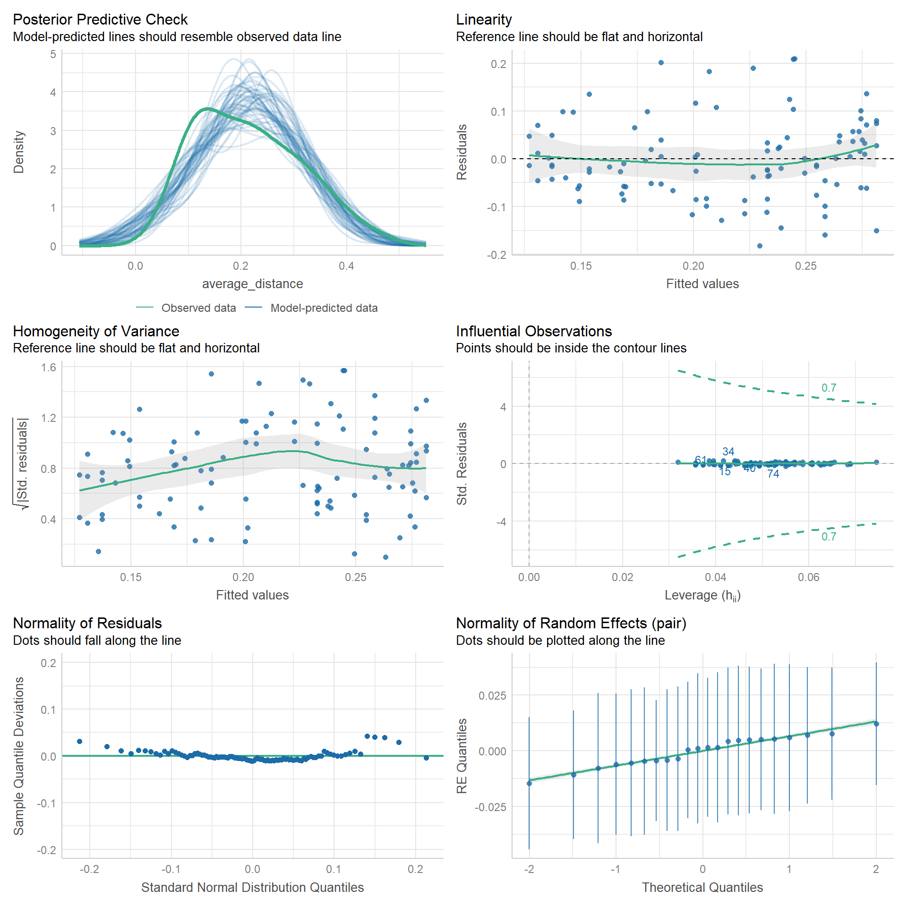<!-- -->

<br>

#### Feature-level analysis

``` r
### each feature
lmer_zoom_shape = lmer(average_distance ~ 
                         handshape_bin + (1|pair),
                       data = df_dtw_zoom_v2)
summ(lmer_zoom_shape, digits = 3)
```

<table class="table table-striped table-hover table-condensed table-responsive" style="width: auto !important; margin-left: auto; margin-right: auto;">

<tbody>

<tr>

<td style="text-align:left;font-weight: bold;">

Observations
</td>

<td style="text-align:right;">

100
</td>

</tr>

<tr>

<td style="text-align:left;font-weight: bold;">

Dependent variable
</td>

<td style="text-align:right;">

average_distance
</td>

</tr>

<tr>

<td style="text-align:left;font-weight: bold;">

Type
</td>

<td style="text-align:right;">

Mixed effects linear regression
</td>

</tr>

</tbody>

</table>

<table class="table table-striped table-hover table-condensed table-responsive" style="width: auto !important; margin-left: auto; margin-right: auto;">

<tbody>

<tr>

<td style="text-align:left;font-weight: bold;">

AIC
</td>

<td style="text-align:right;">

-168.673
</td>

</tr>

<tr>

<td style="text-align:left;font-weight: bold;">

BIC
</td>

<td style="text-align:right;">

-158.252
</td>

</tr>

<tr>

<td style="text-align:left;font-weight: bold;">

Pseudo-R² (fixed effects)
</td>

<td style="text-align:right;">

0.090
</td>

</tr>

<tr>

<td style="text-align:left;font-weight: bold;">

Pseudo-R² (total)
</td>

<td style="text-align:right;">

0.129
</td>

</tr>

</tbody>

</table>

<table class="table table-striped table-hover table-condensed table-responsive" style="width: auto !important; margin-left: auto; margin-right: auto;border-bottom: 0;">

<thead>

<tr>

<th style="border-bottom:hidden;padding-bottom:0; padding-left:3px;padding-right:3px;text-align: center; " colspan="6">

<div style="border-bottom: 1px solid #ddd; padding-bottom: 5px; ">

Fixed Effects

</div>

</th>

</tr>

<tr>

<th style="text-align:left;">

</th>

<th style="text-align:right;">

Est.
</th>

<th style="text-align:right;">

S.E.
</th>

<th style="text-align:right;">

t val.
</th>

<th style="text-align:right;">

d.f.
</th>

<th style="text-align:right;">

p
</th>

</tr>

</thead>

<tbody>

<tr>

<td style="text-align:left;font-weight: bold;">

(Intercept)
</td>

<td style="text-align:right;">

0.210
</td>

<td style="text-align:right;">

0.011
</td>

<td style="text-align:right;">

19.369
</td>

<td style="text-align:right;">

12.436
</td>

<td style="text-align:right;">

0.000
</td>

</tr>

<tr>

<td style="text-align:left;font-weight: bold;">

handshape_bin1
</td>

<td style="text-align:right;">

-0.060
</td>

<td style="text-align:right;">

0.019
</td>

<td style="text-align:right;">

-3.165
</td>

<td style="text-align:right;">

95.325
</td>

<td style="text-align:right;">

0.002
</td>

</tr>

</tbody>

<tfoot>

<tr>

<td style="padding: 0; " colspan="100%">

<sup></sup> p values calculated using Satterthwaite d.f.
</td>

</tr>

</tfoot>

</table>

<table class="table table-striped table-hover table-condensed table-responsive" style="width: auto !important; margin-left: auto; margin-right: auto;">

<thead>

<tr>

<th style="border-bottom:hidden;padding-bottom:0; padding-left:3px;padding-right:3px;text-align: center; " colspan="3">

<div style="border-bottom: 1px solid #ddd; padding-bottom: 5px; ">

Random Effects

</div>

</th>

</tr>

<tr>

<th>

Group
</th>

<th>

Parameter
</th>

<th>

Std. Dev.
</th>

</tr>

</thead>

<tbody>

<tr>

<td>

pair
</td>

<td>

(Intercept)
</td>

<td>

0.020
</td>

</tr>

<tr>

<td>

Residual
</td>

<td>

</td>

<td>

0.093
</td>

</tr>

</tbody>

</table>

<table class="table table-striped table-hover table-condensed table-responsive" style="width: auto !important; margin-left: auto; margin-right: auto;">

<thead>

<tr>

<th style="border-bottom:hidden;padding-bottom:0; padding-left:3px;padding-right:3px;text-align: center; " colspan="3">

<div style="border-bottom: 1px solid #ddd; padding-bottom: 5px; ">

Grouping Variables

</div>

</th>

</tr>

<tr>

<th>

Group
</th>

<th>

\# groups
</th>

<th>

ICC
</th>

</tr>

</thead>

<tbody>

<tr>

<td>

pair
</td>

<td>

22
</td>

<td>

0.043
</td>

</tr>

</tbody>

</table>

``` r
lmer_zoom_movement = lmer(average_distance ~ 
                            movement_bin + (1|pair),
                          data = df_dtw_zoom_v2)
summ(lmer_zoom_movement, digits = 3)
```

<table class="table table-striped table-hover table-condensed table-responsive" style="width: auto !important; margin-left: auto; margin-right: auto;">

<tbody>

<tr>

<td style="text-align:left;font-weight: bold;">

Observations
</td>

<td style="text-align:right;">

100
</td>

</tr>

<tr>

<td style="text-align:left;font-weight: bold;">

Dependent variable
</td>

<td style="text-align:right;">

average_distance
</td>

</tr>

<tr>

<td style="text-align:left;font-weight: bold;">

Type
</td>

<td style="text-align:right;">

Mixed effects linear regression
</td>

</tr>

</tbody>

</table>

<table class="table table-striped table-hover table-condensed table-responsive" style="width: auto !important; margin-left: auto; margin-right: auto;">

<tbody>

<tr>

<td style="text-align:left;font-weight: bold;">

AIC
</td>

<td style="text-align:right;">

-165.152
</td>

</tr>

<tr>

<td style="text-align:left;font-weight: bold;">

BIC
</td>

<td style="text-align:right;">

-154.731
</td>

</tr>

<tr>

<td style="text-align:left;font-weight: bold;">

Pseudo-R² (fixed effects)
</td>

<td style="text-align:right;">

0.057
</td>

</tr>

<tr>

<td style="text-align:left;font-weight: bold;">

Pseudo-R² (total)
</td>

<td style="text-align:right;">

0.083
</td>

</tr>

</tbody>

</table>

<table class="table table-striped table-hover table-condensed table-responsive" style="width: auto !important; margin-left: auto; margin-right: auto;border-bottom: 0;">

<thead>

<tr>

<th style="border-bottom:hidden;padding-bottom:0; padding-left:3px;padding-right:3px;text-align: center; " colspan="6">

<div style="border-bottom: 1px solid #ddd; padding-bottom: 5px; ">

Fixed Effects

</div>

</th>

</tr>

<tr>

<th style="text-align:left;">

</th>

<th style="text-align:right;">

Est.
</th>

<th style="text-align:right;">

S.E.
</th>

<th style="text-align:right;">

t val.
</th>

<th style="text-align:right;">

d.f.
</th>

<th style="text-align:right;">

p
</th>

</tr>

</thead>

<tbody>

<tr>

<td style="text-align:left;font-weight: bold;">

(Intercept)
</td>

<td style="text-align:right;">

0.210
</td>

<td style="text-align:right;">

0.011
</td>

<td style="text-align:right;">

19.754
</td>

<td style="text-align:right;">

14.173
</td>

<td style="text-align:right;">

0.000
</td>

</tr>

<tr>

<td style="text-align:left;font-weight: bold;">

movement_bin1
</td>

<td style="text-align:right;">

-0.048
</td>

<td style="text-align:right;">

0.019
</td>

<td style="text-align:right;">

-2.468
</td>

<td style="text-align:right;">

93.861
</td>

<td style="text-align:right;">

0.015
</td>

</tr>

</tbody>

<tfoot>

<tr>

<td style="padding: 0; " colspan="100%">

<sup></sup> p values calculated using Satterthwaite d.f.
</td>

</tr>

</tfoot>

</table>

<table class="table table-striped table-hover table-condensed table-responsive" style="width: auto !important; margin-left: auto; margin-right: auto;">

<thead>

<tr>

<th style="border-bottom:hidden;padding-bottom:0; padding-left:3px;padding-right:3px;text-align: center; " colspan="3">

<div style="border-bottom: 1px solid #ddd; padding-bottom: 5px; ">

Random Effects

</div>

</th>

</tr>

<tr>

<th>

Group
</th>

<th>

Parameter
</th>

<th>

Std. Dev.
</th>

</tr>

</thead>

<tbody>

<tr>

<td>

pair
</td>

<td>

(Intercept)
</td>

<td>

0.016
</td>

</tr>

<tr>

<td>

Residual
</td>

<td>

</td>

<td>

0.095
</td>

</tr>

</tbody>

</table>

<table class="table table-striped table-hover table-condensed table-responsive" style="width: auto !important; margin-left: auto; margin-right: auto;">

<thead>

<tr>

<th style="border-bottom:hidden;padding-bottom:0; padding-left:3px;padding-right:3px;text-align: center; " colspan="3">

<div style="border-bottom: 1px solid #ddd; padding-bottom: 5px; ">

Grouping Variables

</div>

</th>

</tr>

<tr>

<th>

Group
</th>

<th>

\# groups
</th>

<th>

ICC
</th>

</tr>

</thead>

<tbody>

<tr>

<td>

pair
</td>

<td>

22
</td>

<td>

0.028
</td>

</tr>

</tbody>

</table>

``` r
lmer_zoom_orientation = lmer(average_distance ~ 
                               orientation_bin + (1|pair),
                             data = df_dtw_zoom_v2)
summ(lmer_zoom_orientation, digits = 3)
```

<table class="table table-striped table-hover table-condensed table-responsive" style="width: auto !important; margin-left: auto; margin-right: auto;">

<tbody>

<tr>

<td style="text-align:left;font-weight: bold;">

Observations
</td>

<td style="text-align:right;">

100
</td>

</tr>

<tr>

<td style="text-align:left;font-weight: bold;">

Dependent variable
</td>

<td style="text-align:right;">

average_distance
</td>

</tr>

<tr>

<td style="text-align:left;font-weight: bold;">

Type
</td>

<td style="text-align:right;">

Mixed effects linear regression
</td>

</tr>

</tbody>

</table>

<table class="table table-striped table-hover table-condensed table-responsive" style="width: auto !important; margin-left: auto; margin-right: auto;">

<tbody>

<tr>

<td style="text-align:left;font-weight: bold;">

AIC
</td>

<td style="text-align:right;">

-170.282
</td>

</tr>

<tr>

<td style="text-align:left;font-weight: bold;">

BIC
</td>

<td style="text-align:right;">

-159.861
</td>

</tr>

<tr>

<td style="text-align:left;font-weight: bold;">

Pseudo-R² (fixed effects)
</td>

<td style="text-align:right;">

0.105
</td>

</tr>

<tr>

<td style="text-align:left;font-weight: bold;">

Pseudo-R² (total)
</td>

<td style="text-align:right;">

0.160
</td>

</tr>

</tbody>

</table>

<table class="table table-striped table-hover table-condensed table-responsive" style="width: auto !important; margin-left: auto; margin-right: auto;border-bottom: 0;">

<thead>

<tr>

<th style="border-bottom:hidden;padding-bottom:0; padding-left:3px;padding-right:3px;text-align: center; " colspan="6">

<div style="border-bottom: 1px solid #ddd; padding-bottom: 5px; ">

Fixed Effects

</div>

</th>

</tr>

<tr>

<th style="text-align:left;">

</th>

<th style="text-align:right;">

Est.
</th>

<th style="text-align:right;">

S.E.
</th>

<th style="text-align:right;">

t val.
</th>

<th style="text-align:right;">

d.f.
</th>

<th style="text-align:right;">

p
</th>

</tr>

</thead>

<tbody>

<tr>

<td style="text-align:left;font-weight: bold;">

(Intercept)
</td>

<td style="text-align:right;">

0.208
</td>

<td style="text-align:right;">

0.011
</td>

<td style="text-align:right;">

18.394
</td>

<td style="text-align:right;">

12.179
</td>

<td style="text-align:right;">

0.000
</td>

</tr>

<tr>

<td style="text-align:left;font-weight: bold;">

orientation_bin1
</td>

<td style="text-align:right;">

-0.066
</td>

<td style="text-align:right;">

0.019
</td>

<td style="text-align:right;">

-3.467
</td>

<td style="text-align:right;">

93.433
</td>

<td style="text-align:right;">

0.001
</td>

</tr>

</tbody>

<tfoot>

<tr>

<td style="padding: 0; " colspan="100%">

<sup></sup> p values calculated using Satterthwaite d.f.
</td>

</tr>

</tfoot>

</table>

<table class="table table-striped table-hover table-condensed table-responsive" style="width: auto !important; margin-left: auto; margin-right: auto;">

<thead>

<tr>

<th style="border-bottom:hidden;padding-bottom:0; padding-left:3px;padding-right:3px;text-align: center; " colspan="3">

<div style="border-bottom: 1px solid #ddd; padding-bottom: 5px; ">

Random Effects

</div>

</th>

</tr>

<tr>

<th>

Group
</th>

<th>

Parameter
</th>

<th>

Std. Dev.
</th>

</tr>

</thead>

<tbody>

<tr>

<td>

pair
</td>

<td>

(Intercept)
</td>

<td>

0.023
</td>

</tr>

<tr>

<td>

Residual
</td>

<td>

</td>

<td>

0.091
</td>

</tr>

</tbody>

</table>

<table class="table table-striped table-hover table-condensed table-responsive" style="width: auto !important; margin-left: auto; margin-right: auto;">

<thead>

<tr>

<th style="border-bottom:hidden;padding-bottom:0; padding-left:3px;padding-right:3px;text-align: center; " colspan="3">

<div style="border-bottom: 1px solid #ddd; padding-bottom: 5px; ">

Grouping Variables

</div>

</th>

</tr>

<tr>

<th>

Group
</th>

<th>

\# groups
</th>

<th>

ICC
</th>

</tr>

</thead>

<tbody>

<tr>

<td>

pair
</td>

<td>

22
</td>

<td>

0.061
</td>

</tr>

</tbody>

</table>

``` r
lmer_zoom_position = lmer(average_distance ~ 
                            position_bin + (1|pair),
                          data = df_dtw_zoom_v2)
summ(lmer_zoom_position, digits = 3)
```

<table class="table table-striped table-hover table-condensed table-responsive" style="width: auto !important; margin-left: auto; margin-right: auto;">

<tbody>

<tr>

<td style="text-align:left;font-weight: bold;">

Observations
</td>

<td style="text-align:right;">

100
</td>

</tr>

<tr>

<td style="text-align:left;font-weight: bold;">

Dependent variable
</td>

<td style="text-align:right;">

average_distance
</td>

</tr>

<tr>

<td style="text-align:left;font-weight: bold;">

Type
</td>

<td style="text-align:right;">

Mixed effects linear regression
</td>

</tr>

</tbody>

</table>

<table class="table table-striped table-hover table-condensed table-responsive" style="width: auto !important; margin-left: auto; margin-right: auto;">

<tbody>

<tr>

<td style="text-align:left;font-weight: bold;">

AIC
</td>

<td style="text-align:right;">

-207.468
</td>

</tr>

<tr>

<td style="text-align:left;font-weight: bold;">

BIC
</td>

<td style="text-align:right;">

-197.047
</td>

</tr>

<tr>

<td style="text-align:left;font-weight: bold;">

Pseudo-R² (fixed effects)
</td>

<td style="text-align:right;">

0.387
</td>

</tr>

<tr>

<td style="text-align:left;font-weight: bold;">

Pseudo-R² (total)
</td>

<td style="text-align:right;">

0.390
</td>

</tr>

</tbody>

</table>

<table class="table table-striped table-hover table-condensed table-responsive" style="width: auto !important; margin-left: auto; margin-right: auto;border-bottom: 0;">

<thead>

<tr>

<th style="border-bottom:hidden;padding-bottom:0; padding-left:3px;padding-right:3px;text-align: center; " colspan="6">

<div style="border-bottom: 1px solid #ddd; padding-bottom: 5px; ">

Fixed Effects

</div>

</th>

</tr>

<tr>

<th style="text-align:left;">

</th>

<th style="text-align:right;">

Est.
</th>

<th style="text-align:right;">

S.E.
</th>

<th style="text-align:right;">

t val.
</th>

<th style="text-align:right;">

d.f.
</th>

<th style="text-align:right;">

p
</th>

</tr>

</thead>

<tbody>

<tr>

<td style="text-align:left;font-weight: bold;">

(Intercept)
</td>

<td style="text-align:right;">

0.217
</td>

<td style="text-align:right;">

0.008
</td>

<td style="text-align:right;">

27.453
</td>

<td style="text-align:right;">

13.627
</td>

<td style="text-align:right;">

0.000
</td>

</tr>

<tr>

<td style="text-align:left;font-weight: bold;">

position_bin1
</td>

<td style="text-align:right;">

-0.122
</td>

<td style="text-align:right;">

0.016
</td>

<td style="text-align:right;">

-7.897
</td>

<td style="text-align:right;">

97.410
</td>

<td style="text-align:right;">

0.000
</td>

</tr>

</tbody>

<tfoot>

<tr>

<td style="padding: 0; " colspan="100%">

<sup></sup> p values calculated using Satterthwaite d.f.
</td>

</tr>

</tfoot>

</table>

<table class="table table-striped table-hover table-condensed table-responsive" style="width: auto !important; margin-left: auto; margin-right: auto;">

<thead>

<tr>

<th style="border-bottom:hidden;padding-bottom:0; padding-left:3px;padding-right:3px;text-align: center; " colspan="3">

<div style="border-bottom: 1px solid #ddd; padding-bottom: 5px; ">

Random Effects

</div>

</th>

</tr>

<tr>

<th>

Group
</th>

<th>

Parameter
</th>

<th>

Std. Dev.
</th>

</tr>

</thead>

<tbody>

<tr>

<td>

pair
</td>

<td>

(Intercept)
</td>

<td>

0.006
</td>

</tr>

<tr>

<td>

Residual
</td>

<td>

</td>

<td>

0.077
</td>

</tr>

</tbody>

</table>

<table class="table table-striped table-hover table-condensed table-responsive" style="width: auto !important; margin-left: auto; margin-right: auto;">

<thead>

<tr>

<th style="border-bottom:hidden;padding-bottom:0; padding-left:3px;padding-right:3px;text-align: center; " colspan="3">

<div style="border-bottom: 1px solid #ddd; padding-bottom: 5px; ">

Grouping Variables

</div>

</th>

</tr>

<tr>

<th>

Group
</th>

<th>

\# groups
</th>

<th>

ICC
</th>

</tr>

</thead>

<tbody>

<tr>

<td>

pair
</td>

<td>

22
</td>

<td>

0.005
</td>

</tr>

</tbody>

</table>

``` r
### all features
lmer_zoom_feature = lmer(average_distance ~ 
                           handshape_bin + movement_bin + orientation_bin + position_bin +
                           (1|pair),
                         data = df_dtw_zoom_v2)

summ(lmer_zoom_feature, digits = 3)
```

<table class="table table-striped table-hover table-condensed table-responsive" style="width: auto !important; margin-left: auto; margin-right: auto;">

<tbody>

<tr>

<td style="text-align:left;font-weight: bold;">

Observations
</td>

<td style="text-align:right;">

100
</td>

</tr>

<tr>

<td style="text-align:left;font-weight: bold;">

Dependent variable
</td>

<td style="text-align:right;">

average_distance
</td>

</tr>

<tr>

<td style="text-align:left;font-weight: bold;">

Type
</td>

<td style="text-align:right;">

Mixed effects linear regression
</td>

</tr>

</tbody>

</table>

<table class="table table-striped table-hover table-condensed table-responsive" style="width: auto !important; margin-left: auto; margin-right: auto;">

<tbody>

<tr>

<td style="text-align:left;font-weight: bold;">

AIC
</td>

<td style="text-align:right;">

-185.957
</td>

</tr>

<tr>

<td style="text-align:left;font-weight: bold;">

BIC
</td>

<td style="text-align:right;">

-167.721
</td>

</tr>

<tr>

<td style="text-align:left;font-weight: bold;">

Pseudo-R² (fixed effects)
</td>

<td style="text-align:right;">

0.396
</td>

</tr>

<tr>

<td style="text-align:left;font-weight: bold;">

Pseudo-R² (total)
</td>

<td style="text-align:right;">

0.409
</td>

</tr>

</tbody>

</table>

<table class="table table-striped table-hover table-condensed table-responsive" style="width: auto !important; margin-left: auto; margin-right: auto;border-bottom: 0;">

<thead>

<tr>

<th style="border-bottom:hidden;padding-bottom:0; padding-left:3px;padding-right:3px;text-align: center; " colspan="6">

<div style="border-bottom: 1px solid #ddd; padding-bottom: 5px; ">

Fixed Effects

</div>

</th>

</tr>

<tr>

<th style="text-align:left;">

</th>

<th style="text-align:right;">

Est.
</th>

<th style="text-align:right;">

S.E.
</th>

<th style="text-align:right;">

t val.
</th>

<th style="text-align:right;">

d.f.
</th>

<th style="text-align:right;">

p
</th>

</tr>

</thead>

<tbody>

<tr>

<td style="text-align:left;font-weight: bold;">

(Intercept)
</td>

<td style="text-align:right;">

0.214
</td>

<td style="text-align:right;">

0.009
</td>

<td style="text-align:right;">

24.929
</td>

<td style="text-align:right;">

15.915
</td>

<td style="text-align:right;">

0.000
</td>

</tr>

<tr>

<td style="text-align:left;font-weight: bold;">

handshape_bin1
</td>

<td style="text-align:right;">

-0.020
</td>

<td style="text-align:right;">

0.021
</td>

<td style="text-align:right;">

-0.937
</td>

<td style="text-align:right;">

94.588
</td>

<td style="text-align:right;">

0.351
</td>

</tr>

<tr>

<td style="text-align:left;font-weight: bold;">

movement_bin1
</td>

<td style="text-align:right;">

0.014
</td>

<td style="text-align:right;">

0.019
</td>

<td style="text-align:right;">

0.736
</td>

<td style="text-align:right;">

94.984
</td>

<td style="text-align:right;">

0.464
</td>

</tr>

<tr>

<td style="text-align:left;font-weight: bold;">

orientation_bin1
</td>

<td style="text-align:right;">

-0.016
</td>

<td style="text-align:right;">

0.021
</td>

<td style="text-align:right;">

-0.771
</td>

<td style="text-align:right;">

93.739
</td>

<td style="text-align:right;">

0.443
</td>

</tr>

<tr>

<td style="text-align:left;font-weight: bold;">

position_bin1
</td>

<td style="text-align:right;">

-0.116
</td>

<td style="text-align:right;">

0.017
</td>

<td style="text-align:right;">

-6.716
</td>

<td style="text-align:right;">

94.001
</td>

<td style="text-align:right;">

0.000
</td>

</tr>

</tbody>

<tfoot>

<tr>

<td style="padding: 0; " colspan="100%">

<sup></sup> p values calculated using Satterthwaite d.f.
</td>

</tr>

</tfoot>

</table>

<table class="table table-striped table-hover table-condensed table-responsive" style="width: auto !important; margin-left: auto; margin-right: auto;">

<thead>

<tr>

<th style="border-bottom:hidden;padding-bottom:0; padding-left:3px;padding-right:3px;text-align: center; " colspan="3">

<div style="border-bottom: 1px solid #ddd; padding-bottom: 5px; ">

Random Effects

</div>

</th>

</tr>

<tr>

<th>

Group
</th>

<th>

Parameter
</th>

<th>

Std. Dev.
</th>

</tr>

</thead>

<tbody>

<tr>

<td>

pair
</td>

<td>

(Intercept)
</td>

<td>

0.011
</td>

</tr>

<tr>

<td>

Residual
</td>

<td>

</td>

<td>

0.077
</td>

</tr>

</tbody>

</table>

<table class="table table-striped table-hover table-condensed table-responsive" style="width: auto !important; margin-left: auto; margin-right: auto;">

<thead>

<tr>

<th style="border-bottom:hidden;padding-bottom:0; padding-left:3px;padding-right:3px;text-align: center; " colspan="3">

<div style="border-bottom: 1px solid #ddd; padding-bottom: 5px; ">

Grouping Variables

</div>

</th>

</tr>

<tr>

<th>

Group
</th>

<th>

\# groups
</th>

<th>

ICC
</th>

</tr>

</thead>

<tbody>

<tr>

<td>

pair
</td>

<td>

22
</td>

<td>

0.020
</td>

</tr>

</tbody>

</table>

``` r
cov2cor(vcov(lmer_zoom_feature))
```

    ## 5 x 5 Matrix of class "corMatrix"
    ##                  (Intercept) handshape_bin1 movement_bin1 orientation_bin1
    ## (Intercept)           1.0000         0.0337         0.115            0.135
    ## handshape_bin1        0.0337         1.0000        -0.252           -0.493
    ## movement_bin1         0.1154        -0.2516         1.000           -0.212
    ## orientation_bin1      0.1351        -0.4930        -0.212            1.000
    ## position_bin1        -0.1456        -0.0581        -0.230           -0.161
    ##                  position_bin1
    ## (Intercept)            -0.1456
    ## handshape_bin1         -0.0581
    ## movement_bin1          -0.2304
    ## orientation_bin1       -0.1614
    ## position_bin1           1.0000

Regressions on each feature show a significant negative association
between DTW distance and similarity rating for all features. However,
the model with all features as fixed effects shows such significant
negative correlation only for position.

To check why the effects “disappeared”, we examined the correlation of
fixed effects and found a strong negative correlation between handshape
and orientation (-0.5). This suggests that when the slope estimate for
orientation is more extremely negative, the slope estimate for handshape
becomes flatter (or more positive). This is likely due to the fact that
handshape and orientation are both reflected in relative finger tip
positions.

<br>

# Session Info

``` r
sessionInfo()
```

    ## R version 4.5.1 (2025-06-13 ucrt)
    ## Platform: x86_64-w64-mingw32/x64
    ## Running under: Windows 11 x64 (build 26200)
    ## 
    ## Matrix products: default
    ##   LAPACK version 3.12.1
    ## 
    ## locale:
    ## [1] LC_COLLATE=English_United States.utf8 
    ## [2] LC_CTYPE=English_United States.utf8   
    ## [3] LC_MONETARY=English_United States.utf8
    ## [4] LC_NUMERIC=C                          
    ## [5] LC_TIME=English_United States.utf8    
    ## 
    ## time zone: Europe/Amsterdam
    ## tzcode source: internal
    ## 
    ## attached base packages:
    ## [1] stats     graphics  grDevices utils     datasets  methods   base     
    ## 
    ## other attached packages:
    ##  [1] svglite_2.2.2      kableExtra_1.4.0   sjPlot_2.9.0       performance_0.15.0
    ##  [5] glmmTMB_1.1.11     jtools_2.3.0       lmerTest_3.1-3     lme4_1.1-37       
    ##  [9] Matrix_1.7-3       plotrix_3.8-4      patchwork_1.3.2    ggpubr_0.6.2      
    ## [13] gridExtra_2.3      plotly_4.11.0      ggtext_0.1.2       lubridate_1.9.4   
    ## [17] forcats_1.0.0      stringr_1.5.1      dplyr_1.1.4        purrr_1.1.0       
    ## [21] readr_2.1.5        tidyr_1.3.1        tibble_3.3.0       ggplot2_3.5.2     
    ## [25] tidyverse_2.0.0   
    ## 
    ## loaded via a namespace (and not attached):
    ##  [1] Rdpack_2.6.4         rlang_1.1.6          magrittr_2.0.4      
    ##  [4] furrr_0.3.1          compiler_4.5.1       mgcv_1.9-3          
    ##  [7] systemfonts_1.3.1    vctrs_0.6.5          crayon_1.5.3        
    ## [10] pkgconfig_2.0.3      fastmap_1.2.0        backports_1.5.0     
    ## [13] labeling_0.4.3       pander_0.6.6         rmarkdown_2.29      
    ## [16] tzdb_0.5.0           nloptr_2.2.1         ragg_1.4.0          
    ## [19] bit_4.6.0            xfun_0.52            jsonlite_2.0.0      
    ## [22] broom_1.0.9          parallel_4.5.1       R6_2.6.1            
    ## [25] stringi_1.8.7        RColorBrewer_1.1-3   parallelly_1.45.1   
    ## [28] car_3.1-3            boot_1.3-31          numDeriv_2016.8-1.1 
    ## [31] estimability_1.5.1   Rcpp_1.1.0           knitr_1.50          
    ## [34] splines_4.5.1        timechange_0.3.0     tidyselect_1.2.1    
    ## [37] rstudioapi_0.17.1    abind_1.4-8          yaml_2.3.10         
    ## [40] TMB_1.9.17           codetools_0.2-20     listenv_0.9.1       
    ## [43] lattice_0.22-7       bayestestR_0.16.1    S7_0.2.0            
    ## [46] withr_3.0.2          coda_0.19-4.1        evaluate_1.0.4      
    ## [49] future_1.67.0        ggdist_3.3.3         xml2_1.3.8          
    ## [52] pillar_1.11.1        carData_3.0-5        reformulas_0.4.1    
    ## [55] insight_1.3.1        distributional_0.5.0 generics_0.1.4      
    ## [58] vroom_1.6.5          hms_1.1.3            scales_1.4.0        
    ## [61] minqa_1.2.8          globals_0.18.0       xtable_1.8-4        
    ## [64] glue_1.8.0           emmeans_1.11.2       lazyeval_0.2.2      
    ## [67] tools_4.5.1          see_0.11.0           data.table_1.17.8   
    ## [70] ggsignif_0.6.4       mvtnorm_1.3-3        grid_4.5.1          
    ## [73] rbibutils_2.3        datawizard_1.2.0     nlme_3.1-168        
    ## [76] Formula_1.2-5        cli_3.6.5            textshaping_1.0.1   
    ## [79] viridisLite_0.4.2    gtable_0.3.6         broom.mixed_0.2.9.6 
    ## [82] rstatix_0.7.3        digest_0.6.37        ggrepel_0.9.6       
    ## [85] htmlwidgets_1.6.4    farver_2.1.2         htmltools_0.5.8.1   
    ## [88] lifecycle_1.0.4      httr_1.4.7           bit64_4.6.0-1       
    ## [91] gridtext_0.1.5       MASS_7.3-65
