Supplementary analysis
================
Last updated: 2025-11-18

# 1. Relation between correlation and regression

In the manuscript, we reported that accounting for mirrored gestures
greatly improved the Spearman’s rank correlation coefficient (from -0.39
to -0.56, by .17). However, the beta coefficient of mixed effects model
only improved by 0.01 (from -0.04 to -0.05), with the SE becoming
smaller when accounting for mirrored gestures (from .01 to .007). Why
didn’t the beta coefficient improve much even though correlation greatly
improved?

Let’s run some simulations to understand the effect of beta and variance
on correlation. In the simulation, we will use the values from our
mixed-effects models:

\[Study 2 without mirroring\]

- `mean distance` = 0.33
- `effect_size_s` (beta) = -0.038
- `sd_l` (sigma) = 0.15

\[modified approach\]

- `mean distance` = 0.29
- `effect_size_s` (beta) = -0.046
- `sd_l` (sigma) = 0.122

``` r
set.seed(123)

### simulate dataframe with small effect size & large deviation (Study 2 without mirroring)
n = 1000
mean = 0.31 # mean(0.33, 0.29)
effect_size_s = -0.038
sd_l = 0.15
x = as.integer(runif(n, min=0, max=4))
y = effect_size_s*x + rnorm(n, mean, sd_l)

df1 = data.frame(x = x, y = y)
cor1 = cor.test(df1$x, df1$y, method="spearman")
m = lm(y ~ x, data=df1)

print("======= small effect size & large deviation ======")
```

    ## [1] "======= small effect size & large deviation ======"

``` r
print(cor1$estimate)
```

    ##    rho 
    ## -0.274

``` r
# print(m$coefficients)


### simulate dataframe with small effect size & small deviation
sd_s = 0.122
x = as.integer(runif(n, min=0, max=4))
y = effect_size_s*x + rnorm(n, mean, sd_s)

df2 = data.frame(x = x, y = y)
cor2 = cor.test(df2$x, df2$y, method="spearman")
m = lm(y ~ x, data=df2)

print("======= small effect size & large deviation ======")
```

    ## [1] "======= small effect size & large deviation ======"

``` r
print(cor2$estimate)
```

    ##    rho 
    ## -0.352

``` r
# print(m$coefficients)


### simulate dataframe with large effect size & small deviation (with mirroring)
effect_size_l = -0.046
x = as.integer(runif(n, min=0, max=4))
y = effect_size_l*x + rnorm(n, mean, sd_s)

df3 = data.frame(x = x, y = y)
cor3 = cor.test(df3$x, df3$y, method="spearman")
m = lm(y ~ x, data=df3)

print("======= large effect size & small deviation ======")
```

    ## [1] "======= large effect size & small deviation ======"

``` r
print(cor3$estimate)
```

    ##    rho 
    ## -0.419

``` r
# print(m$coefficients)

print("======= diff in correlation score ======")
```

    ## [1] "======= diff in correlation score ======"

``` r
print(paste0("diff between df1 and df3: ", round(cor3$estimate - cor1$estimate, 2)))
```

    ## [1] "diff between df1 and df3: -0.14"

``` r
### scatter plots
p1 = ggplot(df1, aes(x=x, y=y)) +
  geom_point(alpha=0.3) +
  geom_smooth(method="lm", color="blue") +
  coord_cartesian(ylim=c(0, 0.8)) +
  ggtitle("small effect size & large deviation")
p2 = ggplot(df2, aes(x=x, y=y)) +
  geom_point(alpha=0.3) +
  geom_smooth(method="lm", color="blue") +
  coord_cartesian(ylim=c(0, 0.8)) +
  ggtitle("small effect size & small deviation")
p3 = ggplot(df3, aes(x=x, y=y)) +
  geom_point(alpha=0.3) +
  geom_smooth(method="lm", color="blue") +
  coord_cartesian(ylim=c(0, 0.8)) +
  ggtitle("large effect size & small deviation")

grid.arrange(p1, p2, p3, ncol=3)
```

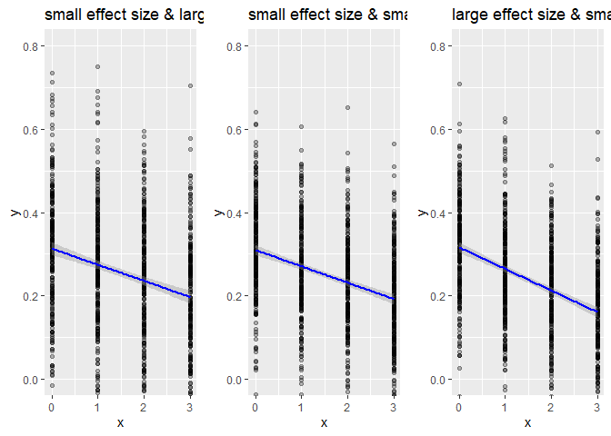<!-- -->

The simulation shows that (i) larger effect size leads to higher
correlation, and (ii) smaller SD leads to higher correlation. In the
simulation, the correlation score improved approximately by 0.14, which
is very close to the degree of improvement we observed in the data.

<br>

## Summary

The degree of improvement in $\beta$ (from -0.04 to -0.05) from the
original to modified approach may appear small compared to the degree of
improvement in correlation and thus may seem contradictory. However,
these results are not contradictory and can be explained by the fact
that correlation is not only influenced by the effect size ($\beta$) but
also by the variance in the data ($SD^2$). A higher effect size leads to
a stronger correlation, and a smaller variance in the data also leads to
a stronger correlation. In our case, the effect size increased by 0.01,
and the SD of the data decreased by 0.03 for the modified approach,
resulting in a higher correlation. Through a simulation-based approach,
we demonstrated that both effect size and SD affects the level of
correlation, and we observed a similar degree of increase in
correlation.

<br>

==========================================================================

# 2. Supplementary analyses

We used binary similarity rating (similar/not similar) for the main
analysses reported in the manuscript. However, the original ratings was
on a scale from 0 to 5, so here we will use the original ratings to see
if DTW’s predictions correlate with human similarty ratings.

# 2.1 Study 2

## Data preparation

``` r
### Load data
df_dtw_zoom = read_csv("data/dtw_distance_zoom.csv") %>% 
  rename(target = target_2) %>%
  select(comparison_id, pair, target, average_distance, hands_dtw) %>%
  mutate(dataset = "zoom",
         pair = as.factor(pair),
         target = as.factor(target))

df_sim_coding_zoom = read_csv("data/similarity_coding_zoom.csv") %>% 
  rename(position = location) %>% 
  mutate(total_similarity = handshape + movement + orientation + position,
         ### binary coding
         handshape_bin = ifelse(handshape >= 4, 1, 0),
         movement_bin = ifelse(movement >= 4, 1, 0),
         orientation_bin = ifelse(orientation >= 4, 1, 0),
         position_bin = ifelse(position >= 4, 1, 0),
         n_features = handshape_bin + movement_bin + orientation_bin + position_bin,
         handshape_bin = factor(handshape_bin, 
                                levels = c(0, 1), 
                                labels = c("not similar", "similar")),
         movement_bin = factor(movement_bin,
                                levels = c(0, 1), 
                                labels = c("not similar", "similar")),
         orientation_bin = factor(orientation_bin,
                                   levels = c(0, 1), 
                                   labels = c("not similar", "similar")),
         position_bin = factor(position_bin,
                                levels = c(0, 1), 
                                labels = c("not similar", "similar")),
         ### z-score
         handshape_z = scale(handshape)[,1],
         movement_z = scale(movement)[,1],
         orientation_z = scale(orientation)[,1],
         position_z = scale(position)[,1],
         total_similarity_z = scale(total_similarity)[,1]) %>% 
  select(-notes)

### combine dtw and coding data for zoom dataset
df_dtw_zoom = right_join(df_dtw_zoom, df_sim_coding_zoom)

### convert to long format for data visualization
df_dtw_zoom_long = df_dtw_zoom %>%
  pivot_longer(cols = c("handshape", "movement", "orientation", "position"), 
               names_to = "feature", 
               values_to = "similarity") %>% 
  select(-ends_with("_z"), -ends_with("_bin"))

df_dtw_zoom_long_bin = df_dtw_zoom %>%
  pivot_longer(cols = c("handshape_bin", "movement_bin", "orientation_bin", "position_bin"), 
               names_to = "feature", 
               values_to = "similarity_bin") %>% 
  mutate(feature = factor(sub("_bin", "", feature),
                          levels = c("handshape", "movement", "orientation", "position"))) %>% 
  select(-handshape, -movement, -orientation, -position, -ends_with("_z"))

df_dtw_zoom_long_z = df_dtw_zoom %>%
  pivot_longer(cols = c("handshape_z", "movement_z", "orientation_z", "position_z"), 
               names_to = "feature", 
               values_to = "similarity_z") %>% 
  mutate(feature = factor(sub("_z", "", feature),
                          levels = c("handshape", "movement", "orientation", "position"))) %>% 
  select(-handshape, -movement, -orientation, -position, -ends_with("_bin"))

df_dtw_zoom_long = left_join(df_dtw_zoom_long, df_dtw_zoom_long_z) %>% 
  left_join(., df_dtw_zoom_long_bin) %>%
  select(-starts_with("total_similarity"))

## for partial residual plot
df_dtw_zoom$handshape_res = residuals(lm(handshape ~ movement + orientation + position, data = df_dtw_zoom))
df_dtw_zoom$movement_res = residuals(lm(movement ~ handshape + orientation + position, data = df_dtw_zoom))
df_dtw_zoom$orientation_res = residuals(lm(orientation ~ handshape + movement + position, data = df_dtw_zoom))
df_dtw_zoom$position_res = residuals(lm(position ~ handshape + movement + orientation, data = df_dtw_zoom))

df_dtw_zoom_long_res = df_dtw_zoom %>%
  pivot_longer(cols = c("handshape_res", "movement_res", "orientation_res", "position_res"), 
               names_to = "feature", 
               values_to = "similarity_res") %>% 
  mutate(feature = factor(sub("_res", "", feature),
                          levels = c("handshape", "movement", "orientation", "position"))) %>% 
  select(!dataset:total_similarity_z)
```

------------------------------------------------------------------------

## Data visualization

### correlation for each feature

``` r
scp_feature = df_dtw_zoom_long %>%
  ggplot(aes(x = similarity, y = average_distance)) +
  geom_point(size = 0.8, alpha = 0.7) +
  geom_smooth(method = "lm") +
  stat_cor(p.accuracy = 0.001, r.accuracy = 0.01, 
           method="pearson") +
  labs(x="Similarity score", 
       y="Normalized DTW distance") +
  scale_x_continuous(limits = c(0, 5),
                     breaks = seq(0, 5, 1)) +
  scale_y_continuous(limits = c(0, 1),
                     breaks = seq(0, 1, 0.2)) +
  theme_classic(base_size = 14) +
  theme(axis.text.x = element_text(colour = "black", size = 13),
        axis.text.y = element_text(colour = "black", size = 13),
        axis.title = element_text(face = 'bold'),
        axis.title.x = element_text(vjust = -2),
        axis.title.y = element_text(vjust = 2),
        strip.text = element_text(face = 'bold'),
        legend.position = "none",
        plot.margin = unit(c(1.1,1.1,1.1,1.1), "lines")) +
  facet_wrap(~feature, nrow = 2)

# ggplotly(scp_feature)
```

<br>

### partial residual plot

``` r
scp_feature_res = df_dtw_zoom_long_res %>%
  ggplot(aes(x = similarity_res, y = average_distance)) +
  geom_point(size = 0.8, alpha = 0.7) +
  geom_smooth(method = "lm") +
  stat_cor(p.accuracy = 0.001, r.accuracy = 0.01, 
           method="pearson") +
  labs(x="Similarity score (residuals)", 
       y="Normalized DTW distance") +
  scale_y_continuous(limits = c(0, 1),
                     breaks = seq(0, 1, 0.2)) +
  theme_classic(base_size = 14) +
  theme(axis.text.x = element_text(colour = "black", size = 13),
        axis.text.y = element_text(colour = "black", size = 13),
        axis.title = element_text(face = 'bold'),
        axis.title.x = element_text(vjust = -2),
        axis.title.y = element_text(vjust = 2),
        strip.text = element_text(face = 'bold'),
        legend.position = "none",
        plot.margin = unit(c(1.1,1.1,1.1,1.1), "lines")) +
  facet_wrap(~feature, nrow = 2)

scp_feature_res
```

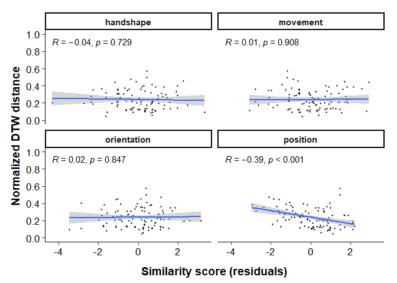<!-- -->

<br>

### correlation for total similarity score

``` r
scp_total = df_dtw_zoom %>%
  ggplot(aes(x = total_similarity, y = average_distance)) +
  geom_point(size = 1, alpha = 0.7) +
  geom_smooth(method = "lm") +
  stat_cor(p.accuracy = 0.001, r.accuracy = 0.01, 
           method="pearson") +
  labs(x="Total similarity score", 
       y="Normalized DTW distance") +
  scale_x_continuous(limits = c(0, 20),
                     breaks = seq(0, 20, 5)) +
  scale_y_continuous(limits = c(0, 1),
                     breaks = seq(0, 1, 0.2)) +
  theme_classic(base_size = 14) +
  theme(axis.text.x = element_text(colour = "black", size = 13),
        axis.text.y = element_text(colour = "black", size = 13),
        axis.title = element_text(face = 'bold'),
        axis.title.x = element_text(vjust = -2),
        axis.title.y = element_text(vjust = 2),
        strip.text = element_text(face = 'bold'),
        legend.position = "none",
        plot.margin = unit(c(1.1,1.1,1.1,1.1), "lines"))

# ggExtra::ggMarginal(scp_total, fill = "lightblue")
# ggplotly(scp_total)
```

``` r
scp_total = scp_total + 
  labs(tag = "A") +
  theme(plot.tag.position = c(0,1),
        plot.tag = element_text(vjust = 0.5, hjust = 0.3))

scp_feature = scp_feature + 
  labs(tag = "B") +
  theme(plot.tag.position = c(0,1),
        plot.tag = element_text(vjust = 0.5, hjust = 0.3))

### combined plot
combined_p_zoom = scp_total + scp_feature + plot_layout(widths = c(5, 5))
combined_p_zoom[[2]] = combined_p_zoom[[2]] + theme(axis.title.y = element_blank())
combined_p_zoom
```

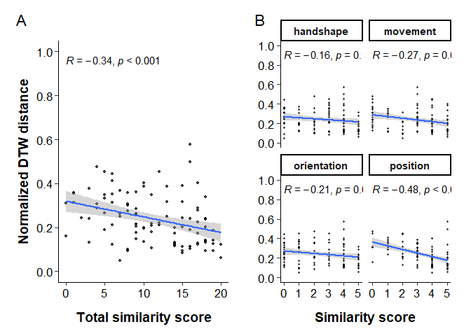<!-- -->

``` r
ggsave("figures/distance_zoom_combined.svg", width=10, height=5, dpi=600)
```

<br>

### \[z\] correlation for each feature

``` r
scp_feature_z = df_dtw_zoom_long %>%
  ggplot(aes(x = similarity_z, y = average_distance)) +
  geom_point(size = 0.8, alpha = 0.7) +
  geom_smooth(method = "lm") +
  stat_cor(p.accuracy = 0.001, r.accuracy = 0.01, 
           method="pearson") +
  labs(x="Standardized similarity score", 
       y="Normalized DTW distance") +
  scale_x_continuous(limits = c(-2.5, 2),
                     breaks = seq(-2.5, 2, 1)) +
  scale_y_continuous(limits = c(0, 1),
                     breaks = seq(0, 1, 0.2)) +
  theme_classic(base_size = 14) +
  theme(axis.text.x = element_text(colour = "black", size = 13),
        axis.text.y = element_text(colour = "black", size = 13),
        axis.title = element_text(face = 'bold'),
        axis.title.x = element_text(vjust = -2),
        axis.title.y = element_text(vjust = 2),
        strip.text = element_text(face = 'bold'),
        legend.position = "none",
        plot.margin = unit(c(1.1,1.1,1.1,1.1), "lines")) +
  facet_wrap(~feature, nrow = 2)

# scp_feature_z
```

<br>

### \[z\] correlation for total similarity score

``` r
scp_total_z = df_dtw_zoom %>%
  ggplot(aes(x = total_similarity_z, y = average_distance)) +
  geom_point(size = 1, alpha = 0.7) +
  geom_smooth(method = "lm") +
  stat_cor(p.accuracy = 0.001, r.accuracy = 0.01, 
           method="pearson") +
  labs(x="Standardized total similarity score (z)", 
       y="Normalized DTW distance") +
  scale_x_continuous(limits = c(-2.2, 1.5),
                     breaks = seq(-2, 1.5, 0.5)) +
  scale_y_continuous(limits = c(0, 1),
                     breaks = seq(0, 1, 0.2)) +
  theme_classic(base_size = 14) +
  theme(axis.text.x = element_text(colour = "black", size = 13),
        axis.text.y = element_text(colour = "black", size = 13),
        axis.title = element_text(face = 'bold'),
        axis.title.x = element_text(vjust = -2),
        axis.title.y = element_text(vjust = 2),
        strip.text = element_text(face = 'bold'),
        legend.position = "none",
        plot.margin = unit(c(1.1,1.1,1.1,1.1), "lines"))

# ggExtra::ggMarginal(scp_total_z, fill = "lightblue")
# scp_total_z
```

``` r
scp_total_z = scp_total_z + 
  labs(tag = "A") +
  theme(plot.tag.position = c(0,1),
        plot.tag = element_text(vjust = 0.5, hjust = 0.3))

scp_feature_z = scp_feature_z + 
  labs(tag = "B") +
  theme(plot.tag.position = c(0,1),
        plot.tag = element_text(vjust = 0.5, hjust = 0.3))

### combined plot
combined_p_zoom_z = scp_total_z + scp_feature_z + plot_layout(widths = c(5, 5))
combined_p_zoom_z[[2]] = combined_p_zoom_z[[2]] + theme(axis.title.y = element_blank())
combined_p_zoom_z
```

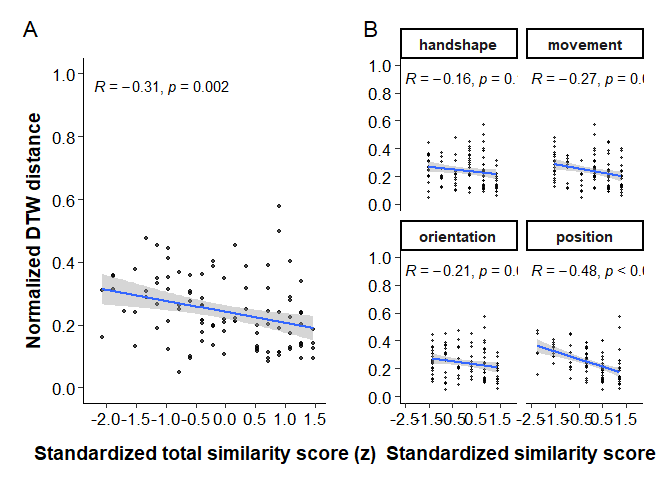<!-- -->

``` r
ggsave("figures/distance_zoom_combined_z.svg", width=10, height=5, dpi=600)
```

<br>

## Statistical analysis

### Check the normality assumption of errors

Linear mixed-effects models assume that the residuals are normally
distributed. Let’s check this assumption by plotting the residuals of
the models. For this, we will use the `check_model()` function from the
`performance` package.

``` r
model = lmer(average_distance ~ 1 + (1|pair) + (1|target), 
             data = subset(df_dtw_zoom))
check_model(model)
```

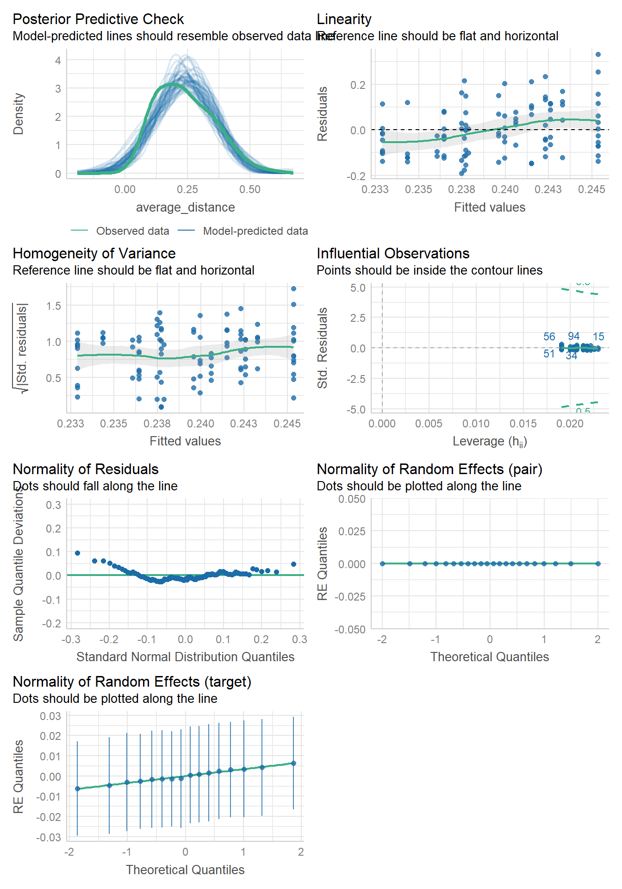<!-- -->

``` r
model_log = lmer(log(average_distance) ~ 1 + (1|pair) + (1|target), 
                 data = subset(df_dtw_zoom))
check_model(model_log)
```

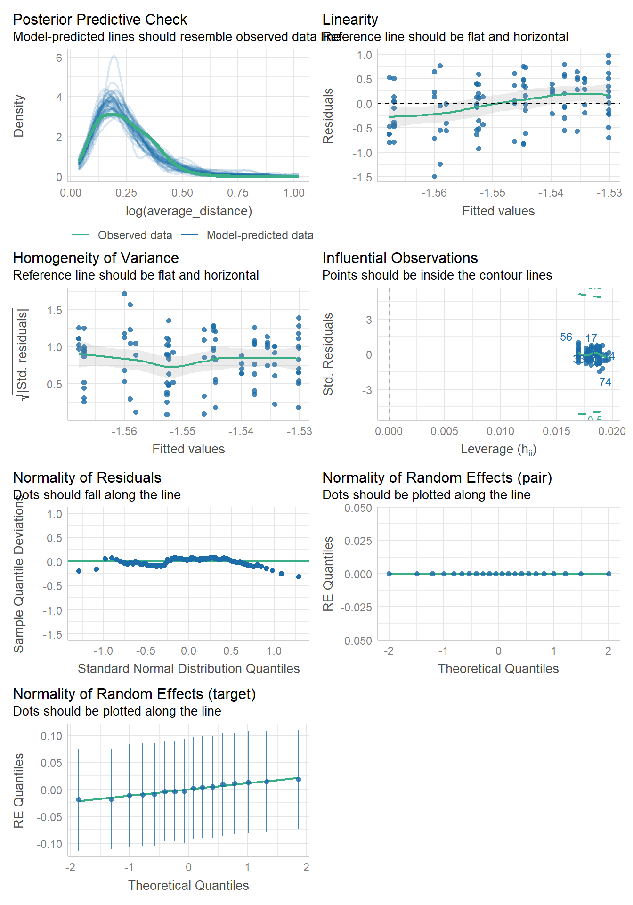<!-- -->

Log-normal model returned a sigular fit (i.e., the model is not able to
estimate the variance of the random effects for pair). Therefore, we
will use linear regression for the analysis.

<br>

### Correlation for total similarity

``` r
x = df_dtw_zoom$total_similarity
y = df_dtw_zoom$average_distance

cor.test(x, y, method="pearson")
```

    ## 
    ##  Pearson's product-moment correlation
    ## 
    ## data:  x and y
    ## t = -4, df = 98, p-value = 0.0006
    ## alternative hypothesis: true correlation is not equal to 0
    ## 95 percent confidence interval:
    ##  -0.499 -0.149
    ## sample estimates:
    ##    cor 
    ## -0.336

``` r
# cor.test(x, y, method="spearman")
```

The correlation between the total similarity score and the normalized
DTW distance is significant, suggesting that the more similar features
two gestures have, the smaller the distance is.

<br>

### LMM for total similarity score

``` r
lmer_zoom_total = lmer(average_distance ~ 
                           total_similarity_z +
                           (1|pair) + (1|target),
                         data = df_dtw_zoom)

summ(lmer_zoom_total, digits = 3)
```

<table class="table table-striped table-hover table-condensed table-responsive" style="width: auto !important; margin-left: auto; margin-right: auto;">

<tbody>

<tr>

<td style="text-align:left;font-weight: bold;">

Observations
</td>

<td style="text-align:right;">

100
</td>

</tr>

<tr>

<td style="text-align:left;font-weight: bold;">

Dependent variable
</td>

<td style="text-align:right;">

average_distance
</td>

</tr>

<tr>

<td style="text-align:left;font-weight: bold;">

Type
</td>

<td style="text-align:right;">

Mixed effects linear regression
</td>

</tr>

</tbody>

</table>

<table class="table table-striped table-hover table-condensed table-responsive" style="width: auto !important; margin-left: auto; margin-right: auto;">

<tbody>

<tr>

<td style="text-align:left;font-weight: bold;">

AIC
</td>

<td style="text-align:right;">

-71.792
</td>

</tr>

<tr>

<td style="text-align:left;font-weight: bold;">

BIC
</td>

<td style="text-align:right;">

-58.766
</td>

</tr>

<tr>

<td style="text-align:left;font-weight: bold;">

Pseudo-R² (fixed effects)
</td>

<td style="text-align:right;">

0.117
</td>

</tr>

<tr>

<td style="text-align:left;font-weight: bold;">

Pseudo-R² (total)
</td>

<td style="text-align:right;">

0.150
</td>

</tr>

</tbody>

</table>

<table class="table table-striped table-hover table-condensed table-responsive" style="width: auto !important; margin-left: auto; margin-right: auto;border-bottom: 0;">

<thead>

<tr>

<th style="border-bottom:hidden;padding-bottom:0; padding-left:3px;padding-right:3px;text-align: center; " colspan="6">

<div style="border-bottom: 1px solid #ddd; padding-bottom: 5px; ">

Fixed Effects

</div>

</th>

</tr>

<tr>

<th style="text-align:left;">

</th>

<th style="text-align:right;">

Est.
</th>

<th style="text-align:right;">

S.E.
</th>

<th style="text-align:right;">

t val.
</th>

<th style="text-align:right;">

d.f.
</th>

<th style="text-align:right;">

p
</th>

</tr>

</thead>

<tbody>

<tr>

<td style="text-align:left;font-weight: bold;">

(Intercept)
</td>

<td style="text-align:right;">

0.329
</td>

<td style="text-align:right;">

0.017
</td>

<td style="text-align:right;">

19.409
</td>

<td style="text-align:right;">

18.142
</td>

<td style="text-align:right;">

0.000
</td>

</tr>

<tr>

<td style="text-align:left;font-weight: bold;">

total_similarity_z
</td>

<td style="text-align:right;">

-0.055
</td>

<td style="text-align:right;">

0.015
</td>

<td style="text-align:right;">

-3.634
</td>

<td style="text-align:right;">

97.722
</td>

<td style="text-align:right;">

0.000
</td>

</tr>

</tbody>

<tfoot>

<tr>

<td style="padding: 0; " colspan="100%">

<sup></sup> p values calculated using Satterthwaite d.f.
</td>

</tr>

</tfoot>

</table>

<table class="table table-striped table-hover table-condensed table-responsive" style="width: auto !important; margin-left: auto; margin-right: auto;">

<thead>

<tr>

<th style="border-bottom:hidden;padding-bottom:0; padding-left:3px;padding-right:3px;text-align: center; " colspan="3">

<div style="border-bottom: 1px solid #ddd; padding-bottom: 5px; ">

Random Effects

</div>

</th>

</tr>

<tr>

<th>

Group
</th>

<th>

Parameter
</th>

<th>

Std. Dev.
</th>

</tr>

</thead>

<tbody>

<tr>

<td>

pair
</td>

<td>

(Intercept)
</td>

<td>

0.000
</td>

</tr>

<tr>

<td>

target
</td>

<td>

(Intercept)
</td>

<td>

0.030
</td>

</tr>

<tr>

<td>

Residual
</td>

<td>

</td>

<td>

0.150
</td>

</tr>

</tbody>

</table>

<table class="table table-striped table-hover table-condensed table-responsive" style="width: auto !important; margin-left: auto; margin-right: auto;">

<thead>

<tr>

<th style="border-bottom:hidden;padding-bottom:0; padding-left:3px;padding-right:3px;text-align: center; " colspan="3">

<div style="border-bottom: 1px solid #ddd; padding-bottom: 5px; ">

Grouping Variables

</div>

</th>

</tr>

<tr>

<th>

Group
</th>

<th>

\# groups
</th>

<th>

ICC
</th>

</tr>

</thead>

<tbody>

<tr>

<td>

pair
</td>

<td>

22
</td>

<td>

0.000
</td>

</tr>

<tr>

<td>

target
</td>

<td>

16
</td>

<td>

0.038
</td>

</tr>

</tbody>

</table>

``` r
check_model(lmer_zoom_total)
```

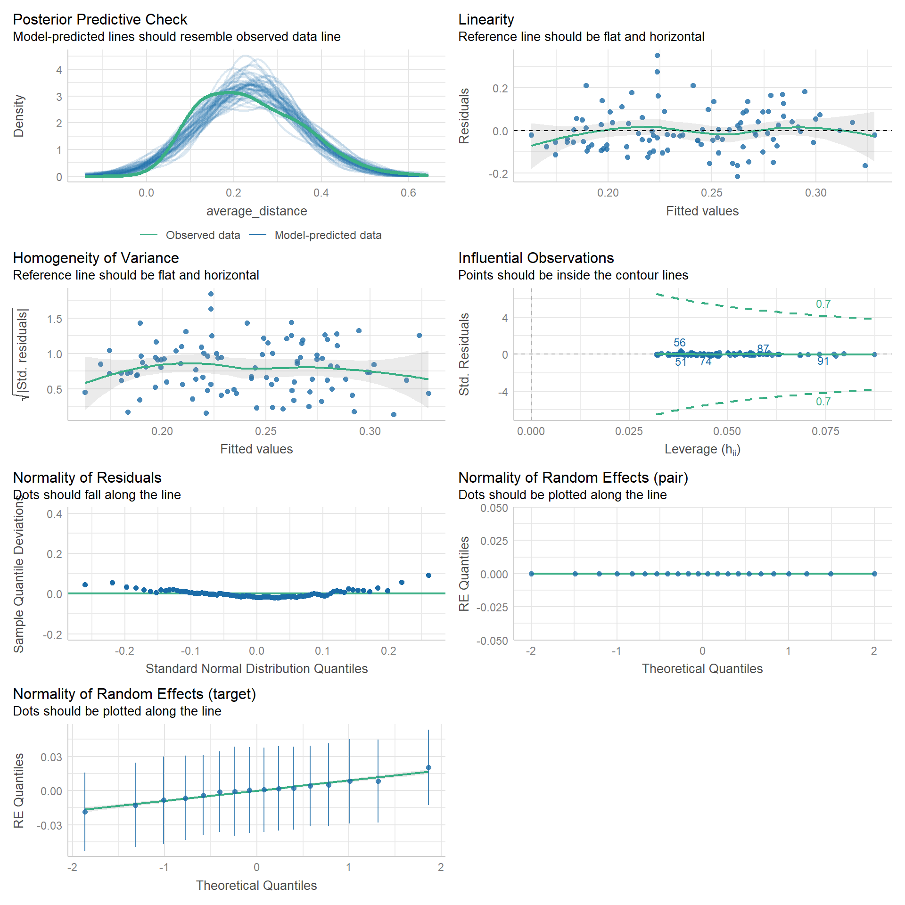<!-- -->

<br>

### Correlation for each feature

``` r
print("Handshape")
```

    ## [1] "Handshape"

``` r
cor.test(df_dtw_zoom$handshape, df_dtw_zoom$average_distance, method="spearman")
```

    ## 
    ##  Spearman's rank correlation rho
    ## 
    ## data:  df_dtw_zoom$handshape and df_dtw_zoom$average_distance
    ## S = 203448, p-value = 0.03
    ## alternative hypothesis: true rho is not equal to 0
    ## sample estimates:
    ##    rho 
    ## -0.221

``` r
print("Orientation")
```

    ## [1] "Orientation"

``` r
cor.test(df_dtw_zoom$orientation, df_dtw_zoom$average_distance, method="spearman")
```

    ## 
    ##  Spearman's rank correlation rho
    ## 
    ## data:  df_dtw_zoom$orientation and df_dtw_zoom$average_distance
    ## S = 207306, p-value = 0.01
    ## alternative hypothesis: true rho is not equal to 0
    ## sample estimates:
    ##    rho 
    ## -0.244

``` r
print("Movement")
```

    ## [1] "Movement"

``` r
cor.test(df_dtw_zoom$movement, df_dtw_zoom$average_distance, method="spearman")
```

    ## 
    ##  Spearman's rank correlation rho
    ## 
    ## data:  df_dtw_zoom$movement and df_dtw_zoom$average_distance
    ## S = 215988, p-value = 0.003
    ## alternative hypothesis: true rho is not equal to 0
    ## sample estimates:
    ##    rho 
    ## -0.296

``` r
print("Position")
```

    ## [1] "Position"

``` r
cor.test(df_dtw_zoom$position, df_dtw_zoom$average_distance, method="spearman")
```

    ## 
    ##  Spearman's rank correlation rho
    ## 
    ## data:  df_dtw_zoom$position and df_dtw_zoom$average_distance
    ## S = 254823, p-value = 0.00000002
    ## alternative hypothesis: true rho is not equal to 0
    ## sample estimates:
    ##    rho 
    ## -0.529

<br>

### LMM for each feature

``` r
### each feature
lmer_zoom_shape = lmer(average_distance ~ 
                 handshape_z + (1|pair) + (1|target),
               data = df_dtw_zoom)
summ(lmer_zoom_shape, digits = 3)
```

<table class="table table-striped table-hover table-condensed table-responsive" style="width: auto !important; margin-left: auto; margin-right: auto;">

<tbody>

<tr>

<td style="text-align:left;font-weight: bold;">

Observations
</td>

<td style="text-align:right;">

100
</td>

</tr>

<tr>

<td style="text-align:left;font-weight: bold;">

Dependent variable
</td>

<td style="text-align:right;">

average_distance
</td>

</tr>

<tr>

<td style="text-align:left;font-weight: bold;">

Type
</td>

<td style="text-align:right;">

Mixed effects linear regression
</td>

</tr>

</tbody>

</table>

<table class="table table-striped table-hover table-condensed table-responsive" style="width: auto !important; margin-left: auto; margin-right: auto;">

<tbody>

<tr>

<td style="text-align:left;font-weight: bold;">

AIC
</td>

<td style="text-align:right;">

-62.170
</td>

</tr>

<tr>

<td style="text-align:left;font-weight: bold;">

BIC
</td>

<td style="text-align:right;">

-49.145
</td>

</tr>

<tr>

<td style="text-align:left;font-weight: bold;">

Pseudo-R² (fixed effects)
</td>

<td style="text-align:right;">

0.026
</td>

</tr>

<tr>

<td style="text-align:left;font-weight: bold;">

Pseudo-R² (total)
</td>

<td style="text-align:right;">

0.049
</td>

</tr>

</tbody>

</table>

<table class="table table-striped table-hover table-condensed table-responsive" style="width: auto !important; margin-left: auto; margin-right: auto;border-bottom: 0;">

<thead>

<tr>

<th style="border-bottom:hidden;padding-bottom:0; padding-left:3px;padding-right:3px;text-align: center; " colspan="6">

<div style="border-bottom: 1px solid #ddd; padding-bottom: 5px; ">

Fixed Effects

</div>

</th>

</tr>

<tr>

<th style="text-align:left;">

</th>

<th style="text-align:right;">

Est.
</th>

<th style="text-align:right;">

S.E.
</th>

<th style="text-align:right;">

t val.
</th>

<th style="text-align:right;">

d.f.
</th>

<th style="text-align:right;">

p
</th>

</tr>

</thead>

<tbody>

<tr>

<td style="text-align:left;font-weight: bold;">

(Intercept)
</td>

<td style="text-align:right;">

0.329
</td>

<td style="text-align:right;">

0.017
</td>

<td style="text-align:right;">

19.237
</td>

<td style="text-align:right;">

16.878
</td>

<td style="text-align:right;">

0.000
</td>

</tr>

<tr>

<td style="text-align:left;font-weight: bold;">

handshape_z
</td>

<td style="text-align:right;">

-0.026
</td>

<td style="text-align:right;">

0.016
</td>

<td style="text-align:right;">

-1.631
</td>

<td style="text-align:right;">

97.900
</td>

<td style="text-align:right;">

0.106
</td>

</tr>

</tbody>

<tfoot>

<tr>

<td style="padding: 0; " colspan="100%">

<sup></sup> p values calculated using Satterthwaite d.f.
</td>

</tr>

</tfoot>

</table>

<table class="table table-striped table-hover table-condensed table-responsive" style="width: auto !important; margin-left: auto; margin-right: auto;">

<thead>

<tr>

<th style="border-bottom:hidden;padding-bottom:0; padding-left:3px;padding-right:3px;text-align: center; " colspan="3">

<div style="border-bottom: 1px solid #ddd; padding-bottom: 5px; ">

Random Effects

</div>

</th>

</tr>

<tr>

<th>

Group
</th>

<th>

Parameter
</th>

<th>

Std. Dev.
</th>

</tr>

</thead>

<tbody>

<tr>

<td>

pair
</td>

<td>

(Intercept)
</td>

<td>

0.000
</td>

</tr>

<tr>

<td>

target
</td>

<td>

(Intercept)
</td>

<td>

0.024
</td>

</tr>

<tr>

<td>

Residual
</td>

<td>

</td>

<td>

0.158
</td>

</tr>

</tbody>

</table>

<table class="table table-striped table-hover table-condensed table-responsive" style="width: auto !important; margin-left: auto; margin-right: auto;">

<thead>

<tr>

<th style="border-bottom:hidden;padding-bottom:0; padding-left:3px;padding-right:3px;text-align: center; " colspan="3">

<div style="border-bottom: 1px solid #ddd; padding-bottom: 5px; ">

Grouping Variables

</div>

</th>

</tr>

<tr>

<th>

Group
</th>

<th>

\# groups
</th>

<th>

ICC
</th>

</tr>

</thead>

<tbody>

<tr>

<td>

pair
</td>

<td>

22
</td>

<td>

0.000
</td>

</tr>

<tr>

<td>

target
</td>

<td>

16
</td>

<td>

0.023
</td>

</tr>

</tbody>

</table>

``` r
lmer_zoom_movement = lmer(average_distance ~ 
                             movement_z + (1|pair) + (1|target),
                           data = df_dtw_zoom)
summ(lmer_zoom_movement, digits = 3)
```

<table class="table table-striped table-hover table-condensed table-responsive" style="width: auto !important; margin-left: auto; margin-right: auto;">

<tbody>

<tr>

<td style="text-align:left;font-weight: bold;">

Observations
</td>

<td style="text-align:right;">

100
</td>

</tr>

<tr>

<td style="text-align:left;font-weight: bold;">

Dependent variable
</td>

<td style="text-align:right;">

average_distance
</td>

</tr>

<tr>

<td style="text-align:left;font-weight: bold;">

Type
</td>

<td style="text-align:right;">

Mixed effects linear regression
</td>

</tr>

</tbody>

</table>

<table class="table table-striped table-hover table-condensed table-responsive" style="width: auto !important; margin-left: auto; margin-right: auto;">

<tbody>

<tr>

<td style="text-align:left;font-weight: bold;">

AIC
</td>

<td style="text-align:right;">

-67.322
</td>

</tr>

<tr>

<td style="text-align:left;font-weight: bold;">

BIC
</td>

<td style="text-align:right;">

-54.296
</td>

</tr>

<tr>

<td style="text-align:left;font-weight: bold;">

Pseudo-R² (fixed effects)
</td>

<td style="text-align:right;">

0.076
</td>

</tr>

<tr>

<td style="text-align:left;font-weight: bold;">

Pseudo-R² (total)
</td>

<td style="text-align:right;">

0.104
</td>

</tr>

</tbody>

</table>

<table class="table table-striped table-hover table-condensed table-responsive" style="width: auto !important; margin-left: auto; margin-right: auto;border-bottom: 0;">

<thead>

<tr>

<th style="border-bottom:hidden;padding-bottom:0; padding-left:3px;padding-right:3px;text-align: center; " colspan="6">

<div style="border-bottom: 1px solid #ddd; padding-bottom: 5px; ">

Fixed Effects

</div>

</th>

</tr>

<tr>

<th style="text-align:left;">

</th>

<th style="text-align:right;">

Est.
</th>

<th style="text-align:right;">

S.E.
</th>

<th style="text-align:right;">

t val.
</th>

<th style="text-align:right;">

d.f.
</th>

<th style="text-align:right;">

p
</th>

</tr>

</thead>

<tbody>

<tr>

<td style="text-align:left;font-weight: bold;">

(Intercept)
</td>

<td style="text-align:right;">

0.329
</td>

<td style="text-align:right;">

0.017
</td>

<td style="text-align:right;">

19.335
</td>

<td style="text-align:right;">

17.037
</td>

<td style="text-align:right;">

0.000
</td>

</tr>

<tr>

<td style="text-align:left;font-weight: bold;">

movement_z
</td>

<td style="text-align:right;">

-0.045
</td>

<td style="text-align:right;">

0.016
</td>

<td style="text-align:right;">

-2.857
</td>

<td style="text-align:right;">

97.648
</td>

<td style="text-align:right;">

0.005
</td>

</tr>

</tbody>

<tfoot>

<tr>

<td style="padding: 0; " colspan="100%">

<sup></sup> p values calculated using Satterthwaite d.f.
</td>

</tr>

</tfoot>

</table>

<table class="table table-striped table-hover table-condensed table-responsive" style="width: auto !important; margin-left: auto; margin-right: auto;">

<thead>

<tr>

<th style="border-bottom:hidden;padding-bottom:0; padding-left:3px;padding-right:3px;text-align: center; " colspan="3">

<div style="border-bottom: 1px solid #ddd; padding-bottom: 5px; ">

Random Effects

</div>

</th>

</tr>

<tr>

<th>

Group
</th>

<th>

Parameter
</th>

<th>

Std. Dev.
</th>

</tr>

</thead>

<tbody>

<tr>

<td>

pair
</td>

<td>

(Intercept)
</td>

<td>

0.000
</td>

</tr>

<tr>

<td>

target
</td>

<td>

(Intercept)
</td>

<td>

0.027
</td>

</tr>

<tr>

<td>

Residual
</td>

<td>

</td>

<td>

0.154
</td>

</tr>

</tbody>

</table>

<table class="table table-striped table-hover table-condensed table-responsive" style="width: auto !important; margin-left: auto; margin-right: auto;">

<thead>

<tr>

<th style="border-bottom:hidden;padding-bottom:0; padding-left:3px;padding-right:3px;text-align: center; " colspan="3">

<div style="border-bottom: 1px solid #ddd; padding-bottom: 5px; ">

Grouping Variables

</div>

</th>

</tr>

<tr>

<th>

Group
</th>

<th>

\# groups
</th>

<th>

ICC
</th>

</tr>

</thead>

<tbody>

<tr>

<td>

pair
</td>

<td>

22
</td>

<td>

0.000
</td>

</tr>

<tr>

<td>

target
</td>

<td>

16
</td>

<td>

0.031
</td>

</tr>

</tbody>

</table>

``` r
lmer_zoom_orientation = lmer(average_distance ~ 
                                orientation_z + (1|pair) + (1|target),
                              data = df_dtw_zoom)
summ(lmer_zoom_orientation, digits = 3)
```

<table class="table table-striped table-hover table-condensed table-responsive" style="width: auto !important; margin-left: auto; margin-right: auto;">

<tbody>

<tr>

<td style="text-align:left;font-weight: bold;">

Observations
</td>

<td style="text-align:right;">

100
</td>

</tr>

<tr>

<td style="text-align:left;font-weight: bold;">

Dependent variable
</td>

<td style="text-align:right;">

average_distance
</td>

</tr>

<tr>

<td style="text-align:left;font-weight: bold;">

Type
</td>

<td style="text-align:right;">

Mixed effects linear regression
</td>

</tr>

</tbody>

</table>

<table class="table table-striped table-hover table-condensed table-responsive" style="width: auto !important; margin-left: auto; margin-right: auto;">

<tbody>

<tr>

<td style="text-align:left;font-weight: bold;">

AIC
</td>

<td style="text-align:right;">

-63.767
</td>

</tr>

<tr>

<td style="text-align:left;font-weight: bold;">

BIC
</td>

<td style="text-align:right;">

-50.742
</td>

</tr>

<tr>

<td style="text-align:left;font-weight: bold;">

Pseudo-R² (fixed effects)
</td>

<td style="text-align:right;">

0.041
</td>

</tr>

<tr>

<td style="text-align:left;font-weight: bold;">

Pseudo-R² (total)
</td>

<td style="text-align:right;">

0.062
</td>

</tr>

</tbody>

</table>

<table class="table table-striped table-hover table-condensed table-responsive" style="width: auto !important; margin-left: auto; margin-right: auto;border-bottom: 0;">

<thead>

<tr>

<th style="border-bottom:hidden;padding-bottom:0; padding-left:3px;padding-right:3px;text-align: center; " colspan="6">

<div style="border-bottom: 1px solid #ddd; padding-bottom: 5px; ">

Fixed Effects

</div>

</th>

</tr>

<tr>

<th style="text-align:left;">

</th>

<th style="text-align:right;">

Est.
</th>

<th style="text-align:right;">

S.E.
</th>

<th style="text-align:right;">

t val.
</th>

<th style="text-align:right;">

d.f.
</th>

<th style="text-align:right;">

p
</th>

</tr>

</thead>

<tbody>

<tr>

<td style="text-align:left;font-weight: bold;">

(Intercept)
</td>

<td style="text-align:right;">

0.329
</td>

<td style="text-align:right;">

0.017
</td>

<td style="text-align:right;">

19.496
</td>

<td style="text-align:right;">

16.647
</td>

<td style="text-align:right;">

0.000
</td>

</tr>

<tr>

<td style="text-align:left;font-weight: bold;">

orientation_z
</td>

<td style="text-align:right;">

-0.033
</td>

<td style="text-align:right;">

0.016
</td>

<td style="text-align:right;">

-2.077
</td>

<td style="text-align:right;">

96.341
</td>

<td style="text-align:right;">

0.040
</td>

</tr>

</tbody>

<tfoot>

<tr>

<td style="padding: 0; " colspan="100%">

<sup></sup> p values calculated using Satterthwaite d.f.
</td>

</tr>

</tfoot>

</table>

<table class="table table-striped table-hover table-condensed table-responsive" style="width: auto !important; margin-left: auto; margin-right: auto;">

<thead>

<tr>

<th style="border-bottom:hidden;padding-bottom:0; padding-left:3px;padding-right:3px;text-align: center; " colspan="3">

<div style="border-bottom: 1px solid #ddd; padding-bottom: 5px; ">

Random Effects

</div>

</th>

</tr>

<tr>

<th>

Group
</th>

<th>

Parameter
</th>

<th>

Std. Dev.
</th>

</tr>

</thead>

<tbody>

<tr>

<td>

pair
</td>

<td>

(Intercept)
</td>

<td>

0.000
</td>

</tr>

<tr>

<td>

target
</td>

<td>

(Intercept)
</td>

<td>

0.023
</td>

</tr>

<tr>

<td>

Residual
</td>

<td>

</td>

<td>

0.157
</td>

</tr>

</tbody>

</table>

<table class="table table-striped table-hover table-condensed table-responsive" style="width: auto !important; margin-left: auto; margin-right: auto;">

<thead>

<tr>

<th style="border-bottom:hidden;padding-bottom:0; padding-left:3px;padding-right:3px;text-align: center; " colspan="3">

<div style="border-bottom: 1px solid #ddd; padding-bottom: 5px; ">

Grouping Variables

</div>

</th>

</tr>

<tr>

<th>

Group
</th>

<th>

\# groups
</th>

<th>

ICC
</th>

</tr>

</thead>

<tbody>

<tr>

<td>

pair
</td>

<td>

22
</td>

<td>

0.000
</td>

</tr>

<tr>

<td>

target
</td>

<td>

16
</td>

<td>

0.021
</td>

</tr>

</tbody>

</table>

``` r
lmer_zoom_position = lmer(average_distance ~ 
                              position_z + (1|pair) + (1|target),
                            data = df_dtw_zoom)
summ(lmer_zoom_position, digits = 3)
```

<table class="table table-striped table-hover table-condensed table-responsive" style="width: auto !important; margin-left: auto; margin-right: auto;">

<tbody>

<tr>

<td style="text-align:left;font-weight: bold;">

Observations
</td>

<td style="text-align:right;">

100
</td>

</tr>

<tr>

<td style="text-align:left;font-weight: bold;">

Dependent variable
</td>

<td style="text-align:right;">

average_distance
</td>

</tr>

<tr>

<td style="text-align:left;font-weight: bold;">

Type
</td>

<td style="text-align:right;">

Mixed effects linear regression
</td>

</tr>

</tbody>

</table>

<table class="table table-striped table-hover table-condensed table-responsive" style="width: auto !important; margin-left: auto; margin-right: auto;">

<tbody>

<tr>

<td style="text-align:left;font-weight: bold;">

AIC
</td>

<td style="text-align:right;">

-85.232
</td>

</tr>

<tr>

<td style="text-align:left;font-weight: bold;">

BIC
</td>

<td style="text-align:right;">

-72.207
</td>

</tr>

<tr>

<td style="text-align:left;font-weight: bold;">

Pseudo-R² (fixed effects)
</td>

<td style="text-align:right;">

0.228
</td>

</tr>

<tr>

<td style="text-align:left;font-weight: bold;">

Pseudo-R² (total)
</td>

<td style="text-align:right;">

0.256
</td>

</tr>

</tbody>

</table>

<table class="table table-striped table-hover table-condensed table-responsive" style="width: auto !important; margin-left: auto; margin-right: auto;border-bottom: 0;">

<thead>

<tr>

<th style="border-bottom:hidden;padding-bottom:0; padding-left:3px;padding-right:3px;text-align: center; " colspan="6">

<div style="border-bottom: 1px solid #ddd; padding-bottom: 5px; ">

Fixed Effects

</div>

</th>

</tr>

<tr>

<th style="text-align:left;">

</th>

<th style="text-align:right;">

Est.
</th>

<th style="text-align:right;">

S.E.
</th>

<th style="text-align:right;">

t val.
</th>

<th style="text-align:right;">

d.f.
</th>

<th style="text-align:right;">

p
</th>

</tr>

</thead>

<tbody>

<tr>

<td style="text-align:left;font-weight: bold;">

(Intercept)
</td>

<td style="text-align:right;">

0.328
</td>

<td style="text-align:right;">

0.016
</td>

<td style="text-align:right;">

20.821
</td>

<td style="text-align:right;">

20.262
</td>

<td style="text-align:right;">

0.000
</td>

</tr>

<tr>

<td style="text-align:left;font-weight: bold;">

position_z
</td>

<td style="text-align:right;">

-0.077
</td>

<td style="text-align:right;">

0.014
</td>

<td style="text-align:right;">

-5.435
</td>

<td style="text-align:right;">

97.259
</td>

<td style="text-align:right;">

0.000
</td>

</tr>

</tbody>

<tfoot>

<tr>

<td style="padding: 0; " colspan="100%">

<sup></sup> p values calculated using Satterthwaite d.f.
</td>

</tr>

</tfoot>

</table>

<table class="table table-striped table-hover table-condensed table-responsive" style="width: auto !important; margin-left: auto; margin-right: auto;">

<thead>

<tr>

<th style="border-bottom:hidden;padding-bottom:0; padding-left:3px;padding-right:3px;text-align: center; " colspan="3">

<div style="border-bottom: 1px solid #ddd; padding-bottom: 5px; ">

Random Effects

</div>

</th>

</tr>

<tr>

<th>

Group
</th>

<th>

Parameter
</th>

<th>

Std. Dev.
</th>

</tr>

</thead>

<tbody>

<tr>

<td>

pair
</td>

<td>

(Intercept)
</td>

<td>

0.000
</td>

</tr>

<tr>

<td>

target
</td>

<td>

(Intercept)
</td>

<td>

0.027
</td>

</tr>

<tr>

<td>

Residual
</td>

<td>

</td>

<td>

0.140
</td>

</tr>

</tbody>

</table>

<table class="table table-striped table-hover table-condensed table-responsive" style="width: auto !important; margin-left: auto; margin-right: auto;">

<thead>

<tr>

<th style="border-bottom:hidden;padding-bottom:0; padding-left:3px;padding-right:3px;text-align: center; " colspan="3">

<div style="border-bottom: 1px solid #ddd; padding-bottom: 5px; ">

Grouping Variables

</div>

</th>

</tr>

<tr>

<th>

Group
</th>

<th>

\# groups
</th>

<th>

ICC
</th>

</tr>

</thead>

<tbody>

<tr>

<td>

pair
</td>

<td>

22
</td>

<td>

0.000
</td>

</tr>

<tr>

<td>

target
</td>

<td>

16
</td>

<td>

0.036
</td>

</tr>

</tbody>

</table>

``` r
### all features
lmer_zoom_feature = lmer(average_distance ~ 
                            handshape_z + movement_z + orientation_z + position_z +
                            (1|pair) + (1|target),
                          data = df_dtw_zoom)

summ(lmer_zoom_feature, digits = 3)
```

<table class="table table-striped table-hover table-condensed table-responsive" style="width: auto !important; margin-left: auto; margin-right: auto;">

<tbody>

<tr>

<td style="text-align:left;font-weight: bold;">

Observations
</td>

<td style="text-align:right;">

100
</td>

</tr>

<tr>

<td style="text-align:left;font-weight: bold;">

Dependent variable
</td>

<td style="text-align:right;">

average_distance
</td>

</tr>

<tr>

<td style="text-align:left;font-weight: bold;">

Type
</td>

<td style="text-align:right;">

Mixed effects linear regression
</td>

</tr>

</tbody>

</table>

<table class="table table-striped table-hover table-condensed table-responsive" style="width: auto !important; margin-left: auto; margin-right: auto;">

<tbody>

<tr>

<td style="text-align:left;font-weight: bold;">

AIC
</td>

<td style="text-align:right;">

-61.094
</td>

</tr>

<tr>

<td style="text-align:left;font-weight: bold;">

BIC
</td>

<td style="text-align:right;">

-40.253
</td>

</tr>

<tr>

<td style="text-align:left;font-weight: bold;">

Pseudo-R² (fixed effects)
</td>

<td style="text-align:right;">

0.225
</td>

</tr>

<tr>

<td style="text-align:left;font-weight: bold;">

Pseudo-R² (total)
</td>

<td style="text-align:right;">

0.256
</td>

</tr>

</tbody>

</table>

<table class="table table-striped table-hover table-condensed table-responsive" style="width: auto !important; margin-left: auto; margin-right: auto;border-bottom: 0;">

<thead>

<tr>

<th style="border-bottom:hidden;padding-bottom:0; padding-left:3px;padding-right:3px;text-align: center; " colspan="6">

<div style="border-bottom: 1px solid #ddd; padding-bottom: 5px; ">

Fixed Effects

</div>

</th>

</tr>

<tr>

<th style="text-align:left;">

</th>

<th style="text-align:right;">

Est.
</th>

<th style="text-align:right;">

S.E.
</th>

<th style="text-align:right;">

t val.
</th>

<th style="text-align:right;">

d.f.
</th>

<th style="text-align:right;">

p
</th>

</tr>

</thead>

<tbody>

<tr>

<td style="text-align:left;font-weight: bold;">

(Intercept)
</td>

<td style="text-align:right;">

0.328
</td>

<td style="text-align:right;">

0.016
</td>

<td style="text-align:right;">

20.321
</td>

<td style="text-align:right;">

19.732
</td>

<td style="text-align:right;">

0.000
</td>

</tr>

<tr>

<td style="text-align:left;font-weight: bold;">

handshape_z
</td>

<td style="text-align:right;">

-0.011
</td>

<td style="text-align:right;">

0.020
</td>

<td style="text-align:right;">

-0.529
</td>

<td style="text-align:right;">

95.000
</td>

<td style="text-align:right;">

0.598
</td>

</tr>

<tr>

<td style="text-align:left;font-weight: bold;">

movement_z
</td>

<td style="text-align:right;">

0.002
</td>

<td style="text-align:right;">

0.020
</td>

<td style="text-align:right;">

0.115
</td>

<td style="text-align:right;">

94.883
</td>

<td style="text-align:right;">

0.909
</td>

</tr>

<tr>

<td style="text-align:left;font-weight: bold;">

orientation_z
</td>

<td style="text-align:right;">

0.007
</td>

<td style="text-align:right;">

0.023
</td>

<td style="text-align:right;">

0.297
</td>

<td style="text-align:right;">

93.635
</td>

<td style="text-align:right;">

0.767
</td>

</tr>

<tr>

<td style="text-align:left;font-weight: bold;">

position_z
</td>

<td style="text-align:right;">

-0.079
</td>

<td style="text-align:right;">

0.018
</td>

<td style="text-align:right;">

-4.353
</td>

<td style="text-align:right;">

94.994
</td>

<td style="text-align:right;">

0.000
</td>

</tr>

</tbody>

<tfoot>

<tr>

<td style="padding: 0; " colspan="100%">

<sup></sup> p values calculated using Satterthwaite d.f.
</td>

</tr>

</tfoot>

</table>

<table class="table table-striped table-hover table-condensed table-responsive" style="width: auto !important; margin-left: auto; margin-right: auto;">

<thead>

<tr>

<th style="border-bottom:hidden;padding-bottom:0; padding-left:3px;padding-right:3px;text-align: center; " colspan="3">

<div style="border-bottom: 1px solid #ddd; padding-bottom: 5px; ">

Random Effects

</div>

</th>

</tr>

<tr>

<th>

Group
</th>

<th>

Parameter
</th>

<th>

Std. Dev.
</th>

</tr>

</thead>

<tbody>

<tr>

<td>

pair
</td>

<td>

(Intercept)
</td>

<td>

0.000
</td>

</tr>

<tr>

<td>

target
</td>

<td>

(Intercept)
</td>

<td>

0.029
</td>

</tr>

<tr>

<td>

Residual
</td>

<td>

</td>

<td>

0.142
</td>

</tr>

</tbody>

</table>

<table class="table table-striped table-hover table-condensed table-responsive" style="width: auto !important; margin-left: auto; margin-right: auto;">

<thead>

<tr>

<th style="border-bottom:hidden;padding-bottom:0; padding-left:3px;padding-right:3px;text-align: center; " colspan="3">

<div style="border-bottom: 1px solid #ddd; padding-bottom: 5px; ">

Grouping Variables

</div>

</th>

</tr>

<tr>

<th>

Group
</th>

<th>

\# groups
</th>

<th>

ICC
</th>

</tr>

</thead>

<tbody>

<tr>

<td>

pair
</td>

<td>

22
</td>

<td>

0.000
</td>

</tr>

<tr>

<td>

target
</td>

<td>

16
</td>

<td>

0.040
</td>

</tr>

</tbody>

</table>

``` r
cov2cor(vcov(lmer_zoom_feature))
```

    ## 5 x 5 Matrix of class "corMatrix"
    ##               (Intercept) handshape_z movement_z orientation_z position_z
    ## (Intercept)      1.000000   -0.000942   -0.00245       -0.0017     0.0109
    ## handshape_z     -0.000942    1.000000   -0.05720       -0.6202     0.0655
    ## movement_z      -0.002450   -0.057195    1.00000       -0.3089    -0.4662
    ## orientation_z   -0.001700   -0.620216   -0.30894        1.0000    -0.1489
    ## position_z       0.010889    0.065539   -0.46616       -0.1489     1.0000

Regressions on each feature show a significant negative association
between DTW distance and movement, orientation, and position (handshape
didn’t reach significance). However, the model with all features as
fixed effects shows such significant negative correlation only for
position.

To check why the effects “disappeared”, we examined the correlation of
fixed effects and found a strong negative correlation between handshape
and orientation (-0.6) and between movement and position (-0.47). This
suggests that when the slope estimate for orientation is more extremely
negative, the slope estimate for handshape becomes flatter (or more
positive). This is likely due to the fact that handshape and orientation
are both reflected in relative finger tip positions. Similar
relationship was found for movement and position, which is likely due to
the fact that they are both reflected in the wrist positions.

Again, this suggests a need for developing a different approach to
capturing handshape similarity independently of hand orientation.

<br>

# 2.2 Revised DTW pipeline for Zoom dataset

A qualitative check on incongruent cases where a pair of gestures was
annotated as similar but it’s DTW distance was large revealed that the
majority of such cases is because of mirrored movements. To tackle this
issue, for gestures where speaker A and B used the opposing hands (e.g.,
speaker used left-hand and speaker B right-hand), we will calculate DTW
distance for both original and flipped videos and take the minimum of
the two.

## Data preparation

``` r
### Load data
df_dtw_zoom_v2 = read_csv("data/dtw_distance_zoom_mirrored.csv") %>% 
  rename(target = target_2) %>%
  select(comparison_id, pair, target, average_distance, average_distance, hands_dtw) %>%
  mutate(dataset = "zoom",
         pair = as.factor(pair),
         target = as.factor(target))

df_sim_coding_zoom = read_csv("data/similarity_coding_zoom.csv") %>% 
  rename(position = location) %>% 
  mutate(total_similarity = handshape + movement + orientation + position,
         ### binary coding
         handshape_bin = ifelse(handshape >= 4, 1, 0),
         movement_bin = ifelse(movement >= 4, 1, 0),
         orientation_bin = ifelse(orientation >= 4, 1, 0),
         position_bin = ifelse(position >= 4, 1, 0),
         n_features = handshape_bin + movement_bin + orientation_bin + position_bin,
         handshape_bin = factor(handshape_bin, 
                                levels = c(0, 1), 
                                labels = c("not similar", "similar")),
         movement_bin = factor(movement_bin,
                                levels = c(0, 1), 
                                labels = c("not similar", "similar")),
         orientation_bin = factor(orientation_bin,
                                   levels = c(0, 1), 
                                   labels = c("not similar", "similar")),
         position_bin = factor(position_bin,
                                levels = c(0, 1), 
                                labels = c("not similar", "similar")),
         ### z-score
         handshape_z = scale(handshape)[,1],
         movement_z = scale(movement)[,1],
         orientation_z = scale(orientation)[,1],
         position_z = scale(position)[,1],
         total_similarity_z = scale(total_similarity)[,1]) %>% 
  select(-notes)

### combine dtw and coding data for zoom dataset
df_dtw_zoom_v2 = right_join(df_dtw_zoom_v2, df_sim_coding_zoom)

### convert to long format for data visualization
df_dtw_zoom_v2_long = df_dtw_zoom_v2 %>%
  pivot_longer(cols = c("handshape", "movement", "orientation", "position"), 
               names_to = "feature", 
               values_to = "similarity") %>% 
  select(-ends_with("_z"), -ends_with("_bin"))

df_dtw_zoom_v2_long_bin = df_dtw_zoom_v2 %>%
  pivot_longer(cols = c("handshape_bin", "movement_bin", "orientation_bin", "position_bin"), 
               names_to = "feature", 
               values_to = "similarity_bin") %>% 
  mutate(feature = factor(sub("_bin", "", feature),
                          levels = c("handshape", "movement", "orientation", "position"))) %>% 
  select(-handshape, -movement, -orientation, -position, -ends_with("_z"))

df_dtw_zoom_v2_long_z = df_dtw_zoom_v2 %>%
  pivot_longer(cols = c("handshape_z", "movement_z", "orientation_z", "position_z"), 
               names_to = "feature", 
               values_to = "similarity_z") %>% 
  mutate(feature = factor(sub("_z", "", feature),
                          levels = c("handshape", "movement", "orientation", "position"))) %>% 
  select(-handshape, -movement, -orientation, -position, -ends_with("_bin"))

df_dtw_zoom_v2_long = left_join(df_dtw_zoom_v2_long, df_dtw_zoom_v2_long_z) %>% 
  left_join(., df_dtw_zoom_v2_long_bin) %>%
  select(-starts_with("total_similarity"))

## for partial residual plot
df_dtw_zoom_v2$handshape_res = residuals(lm(handshape ~ movement + orientation + position, data = df_dtw_zoom_v2))
df_dtw_zoom_v2$movement_res = residuals(lm(movement ~ handshape + orientation + position, data = df_dtw_zoom_v2))
df_dtw_zoom_v2$orientation_res = residuals(lm(orientation ~ handshape + movement + position, data = df_dtw_zoom_v2))
df_dtw_zoom_v2$position_res = residuals(lm(position ~ handshape + movement + orientation, data = df_dtw_zoom_v2))

df_dtw_zoom_v2_long_res = df_dtw_zoom_v2 %>%
  pivot_longer(cols = c("handshape_res", "movement_res", "orientation_res", "position_res"), 
               names_to = "feature", 
               values_to = "similarity_res") %>% 
  mutate(feature = factor(sub("_res", "", feature),
                          levels = c("handshape", "movement", "orientation", "position"))) %>% 
  select(!dataset:total_similarity_z)
```

<br>

## Data visualization

### correlation for each feature

``` r
scp_feature = df_dtw_zoom_v2_long %>%
  ggplot(aes(x = similarity, y = average_distance)) +
  geom_point(size = 0.8, alpha = 0.7) +
  geom_smooth(method = "lm") +
  stat_cor(p.accuracy = 0.001, r.accuracy = 0.01, 
           method="pearson") +
  labs(x="Similarity score", 
       y="Normalized DTW distance") +
  scale_x_continuous(limits = c(0, 5),
                     breaks = seq(0, 5, 1)) +
  scale_y_continuous(limits = c(0, 0.8),
                     breaks = seq(0, 0.8, 0.2)) +
  theme_classic(base_size = 14) +
  theme(axis.text.x = element_text(colour = "black", size = 13),
        axis.text.y = element_text(colour = "black", size = 13),
        axis.title = element_text(face = 'bold'),
        axis.title.x = element_text(vjust = -2),
        axis.title.y = element_text(vjust = 2),
        strip.text = element_text(face = 'bold'),
        legend.position = "none",
        plot.margin = unit(c(1.1,1.1,1.1,1.1), "lines")) +
  facet_wrap(~feature, nrow = 2)

# ggplotly(scp_feature)
```

<br>

### partial residual plot

``` r
scp_feature_res = df_dtw_zoom_v2_long_res %>%
  ggplot(aes(x = similarity_res, y = average_distance)) +
  geom_point(size = 0.8, alpha = 0.7) +
  geom_smooth(method = "lm") +
  stat_cor(p.accuracy = 0.001, r.accuracy = 0.01, 
           method="pearson") +
  labs(x="Similarity score (residuals)", 
       y="Normalized DTW distance") +
  scale_y_continuous(limits = c(0, 0.8),
                     breaks = seq(0, 0.8, 0.2)) +
  theme_classic(base_size = 14) +
  theme(axis.text.x = element_text(colour = "black", size = 13),
        axis.text.y = element_text(colour = "black", size = 13),
        axis.title = element_text(face = 'bold'),
        axis.title.x = element_text(vjust = -2),
        axis.title.y = element_text(vjust = 2),
        strip.text = element_text(face = 'bold'),
        legend.position = "none",
        plot.margin = unit(c(1.1,1.1,1.1,1.1), "lines")) +
  facet_wrap(~feature, nrow = 2)

scp_feature_res
```

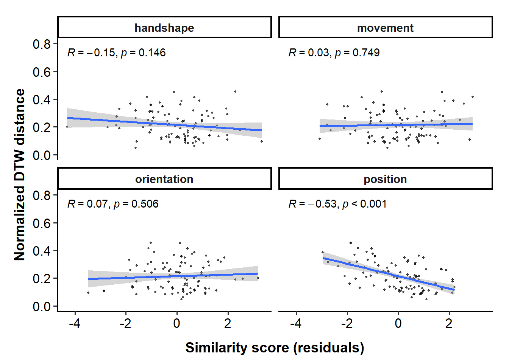<!-- -->

<br>

### correlation for total similarity score

``` r
scp_total = df_dtw_zoom_v2 %>%
  ggplot(aes(x = total_similarity, y = average_distance)) +
  geom_point(size = 1, alpha = 0.7) +
  geom_smooth(method = "lm") +
  stat_cor(p.accuracy = 0.001, r.accuracy = 0.01, 
           method="pearson") +
  labs(x="Total similarity score", 
       y="Normalized DTW distance") +
  scale_x_continuous(limits = c(0, 20),
                     breaks = seq(0, 20, 5)) +
  scale_y_continuous(limits = c(0, 0.8),
                     breaks = seq(0, 0.8, 0.2)) +
  theme_classic(base_size = 14) +
  theme(axis.text.x = element_text(colour = "black", size = 13),
        axis.text.y = element_text(colour = "black", size = 13),
        axis.title = element_text(face = 'bold'),
        axis.title.x = element_text(vjust = -2),
        axis.title.y = element_text(vjust = 2),
        strip.text = element_text(face = 'bold'),
        legend.position = "none",
        plot.margin = unit(c(1.1,1.1,1.1,1.1), "lines"))

# ggExtra::ggMarginal(scp_total, fill = "lightblue")
# scp_total

# ggplotly(scp_total)
```

``` r
scp_total = scp_total + 
  labs(tag = "A") +
  theme(plot.tag.position = c(0,1),
        plot.tag = element_text(vjust = 0.5, hjust = 0.3))

scp_feature = scp_feature + 
  labs(tag = "B") +
  theme(plot.tag.position = c(0,1),
        plot.tag = element_text(vjust = 0.5, hjust = 0.3))

### combined plot
combined_p_zoom = scp_total + scp_feature + plot_layout(widths = c(5, 5))
combined_p_zoom[[2]] = combined_p_zoom[[2]] + theme(axis.title.y = element_blank())
combined_p_zoom
```

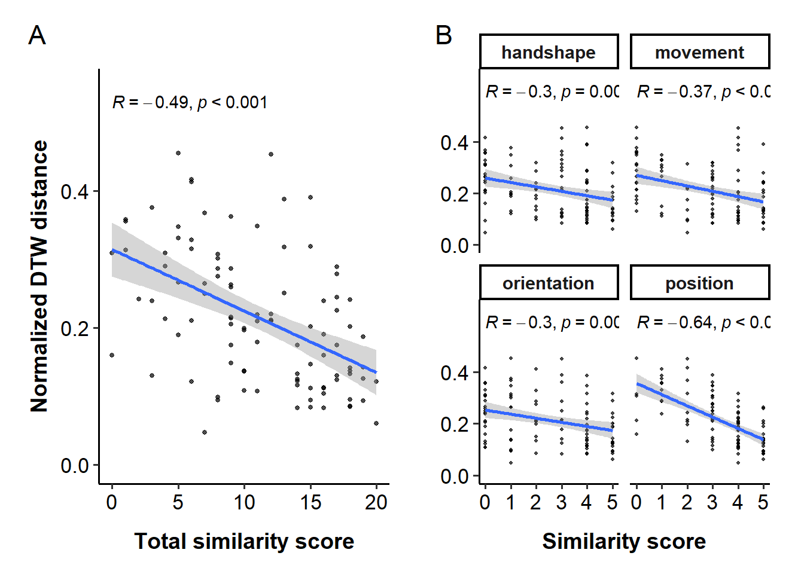<!-- -->

``` r
ggsave("figures/distance_zoom_v2_combined.svg", width=10, height=5, dpi=600)
```

<br>

### \[z\] correlation for each feature

``` r
scp_feature_z = df_dtw_zoom_v2_long %>%
  ggplot(aes(x = similarity_z, y = average_distance)) +
  geom_point(size = 0.8, alpha = 0.7) +
  geom_smooth(method = "lm") +
  stat_cor(p.accuracy = 0.001, r.accuracy = 0.01, 
           method="pearson") +
  labs(x="Standardized similarity score", 
       y="Normalized DTW distance") +
  scale_x_continuous(limits = c(-2.5, 2),
                     breaks = seq(-2.5, 2, 1)) +
  scale_y_continuous(limits = c(0, 0.8),
                     breaks = seq(0, 0.8, 0.2)) +
  theme_classic(base_size = 14) +
  theme(axis.text.x = element_text(colour = "black", size = 13),
        axis.text.y = element_text(colour = "black", size = 13),
        axis.title = element_text(face = 'bold'),
        axis.title.x = element_text(vjust = -2),
        axis.title.y = element_text(vjust = 2),
        strip.text = element_text(face = 'bold'),
        legend.position = "none",
        plot.margin = unit(c(1.1,1.1,1.1,1.1), "lines")) +
  facet_wrap(~feature, nrow = 2)

# scp_feature_z
```

<br>

### \[z\] correlation for total similarity score

``` r
scp_total_z = df_dtw_zoom_v2 %>%
  ggplot(aes(x = total_similarity_z, y = average_distance)) +
  geom_point(size = 1, alpha = 0.7) +
  geom_smooth(method = "lm") +
  stat_cor(p.accuracy = 0.001, r.accuracy = 0.01, 
           method="pearson") +
  labs(x="Standardized total similarity score (z)", 
       y="Normalized DTW distance") +
  scale_x_continuous(limits = c(-2.2, 1.5),
                     breaks = seq(-2, 1.5, 0.5)) +
  scale_y_continuous(limits = c(0, 0.8),
                     breaks = seq(0, 0.8, 0.2)) +
  theme_classic(base_size = 14) +
  theme(axis.text.x = element_text(colour = "black", size = 13),
        axis.text.y = element_text(colour = "black", size = 13),
        axis.title = element_text(face = 'bold'),
        axis.title.x = element_text(vjust = -2),
        axis.title.y = element_text(vjust = 2),
        strip.text = element_text(face = 'bold'),
        legend.position = "none",
        plot.margin = unit(c(1.1,1.1,1.1,1.1), "lines"))

# ggExtra::ggMarginal(scp_total_z, fill = "lightblue")
# scp_total_z
```

``` r
scp_total_z = scp_total_z + 
  labs(tag = "A") +
  theme(plot.tag.position = c(0,1),
        plot.tag = element_text(vjust = 0.5, hjust = 0.3))

scp_feature_z = scp_feature_z + 
  labs(tag = "B") +
  theme(plot.tag.position = c(0,1),
        plot.tag = element_text(vjust = 0.5, hjust = 0.3))

### combined plot
combined_p_zoom_z = scp_total_z + scp_feature_z + plot_layout(widths = c(5, 5))
combined_p_zoom_z[[2]] = combined_p_zoom_z[[2]] + theme(axis.title.y = element_blank())
combined_p_zoom_z
```

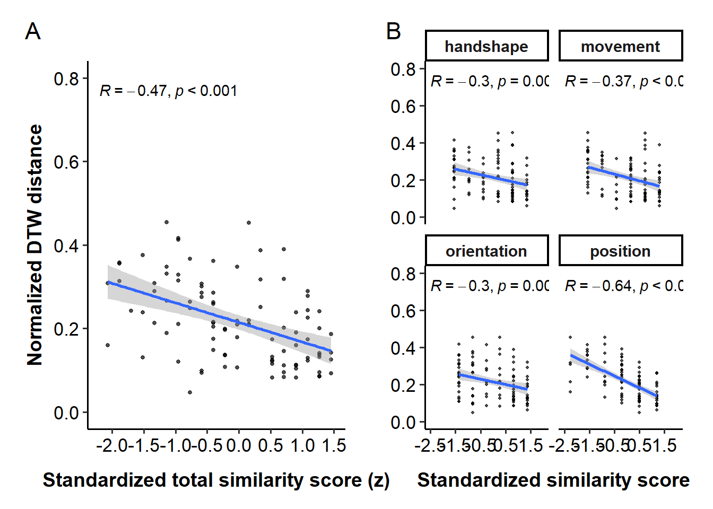<!-- -->

``` r
ggsave("figures/distance_zoom_v2_combined_z.svg", width=10, height=5, dpi=600)
```

<br>

## Statistical analysis

### Check the normality assumption of errors

Linear mixed-effects models assume that the residuals are normally
distributed. Let’s check this assumption by plotting the residuals of
the models. For this, we will use the `check_model()` function from the
`performance` package.

``` r
model = lmer(average_distance ~ 1 + (1|pair), 
             data = subset(df_dtw_zoom_v2))
check_model(model)
```

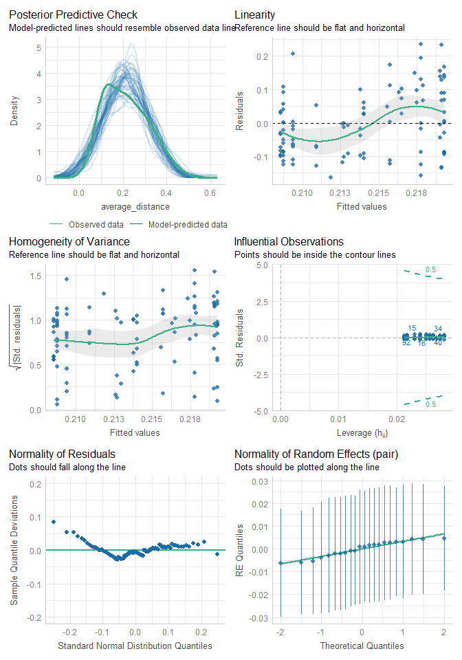<!-- -->

``` r
model_log = lmer(log(average_distance) ~ 1 + (1|pair), 
                 data = subset(df_dtw_zoom_v2))
check_model(model_log)
```

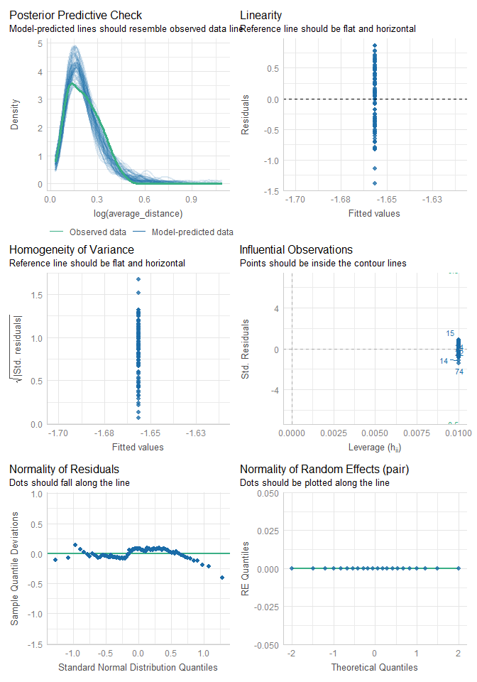<!-- -->

Models including random intercepts for dyads and items returned a
singular fit, most likely because of the small sample size. After
removing the by-item random intercept, the model converged only for the
linear model. Therefore, we will use linear regression for the analysis.

<br>

### Correlation for total similarity

``` r
x = df_dtw_zoom_v2$total_similarity
y = df_dtw_zoom_v2$average_distance

cor.test(x, y, method="pearson")
```

    ## 
    ##  Pearson's product-moment correlation
    ## 
    ## data:  x and y
    ## t = -5, df = 98, p-value = 0.0000003
    ## alternative hypothesis: true correlation is not equal to 0
    ## 95 percent confidence interval:
    ##  -0.622 -0.318
    ## sample estimates:
    ##    cor 
    ## -0.484

``` r
cor.test(x, y, method="spearman")
```

    ## 
    ##  Spearman's rank correlation rho
    ## 
    ## data:  x and y
    ## S = 250085, p-value = 0.0000001
    ## alternative hypothesis: true rho is not equal to 0
    ## sample estimates:
    ##    rho 
    ## -0.501

The correlation between the total similarity score and the normalized
DTW distance improved after accounting for the mirrored gestures.

<br>

### LMM for total similarity score

``` r
lmer_zoom_total = lmer(average_distance ~ 
                           total_similarity_z +
                           (1|pair),
                         data = df_dtw_zoom_v2)

summ(lmer_zoom_total, digits = 3)
```

<table class="table table-striped table-hover table-condensed table-responsive" style="width: auto !important; margin-left: auto; margin-right: auto;">

<tbody>

<tr>

<td style="text-align:left;font-weight: bold;">

Observations
</td>

<td style="text-align:right;">

100
</td>

</tr>

<tr>

<td style="text-align:left;font-weight: bold;">

Dependent variable
</td>

<td style="text-align:right;">

average_distance
</td>

</tr>

<tr>

<td style="text-align:left;font-weight: bold;">

Type
</td>

<td style="text-align:right;">

Mixed effects linear regression
</td>

</tr>

</tbody>

</table>

<table class="table table-striped table-hover table-condensed table-responsive" style="width: auto !important; margin-left: auto; margin-right: auto;">

<tbody>

<tr>

<td style="text-align:left;font-weight: bold;">

AIC
</td>

<td style="text-align:right;">

-113.756
</td>

</tr>

<tr>

<td style="text-align:left;font-weight: bold;">

BIC
</td>

<td style="text-align:right;">

-103.336
</td>

</tr>

<tr>

<td style="text-align:left;font-weight: bold;">

Pseudo-R² (fixed effects)
</td>

<td style="text-align:right;">

0.236
</td>

</tr>

<tr>

<td style="text-align:left;font-weight: bold;">

Pseudo-R² (total)
</td>

<td style="text-align:right;">

0.291
</td>

</tr>

</tbody>

</table>

<table class="table table-striped table-hover table-condensed table-responsive" style="width: auto !important; margin-left: auto; margin-right: auto;border-bottom: 0;">

<thead>

<tr>

<th style="border-bottom:hidden;padding-bottom:0; padding-left:3px;padding-right:3px;text-align: center; " colspan="6">

<div style="border-bottom: 1px solid #ddd; padding-bottom: 5px; ">

Fixed Effects

</div>

</th>

</tr>

<tr>

<th style="text-align:left;">

</th>

<th style="text-align:right;">

Est.
</th>

<th style="text-align:right;">

S.E.
</th>

<th style="text-align:right;">

t val.
</th>

<th style="text-align:right;">

d.f.
</th>

<th style="text-align:right;">

p
</th>

</tr>

</thead>

<tbody>

<tr>

<td style="text-align:left;font-weight: bold;">

(Intercept)
</td>

<td style="text-align:right;">

0.294
</td>

<td style="text-align:right;">

0.015
</td>

<td style="text-align:right;">

19.733
</td>

<td style="text-align:right;">

13.059
</td>

<td style="text-align:right;">

0.000
</td>

</tr>

<tr>

<td style="text-align:left;font-weight: bold;">

total_similarity_z
</td>

<td style="text-align:right;">

-0.070
</td>

<td style="text-align:right;">

0.012
</td>

<td style="text-align:right;">

-5.640
</td>

<td style="text-align:right;">

93.180
</td>

<td style="text-align:right;">

0.000
</td>

</tr>

</tbody>

<tfoot>

<tr>

<td style="padding: 0; " colspan="100%">

<sup></sup> p values calculated using Satterthwaite d.f.
</td>

</tr>

</tfoot>

</table>

<table class="table table-striped table-hover table-condensed table-responsive" style="width: auto !important; margin-left: auto; margin-right: auto;">

<thead>

<tr>

<th style="border-bottom:hidden;padding-bottom:0; padding-left:3px;padding-right:3px;text-align: center; " colspan="3">

<div style="border-bottom: 1px solid #ddd; padding-bottom: 5px; ">

Random Effects

</div>

</th>

</tr>

<tr>

<th>

Group
</th>

<th>

Parameter
</th>

<th>

Std. Dev.
</th>

</tr>

</thead>

<tbody>

<tr>

<td>

pair
</td>

<td>

(Intercept)
</td>

<td>

0.034
</td>

</tr>

<tr>

<td>

Residual
</td>

<td>

</td>

<td>

0.120
</td>

</tr>

</tbody>

</table>

<table class="table table-striped table-hover table-condensed table-responsive" style="width: auto !important; margin-left: auto; margin-right: auto;">

<thead>

<tr>

<th style="border-bottom:hidden;padding-bottom:0; padding-left:3px;padding-right:3px;text-align: center; " colspan="3">

<div style="border-bottom: 1px solid #ddd; padding-bottom: 5px; ">

Grouping Variables

</div>

</th>

</tr>

<tr>

<th>

Group
</th>

<th>

\# groups
</th>

<th>

ICC
</th>

</tr>

</thead>

<tbody>

<tr>

<td>

pair
</td>

<td>

22
</td>

<td>

0.072
</td>

</tr>

</tbody>

</table>

``` r
check_model(lmer_zoom_total)
```

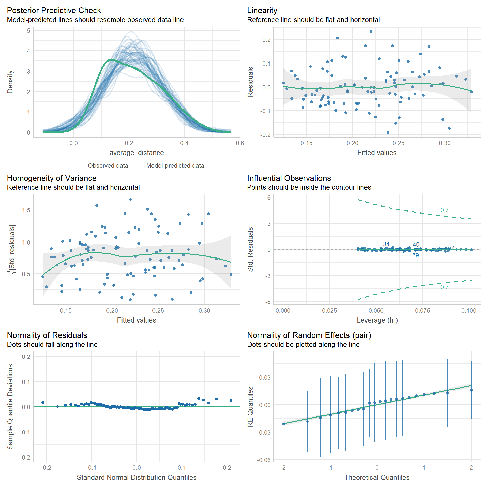<!-- -->

<br>

### Correlation for each feature

``` r
print("Handshape")
```

    ## [1] "Handshape"

``` r
cor.test(df_dtw_zoom_v2$handshape, df_dtw_zoom_v2$average_distance, method="spearman")
```

    ## 
    ##  Spearman's rank correlation rho
    ## 
    ## data:  df_dtw_zoom_v2$handshape and df_dtw_zoom_v2$average_distance
    ## S = 221316, p-value = 0.0009
    ## alternative hypothesis: true rho is not equal to 0
    ## sample estimates:
    ##    rho 
    ## -0.328

``` r
print("Orientation")
```

    ## [1] "Orientation"

``` r
cor.test(df_dtw_zoom_v2$orientation, df_dtw_zoom_v2$average_distance, method="spearman")
```

    ## 
    ##  Spearman's rank correlation rho
    ## 
    ## data:  df_dtw_zoom_v2$orientation and df_dtw_zoom_v2$average_distance
    ## S = 216770, p-value = 0.002
    ## alternative hypothesis: true rho is not equal to 0
    ## sample estimates:
    ##    rho 
    ## -0.301

``` r
print("Movement")
```

    ## [1] "Movement"

``` r
cor.test(df_dtw_zoom_v2$movement, df_dtw_zoom_v2$average_distance, method="spearman")
```

    ## 
    ##  Spearman's rank correlation rho
    ## 
    ## data:  df_dtw_zoom_v2$movement and df_dtw_zoom_v2$average_distance
    ## S = 226207, p-value = 0.0003
    ## alternative hypothesis: true rho is not equal to 0
    ## sample estimates:
    ##    rho 
    ## -0.357

``` r
print("Position")
```

    ## [1] "Position"

``` r
cor.test(df_dtw_zoom_v2$position, df_dtw_zoom_v2$average_distance, method="spearman")
```

    ## 
    ##  Spearman's rank correlation rho
    ## 
    ## data:  df_dtw_zoom_v2$position and df_dtw_zoom_v2$average_distance
    ## S = 276775, p-value = 0.00000000000007
    ## alternative hypothesis: true rho is not equal to 0
    ## sample estimates:
    ##    rho 
    ## -0.661

<br>

### LMM for each feature

``` r
### each feature
lmer_zoom_shape = lmer(average_distance ~ 
                 handshape_z + (1|pair),
               data = df_dtw_zoom_v2)
summ(lmer_zoom_shape, digits = 3)
```

<table class="table table-striped table-hover table-condensed table-responsive" style="width: auto !important; margin-left: auto; margin-right: auto;">

<tbody>

<tr>

<td style="text-align:left;font-weight: bold;">

Observations
</td>

<td style="text-align:right;">

100
</td>

</tr>

<tr>

<td style="text-align:left;font-weight: bold;">

Dependent variable
</td>

<td style="text-align:right;">

average_distance
</td>

</tr>

<tr>

<td style="text-align:left;font-weight: bold;">

Type
</td>

<td style="text-align:right;">

Mixed effects linear regression
</td>

</tr>

</tbody>

</table>

<table class="table table-striped table-hover table-condensed table-responsive" style="width: auto !important; margin-left: auto; margin-right: auto;">

<tbody>

<tr>

<td style="text-align:left;font-weight: bold;">

AIC
</td>

<td style="text-align:right;">

-96.063
</td>

</tr>

<tr>

<td style="text-align:left;font-weight: bold;">

BIC
</td>

<td style="text-align:right;">

-85.642
</td>

</tr>

<tr>

<td style="text-align:left;font-weight: bold;">

Pseudo-R² (fixed effects)
</td>

<td style="text-align:right;">

0.091
</td>

</tr>

<tr>

<td style="text-align:left;font-weight: bold;">

Pseudo-R² (total)
</td>

<td style="text-align:right;">

0.141
</td>

</tr>

</tbody>

</table>

<table class="table table-striped table-hover table-condensed table-responsive" style="width: auto !important; margin-left: auto; margin-right: auto;border-bottom: 0;">

<thead>

<tr>

<th style="border-bottom:hidden;padding-bottom:0; padding-left:3px;padding-right:3px;text-align: center; " colspan="6">

<div style="border-bottom: 1px solid #ddd; padding-bottom: 5px; ">

Fixed Effects

</div>

</th>

</tr>

<tr>

<th style="text-align:left;">

</th>

<th style="text-align:right;">

Est.
</th>

<th style="text-align:right;">

S.E.
</th>

<th style="text-align:right;">

t val.
</th>

<th style="text-align:right;">

d.f.
</th>

<th style="text-align:right;">

p
</th>

</tr>

</thead>

<tbody>

<tr>

<td style="text-align:left;font-weight: bold;">

(Intercept)
</td>

<td style="text-align:right;">

0.295
</td>

<td style="text-align:right;">

0.016
</td>

<td style="text-align:right;">

18.758
</td>

<td style="text-align:right;">

10.742
</td>

<td style="text-align:right;">

0.000
</td>

</tr>

<tr>

<td style="text-align:left;font-weight: bold;">

handshape_z
</td>

<td style="text-align:right;">

-0.043
</td>

<td style="text-align:right;">

0.014
</td>

<td style="text-align:right;">

-3.182
</td>

<td style="text-align:right;">

95.817
</td>

<td style="text-align:right;">

0.002
</td>

</tr>

</tbody>

<tfoot>

<tr>

<td style="padding: 0; " colspan="100%">

<sup></sup> p values calculated using Satterthwaite d.f.
</td>

</tr>

</tfoot>

</table>

<table class="table table-striped table-hover table-condensed table-responsive" style="width: auto !important; margin-left: auto; margin-right: auto;">

<thead>

<tr>

<th style="border-bottom:hidden;padding-bottom:0; padding-left:3px;padding-right:3px;text-align: center; " colspan="3">

<div style="border-bottom: 1px solid #ddd; padding-bottom: 5px; ">

Random Effects

</div>

</th>

</tr>

<tr>

<th>

Group
</th>

<th>

Parameter
</th>

<th>

Std. Dev.
</th>

</tr>

</thead>

<tbody>

<tr>

<td>

pair
</td>

<td>

(Intercept)
</td>

<td>

0.032
</td>

</tr>

<tr>

<td>

Residual
</td>

<td>

</td>

<td>

0.133
</td>

</tr>

</tbody>

</table>

<table class="table table-striped table-hover table-condensed table-responsive" style="width: auto !important; margin-left: auto; margin-right: auto;">

<thead>

<tr>

<th style="border-bottom:hidden;padding-bottom:0; padding-left:3px;padding-right:3px;text-align: center; " colspan="3">

<div style="border-bottom: 1px solid #ddd; padding-bottom: 5px; ">

Grouping Variables

</div>

</th>

</tr>

<tr>

<th>

Group
</th>

<th>

\# groups
</th>

<th>

ICC
</th>

</tr>

</thead>

<tbody>

<tr>

<td>

pair
</td>

<td>

22
</td>

<td>

0.055
</td>

</tr>

</tbody>

</table>

``` r
lmer_zoom_movement = lmer(average_distance ~ 
                             movement_z + (1|pair),
                           data = df_dtw_zoom_v2)
summ(lmer_zoom_movement, digits = 3)
```

<table class="table table-striped table-hover table-condensed table-responsive" style="width: auto !important; margin-left: auto; margin-right: auto;">

<tbody>

<tr>

<td style="text-align:left;font-weight: bold;">

Observations
</td>

<td style="text-align:right;">

100
</td>

</tr>

<tr>

<td style="text-align:left;font-weight: bold;">

Dependent variable
</td>

<td style="text-align:right;">

average_distance
</td>

</tr>

<tr>

<td style="text-align:left;font-weight: bold;">

Type
</td>

<td style="text-align:right;">

Mixed effects linear regression
</td>

</tr>

</tbody>

</table>

<table class="table table-striped table-hover table-condensed table-responsive" style="width: auto !important; margin-left: auto; margin-right: auto;">

<tbody>

<tr>

<td style="text-align:left;font-weight: bold;">

AIC
</td>

<td style="text-align:right;">

-100.665
</td>

</tr>

<tr>

<td style="text-align:left;font-weight: bold;">

BIC
</td>

<td style="text-align:right;">

-90.245
</td>

</tr>

<tr>

<td style="text-align:left;font-weight: bold;">

Pseudo-R² (fixed effects)
</td>

<td style="text-align:right;">

0.131
</td>

</tr>

<tr>

<td style="text-align:left;font-weight: bold;">

Pseudo-R² (total)
</td>

<td style="text-align:right;">

0.165
</td>

</tr>

</tbody>

</table>

<table class="table table-striped table-hover table-condensed table-responsive" style="width: auto !important; margin-left: auto; margin-right: auto;border-bottom: 0;">

<thead>

<tr>

<th style="border-bottom:hidden;padding-bottom:0; padding-left:3px;padding-right:3px;text-align: center; " colspan="6">

<div style="border-bottom: 1px solid #ddd; padding-bottom: 5px; ">

Fixed Effects

</div>

</th>

</tr>

<tr>

<th style="text-align:left;">

</th>

<th style="text-align:right;">

Est.
</th>

<th style="text-align:right;">

S.E.
</th>

<th style="text-align:right;">

t val.
</th>

<th style="text-align:right;">

d.f.
</th>

<th style="text-align:right;">

p
</th>

</tr>

</thead>

<tbody>

<tr>

<td style="text-align:left;font-weight: bold;">

(Intercept)
</td>

<td style="text-align:right;">

0.296
</td>

<td style="text-align:right;">

0.015
</td>

<td style="text-align:right;">

19.939
</td>

<td style="text-align:right;">

12.589
</td>

<td style="text-align:right;">

0.000
</td>

</tr>

<tr>

<td style="text-align:left;font-weight: bold;">

movement_z
</td>

<td style="text-align:right;">

-0.052
</td>

<td style="text-align:right;">

0.013
</td>

<td style="text-align:right;">

-3.895
</td>

<td style="text-align:right;">

96.579
</td>

<td style="text-align:right;">

0.000
</td>

</tr>

</tbody>

<tfoot>

<tr>

<td style="padding: 0; " colspan="100%">

<sup></sup> p values calculated using Satterthwaite d.f.
</td>

</tr>

</tfoot>

</table>

<table class="table table-striped table-hover table-condensed table-responsive" style="width: auto !important; margin-left: auto; margin-right: auto;">

<thead>

<tr>

<th style="border-bottom:hidden;padding-bottom:0; padding-left:3px;padding-right:3px;text-align: center; " colspan="3">

<div style="border-bottom: 1px solid #ddd; padding-bottom: 5px; ">

Random Effects

</div>

</th>

</tr>

<tr>

<th>

Group
</th>

<th>

Parameter
</th>

<th>

Std. Dev.
</th>

</tr>

</thead>

<tbody>

<tr>

<td>

pair
</td>

<td>

(Intercept)
</td>

<td>

0.026
</td>

</tr>

<tr>

<td>

Residual
</td>

<td>

</td>

<td>

0.130
</td>

</tr>

</tbody>

</table>

<table class="table table-striped table-hover table-condensed table-responsive" style="width: auto !important; margin-left: auto; margin-right: auto;">

<thead>

<tr>

<th style="border-bottom:hidden;padding-bottom:0; padding-left:3px;padding-right:3px;text-align: center; " colspan="3">

<div style="border-bottom: 1px solid #ddd; padding-bottom: 5px; ">

Grouping Variables

</div>

</th>

</tr>

<tr>

<th>

Group
</th>

<th>

\# groups
</th>

<th>

ICC
</th>

</tr>

</thead>

<tbody>

<tr>

<td>

pair
</td>

<td>

22
</td>

<td>

0.039
</td>

</tr>

</tbody>

</table>

``` r
lmer_zoom_orientation = lmer(average_distance ~ 
                                orientation_z + (1|pair),
                              data = df_dtw_zoom_v2)
summ(lmer_zoom_orientation, digits = 3)
```

<table class="table table-striped table-hover table-condensed table-responsive" style="width: auto !important; margin-left: auto; margin-right: auto;">

<tbody>

<tr>

<td style="text-align:left;font-weight: bold;">

Observations
</td>

<td style="text-align:right;">

100
</td>

</tr>

<tr>

<td style="text-align:left;font-weight: bold;">

Dependent variable
</td>

<td style="text-align:right;">

average_distance
</td>

</tr>

<tr>

<td style="text-align:left;font-weight: bold;">

Type
</td>

<td style="text-align:right;">

Mixed effects linear regression
</td>

</tr>

</tbody>

</table>

<table class="table table-striped table-hover table-condensed table-responsive" style="width: auto !important; margin-left: auto; margin-right: auto;">

<tbody>

<tr>

<td style="text-align:left;font-weight: bold;">

AIC
</td>

<td style="text-align:right;">

-96.387
</td>

</tr>

<tr>

<td style="text-align:left;font-weight: bold;">

BIC
</td>

<td style="text-align:right;">

-85.967
</td>

</tr>

<tr>

<td style="text-align:left;font-weight: bold;">

Pseudo-R² (fixed effects)
</td>

<td style="text-align:right;">

0.096
</td>

</tr>

<tr>

<td style="text-align:left;font-weight: bold;">

Pseudo-R² (total)
</td>

<td style="text-align:right;">

0.169
</td>

</tr>

</tbody>

</table>

<table class="table table-striped table-hover table-condensed table-responsive" style="width: auto !important; margin-left: auto; margin-right: auto;border-bottom: 0;">

<thead>

<tr>

<th style="border-bottom:hidden;padding-bottom:0; padding-left:3px;padding-right:3px;text-align: center; " colspan="6">

<div style="border-bottom: 1px solid #ddd; padding-bottom: 5px; ">

Fixed Effects

</div>

</th>

</tr>

<tr>

<th style="text-align:left;">

</th>

<th style="text-align:right;">

Est.
</th>

<th style="text-align:right;">

S.E.
</th>

<th style="text-align:right;">

t val.
</th>

<th style="text-align:right;">

d.f.
</th>

<th style="text-align:right;">

p
</th>

</tr>

</thead>

<tbody>

<tr>

<td style="text-align:left;font-weight: bold;">

(Intercept)
</td>

<td style="text-align:right;">

0.295
</td>

<td style="text-align:right;">

0.017
</td>

<td style="text-align:right;">

17.787
</td>

<td style="text-align:right;">

12.136
</td>

<td style="text-align:right;">

0.000
</td>

</tr>

<tr>

<td style="text-align:left;font-weight: bold;">

orientation_z
</td>

<td style="text-align:right;">

-0.044
</td>

<td style="text-align:right;">

0.014
</td>

<td style="text-align:right;">

-3.294
</td>

<td style="text-align:right;">

94.407
</td>

<td style="text-align:right;">

0.001
</td>

</tr>

</tbody>

<tfoot>

<tr>

<td style="padding: 0; " colspan="100%">

<sup></sup> p values calculated using Satterthwaite d.f.
</td>

</tr>

</tfoot>

</table>

<table class="table table-striped table-hover table-condensed table-responsive" style="width: auto !important; margin-left: auto; margin-right: auto;">

<thead>

<tr>

<th style="border-bottom:hidden;padding-bottom:0; padding-left:3px;padding-right:3px;text-align: center; " colspan="3">

<div style="border-bottom: 1px solid #ddd; padding-bottom: 5px; ">

Random Effects

</div>

</th>

</tr>

<tr>

<th>

Group
</th>

<th>

Parameter
</th>

<th>

Std. Dev.
</th>

</tr>

</thead>

<tbody>

<tr>

<td>

pair
</td>

<td>

(Intercept)
</td>

<td>

0.039
</td>

</tr>

<tr>

<td>

Residual
</td>

<td>

</td>

<td>

0.131
</td>

</tr>

</tbody>

</table>

<table class="table table-striped table-hover table-condensed table-responsive" style="width: auto !important; margin-left: auto; margin-right: auto;">

<thead>

<tr>

<th style="border-bottom:hidden;padding-bottom:0; padding-left:3px;padding-right:3px;text-align: center; " colspan="3">

<div style="border-bottom: 1px solid #ddd; padding-bottom: 5px; ">

Grouping Variables

</div>

</th>

</tr>

<tr>

<th>

Group
</th>

<th>

\# groups
</th>

<th>

ICC
</th>

</tr>

</thead>

<tbody>

<tr>

<td>

pair
</td>

<td>

22
</td>

<td>

0.081
</td>

</tr>

</tbody>

</table>

``` r
lmer_zoom_position = lmer(average_distance ~ 
                              position_z + (1|pair),
                            data = df_dtw_zoom_v2)
summ(lmer_zoom_position, digits = 3)
```

<table class="table table-striped table-hover table-condensed table-responsive" style="width: auto !important; margin-left: auto; margin-right: auto;">

<tbody>

<tr>

<td style="text-align:left;font-weight: bold;">

Observations
</td>

<td style="text-align:right;">

100
</td>

</tr>

<tr>

<td style="text-align:left;font-weight: bold;">

Dependent variable
</td>

<td style="text-align:right;">

average_distance
</td>

</tr>

<tr>

<td style="text-align:left;font-weight: bold;">

Type
</td>

<td style="text-align:right;">

Mixed effects linear regression
</td>

</tr>

</tbody>

</table>

<table class="table table-striped table-hover table-condensed table-responsive" style="width: auto !important; margin-left: auto; margin-right: auto;">

<tbody>

<tr>

<td style="text-align:left;font-weight: bold;">

AIC
</td>

<td style="text-align:right;">

-137.946
</td>

</tr>

<tr>

<td style="text-align:left;font-weight: bold;">

BIC
</td>

<td style="text-align:right;">

-127.525
</td>

</tr>

<tr>

<td style="text-align:left;font-weight: bold;">

Pseudo-R² (fixed effects)
</td>

<td style="text-align:right;">

0.405
</td>

</tr>

<tr>

<td style="text-align:left;font-weight: bold;">

Pseudo-R² (total)
</td>

<td style="text-align:right;">

0.431
</td>

</tr>

</tbody>

</table>

<table class="table table-striped table-hover table-condensed table-responsive" style="width: auto !important; margin-left: auto; margin-right: auto;border-bottom: 0;">

<thead>

<tr>

<th style="border-bottom:hidden;padding-bottom:0; padding-left:3px;padding-right:3px;text-align: center; " colspan="6">

<div style="border-bottom: 1px solid #ddd; padding-bottom: 5px; ">

Fixed Effects

</div>

</th>

</tr>

<tr>

<th style="text-align:left;">

</th>

<th style="text-align:right;">

Est.
</th>

<th style="text-align:right;">

S.E.
</th>

<th style="text-align:right;">

t val.
</th>

<th style="text-align:right;">

d.f.
</th>

<th style="text-align:right;">

p
</th>

</tr>

</thead>

<tbody>

<tr>

<td style="text-align:left;font-weight: bold;">

(Intercept)
</td>

<td style="text-align:right;">

0.294
</td>

<td style="text-align:right;">

0.012
</td>

<td style="text-align:right;">

23.742
</td>

<td style="text-align:right;">

16.208
</td>

<td style="text-align:right;">

0.000
</td>

</tr>

<tr>

<td style="text-align:left;font-weight: bold;">

position_z
</td>

<td style="text-align:right;">

-0.091
</td>

<td style="text-align:right;">

0.011
</td>

<td style="text-align:right;">

-8.221
</td>

<td style="text-align:right;">

97.982
</td>

<td style="text-align:right;">

0.000
</td>

</tr>

</tbody>

<tfoot>

<tr>

<td style="padding: 0; " colspan="100%">

<sup></sup> p values calculated using Satterthwaite d.f.
</td>

</tr>

</tfoot>

</table>

<table class="table table-striped table-hover table-condensed table-responsive" style="width: auto !important; margin-left: auto; margin-right: auto;">

<thead>

<tr>

<th style="border-bottom:hidden;padding-bottom:0; padding-left:3px;padding-right:3px;text-align: center; " colspan="3">

<div style="border-bottom: 1px solid #ddd; padding-bottom: 5px; ">

Random Effects

</div>

</th>

</tr>

<tr>

<th>

Group
</th>

<th>

Parameter
</th>

<th>

Std. Dev.
</th>

</tr>

</thead>

<tbody>

<tr>

<td>

pair
</td>

<td>

(Intercept)
</td>

<td>

0.023
</td>

</tr>

<tr>

<td>

Residual
</td>

<td>

</td>

<td>

0.108
</td>

</tr>

</tbody>

</table>

<table class="table table-striped table-hover table-condensed table-responsive" style="width: auto !important; margin-left: auto; margin-right: auto;">

<thead>

<tr>

<th style="border-bottom:hidden;padding-bottom:0; padding-left:3px;padding-right:3px;text-align: center; " colspan="3">

<div style="border-bottom: 1px solid #ddd; padding-bottom: 5px; ">

Grouping Variables

</div>

</th>

</tr>

<tr>

<th>

Group
</th>

<th>

\# groups
</th>

<th>

ICC
</th>

</tr>

</thead>

<tbody>

<tr>

<td>

pair
</td>

<td>

22
</td>

<td>

0.044
</td>

</tr>

</tbody>

</table>

``` r
### all features
lmer_zoom_feature = lmer(average_distance ~ 
                            handshape_z + movement_z + orientation_z + position_z +
                            (1|pair),
                          data = df_dtw_zoom_v2)

summ(lmer_zoom_feature, digits = 3)
```

<table class="table table-striped table-hover table-condensed table-responsive" style="width: auto !important; margin-left: auto; margin-right: auto;">

<tbody>

<tr>

<td style="text-align:left;font-weight: bold;">

Observations
</td>

<td style="text-align:right;">

100
</td>

</tr>

<tr>

<td style="text-align:left;font-weight: bold;">

Dependent variable
</td>

<td style="text-align:right;">

average_distance
</td>

</tr>

<tr>

<td style="text-align:left;font-weight: bold;">

Type
</td>

<td style="text-align:right;">

Mixed effects linear regression
</td>

</tr>

</tbody>

</table>

<table class="table table-striped table-hover table-condensed table-responsive" style="width: auto !important; margin-left: auto; margin-right: auto;">

<tbody>

<tr>

<td style="text-align:left;font-weight: bold;">

AIC
</td>

<td style="text-align:right;">

-115.495
</td>

</tr>

<tr>

<td style="text-align:left;font-weight: bold;">

BIC
</td>

<td style="text-align:right;">

-97.259
</td>

</tr>

<tr>

<td style="text-align:left;font-weight: bold;">

Pseudo-R² (fixed effects)
</td>

<td style="text-align:right;">

0.419
</td>

</tr>

<tr>

<td style="text-align:left;font-weight: bold;">

Pseudo-R² (total)
</td>

<td style="text-align:right;">

0.442
</td>

</tr>

</tbody>

</table>

<table class="table table-striped table-hover table-condensed table-responsive" style="width: auto !important; margin-left: auto; margin-right: auto;border-bottom: 0;">

<thead>

<tr>

<th style="border-bottom:hidden;padding-bottom:0; padding-left:3px;padding-right:3px;text-align: center; " colspan="6">

<div style="border-bottom: 1px solid #ddd; padding-bottom: 5px; ">

Fixed Effects

</div>

</th>

</tr>

<tr>

<th style="text-align:left;">

</th>

<th style="text-align:right;">

Est.
</th>

<th style="text-align:right;">

S.E.
</th>

<th style="text-align:right;">

t val.
</th>

<th style="text-align:right;">

d.f.
</th>

<th style="text-align:right;">

p
</th>

</tr>

</thead>

<tbody>

<tr>

<td style="text-align:left;font-weight: bold;">

(Intercept)
</td>

<td style="text-align:right;">

0.294
</td>

<td style="text-align:right;">

0.012
</td>

<td style="text-align:right;">

23.993
</td>

<td style="text-align:right;">

15.845
</td>

<td style="text-align:right;">

0.000
</td>

</tr>

<tr>

<td style="text-align:left;font-weight: bold;">

handshape_z
</td>

<td style="text-align:right;">

-0.028
</td>

<td style="text-align:right;">

0.015
</td>

<td style="text-align:right;">

-1.820
</td>

<td style="text-align:right;">

94.726
</td>

<td style="text-align:right;">

0.072
</td>

</tr>

<tr>

<td style="text-align:left;font-weight: bold;">

movement_z
</td>

<td style="text-align:right;">

0.007
</td>

<td style="text-align:right;">

0.015
</td>

<td style="text-align:right;">

0.438
</td>

<td style="text-align:right;">

94.965
</td>

<td style="text-align:right;">

0.662
</td>

</tr>

<tr>

<td style="text-align:left;font-weight: bold;">

orientation_z
</td>

<td style="text-align:right;">

0.012
</td>

<td style="text-align:right;">

0.017
</td>

<td style="text-align:right;">

0.717
</td>

<td style="text-align:right;">

94.897
</td>

<td style="text-align:right;">

0.475
</td>

</tr>

<tr>

<td style="text-align:left;font-weight: bold;">

position_z
</td>

<td style="text-align:right;">

-0.092
</td>

<td style="text-align:right;">

0.014
</td>

<td style="text-align:right;">

-6.698
</td>

<td style="text-align:right;">

94.970
</td>

<td style="text-align:right;">

0.000
</td>

</tr>

</tbody>

<tfoot>

<tr>

<td style="padding: 0; " colspan="100%">

<sup></sup> p values calculated using Satterthwaite d.f.
</td>

</tr>

</tfoot>

</table>

<table class="table table-striped table-hover table-condensed table-responsive" style="width: auto !important; margin-left: auto; margin-right: auto;">

<thead>

<tr>

<th style="border-bottom:hidden;padding-bottom:0; padding-left:3px;padding-right:3px;text-align: center; " colspan="3">

<div style="border-bottom: 1px solid #ddd; padding-bottom: 5px; ">

Random Effects

</div>

</th>

</tr>

<tr>

<th>

Group
</th>

<th>

Parameter
</th>

<th>

Std. Dev.
</th>

</tr>

</thead>

<tbody>

<tr>

<td>

pair
</td>

<td>

(Intercept)
</td>

<td>

0.022
</td>

</tr>

<tr>

<td>

Residual
</td>

<td>

</td>

<td>

0.107
</td>

</tr>

</tbody>

</table>

<table class="table table-striped table-hover table-condensed table-responsive" style="width: auto !important; margin-left: auto; margin-right: auto;">

<thead>

<tr>

<th style="border-bottom:hidden;padding-bottom:0; padding-left:3px;padding-right:3px;text-align: center; " colspan="3">

<div style="border-bottom: 1px solid #ddd; padding-bottom: 5px; ">

Grouping Variables

</div>

</th>

</tr>

<tr>

<th>

Group
</th>

<th>

\# groups
</th>

<th>

ICC
</th>

</tr>

</thead>

<tbody>

<tr>

<td>

pair
</td>

<td>

22
</td>

<td>

0.040
</td>

</tr>

</tbody>

</table>

``` r
cov2cor(vcov(lmer_zoom_feature))
```

    ## 5 x 5 Matrix of class "corMatrix"
    ##               (Intercept) handshape_z movement_z orientation_z position_z
    ## (Intercept)       1.00000     0.00171    -0.0240        0.0252     0.0142
    ## handshape_z       0.00171     1.00000    -0.0558       -0.6136     0.0482
    ## movement_z       -0.02401    -0.05583     1.0000       -0.3255    -0.4534
    ## orientation_z     0.02518    -0.61364    -0.3255        1.0000    -0.1393
    ## position_z        0.01421     0.04817    -0.4534       -0.1393     1.0000

Regressions on each feature show a significant negative association
between DTW distance for all features. However, the model with all
features as fixed effects shows such significant negative correlation
only for position.

To check why the effects “disappeared”, we examined the correlation of
fixed effects and found a strong negative correlation between handshape
and orientation (-0.6) and between movement and position (-0.45). This
suggests that when the slope estimate for orientation is more extremely
negative, the slope estimate for handshape becomes flatter (or more
positive). This is likely due to the fact that handshape and orientation
are both reflected in relative finger tip positions. Similar
relationship was found for movement and position, which is likely due to
the fact that they are both reflected in the wrist positions.

<br>

==============================================================

# 3. Session Info

``` r
sessionInfo()
```

    ## R version 4.5.1 (2025-06-13 ucrt)
    ## Platform: x86_64-w64-mingw32/x64
    ## Running under: Windows 11 x64 (build 26200)
    ## 
    ## Matrix products: default
    ##   LAPACK version 3.12.1
    ## 
    ## locale:
    ## [1] LC_COLLATE=English_United States.utf8 
    ## [2] LC_CTYPE=English_United States.utf8   
    ## [3] LC_MONETARY=English_United States.utf8
    ## [4] LC_NUMERIC=C                          
    ## [5] LC_TIME=English_United States.utf8    
    ## 
    ## time zone: Europe/Amsterdam
    ## tzcode source: internal
    ## 
    ## attached base packages:
    ## [1] stats     graphics  grDevices utils     datasets  methods   base     
    ## 
    ## other attached packages:
    ##  [1] svglite_2.2.2      kableExtra_1.4.0   sjPlot_2.9.0       performance_0.15.0
    ##  [5] glmmTMB_1.1.11     jtools_2.3.0       lmerTest_3.1-3     lme4_1.1-37       
    ##  [9] Matrix_1.7-3       plotrix_3.8-4      patchwork_1.3.2    ggpubr_0.6.2      
    ## [13] gridExtra_2.3      plotly_4.11.0      ggtext_0.1.2       lubridate_1.9.4   
    ## [17] forcats_1.0.0      stringr_1.5.1      dplyr_1.1.4        purrr_1.1.0       
    ## [21] readr_2.1.5        tidyr_1.3.1        tibble_3.3.0       ggplot2_3.5.2     
    ## [25] tidyverse_2.0.0   
    ## 
    ## loaded via a namespace (and not attached):
    ##  [1] Rdpack_2.6.4        rlang_1.1.6         magrittr_2.0.4     
    ##  [4] furrr_0.3.1         compiler_4.5.1      mgcv_1.9-3         
    ##  [7] systemfonts_1.3.1   vctrs_0.6.5         crayon_1.5.3       
    ## [10] pkgconfig_2.0.3     fastmap_1.2.0       backports_1.5.0    
    ## [13] labeling_0.4.3      pander_0.6.6        rmarkdown_2.29     
    ## [16] tzdb_0.5.0          nloptr_2.2.1        ragg_1.4.0         
    ## [19] bit_4.6.0           xfun_0.52           jsonlite_2.0.0     
    ## [22] broom_1.0.9         parallel_4.5.1      R6_2.6.1           
    ## [25] stringi_1.8.7       RColorBrewer_1.1-3  parallelly_1.45.1  
    ## [28] car_3.1-3           boot_1.3-31         numDeriv_2016.8-1.1
    ## [31] estimability_1.5.1  Rcpp_1.1.0          knitr_1.50         
    ## [34] splines_4.5.1       timechange_0.3.0    tidyselect_1.2.1   
    ## [37] rstudioapi_0.17.1   abind_1.4-8         yaml_2.3.10        
    ## [40] TMB_1.9.17          codetools_0.2-20    listenv_0.9.1      
    ## [43] lattice_0.22-7      bayestestR_0.16.1   S7_0.2.0           
    ## [46] withr_3.0.2         coda_0.19-4.1       evaluate_1.0.4     
    ## [49] future_1.67.0       xml2_1.3.8          pillar_1.11.1      
    ## [52] carData_3.0-5       reformulas_0.4.1    insight_1.3.1      
    ## [55] generics_0.1.4      vroom_1.6.5         hms_1.1.3          
    ## [58] scales_1.4.0        minqa_1.2.8         globals_0.18.0     
    ## [61] xtable_1.8-4        glue_1.8.0          emmeans_1.11.2     
    ## [64] lazyeval_0.2.2      tools_4.5.1         see_0.11.0         
    ## [67] data.table_1.17.8   ggsignif_0.6.4      mvtnorm_1.3-3      
    ## [70] grid_4.5.1          rbibutils_2.3       datawizard_1.2.0   
    ## [73] nlme_3.1-168        Formula_1.2-5       cli_3.6.5          
    ## [76] textshaping_1.0.1   viridisLite_0.4.2   gtable_0.3.6       
    ## [79] broom.mixed_0.2.9.6 rstatix_0.7.3       digest_0.6.37      
    ## [82] ggrepel_0.9.6       htmlwidgets_1.6.4   farver_2.1.2       
    ## [85] htmltools_0.5.8.1   lifecycle_1.0.4     httr_1.4.7         
    ## [88] bit64_4.6.0-1       gridtext_0.1.5      MASS_7.3-65
